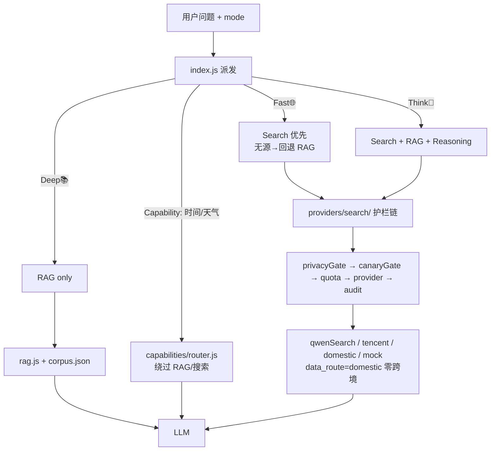
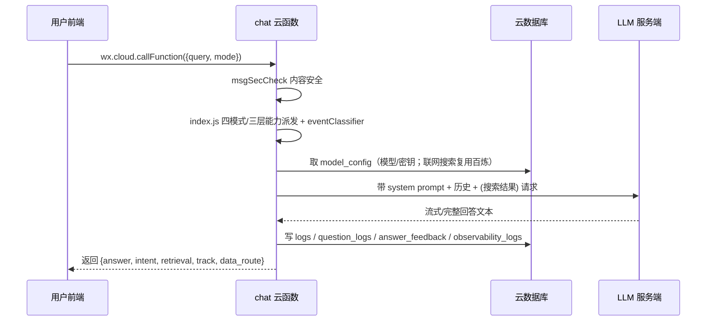

# 01 · 系统架构（Architecture）

> **刷新于 2026-08-07（终校至 Q2-15）**：补充 Freshness 在线搜索、`providers/search/` 护栏链、Think 模式、四模式派发。

## 分层概览

```
┌─────────────────────────────────────────────────────────────┐
│  前端（miniprogram/）  WeChat 小程序端，WXSS/WXML/WXS        │
│  pages: home / chat / about / books / admin / privacy / sessions │
└───────────────────────────┬─────────────────────────────────┘
                              │ wx.cloud.callFunction / wx.request
                              ▼
┌─────────────────────────────────────────────────────────────┐
│  云函数（cloudfunctions/）  Node.js16.13 运行时              │
│  admin / chat / feedback / history / ingest / login          │
│  + capabilities/（实时能力层，Phase R）                        │
│  chat 内：freshness/ think/ providers/search/ security/ observability/ │
└───────────────────────────┬─────────────────────────────────┘
                              │ cloud.database() / cloud.openapi
              ┌───────────────┴───────────────┐
              ▼                               ▼
        ┌──────────────┐                ┌──────────────┐
        │  数据库集合    │                │  微信开放接口   │
        │ logs/model_config/│              │ msgSecCheck  │
        │ question_logs/    │              │ （内容安全）  │
        │ answer_feedback/  │              └──────────────┘
        │ answer_quality_log/│
        │ conversations/     │
        │ chunks/documents   │
        │ observability_logs │
        └──────────────┘
              ▲
              │ 模型调用（model_config 集合配置，前端零配置；联网搜索复用 model_config 百炼）
              │
        ┌──────────────┐
        │  LLM（服务端 chat 函数）│
        └──────────────────────────────────────────────────────┘
```

## 四模式 + 三层能力派发



- **Capability**：确定性实时事实，直接实时取数，绕过 RAG。`CAPABILITY_ENABLED` 默认 true；时间/天气已上线。
- **Freshness（在线搜索）**：`freshness/eventClassifier.js` 四分类（A 纯知识 / B 事件含时间锚点 / C 歧义降级 / D 危机），**B/D 触发** `searchLayer.search()`；结果经护栏链，只作 runtime context。
- **Knowledge**：经典 RAG（`rag.js`/`intent.js`/`corpus.json`/`knowledgeRouter.js`，冻结）。
- **Think**：Search + RAG + Reasoning 融合（`think/`）。

## providers/search/ 护栏链（关键，不可破坏）

```
privacyGate（PII 硬阻断/脱敏）→ canaryGate（仅白名单 openid 走真实源）→ quota（日配额）→ provider（qwen/tencent/domestic/mock）→ audit（7 字段白名单，零泄露）
```

- `data_route`：`domestic`（国内源，零跨境）/ `cross_border`（tavily/bing/serp，已禁用）/ `blocked`（隐私/合规拦截）。
- 失败 fail-soft：无端点/无结果/超配额 → 诚实降级，不报错。
- 当前激活 env（已部署）：`FRESHNESS_ENABLED=true`、`FRESHNESS_FACTUAL_ENABLED=true`、`SEARCH_PROVIDER=qwen`、`PRIVACY_GATE_ENABLED=true`、`SEARCH_CANARY_ENABLED=true`、`SEARCH_CANARY_OPENIDS=ADMIN_OPENID`、`SEARCH_MAX_RESULTS=5`、`SEARCH_TIMEOUT_MS=3000`、`SEARCH_DAILY_QUOTA=500`。

## 数据流（一次完整对话）



## 关键模块关系

| 层 | 模块 | 职责 |
|----|------|------|
| 前端 | miniprogram/pages/* | UI 渲染、setData、隐私浮层、会话列表、四模式选择 |
| 云函数入口 | cloudfunctions/chat/index.js（**非冻结**） | 派发 + 轨道/模式路由 |
| 实时能力 | cloudfunctions/capabilities/* | 时间/天气等确定性事实 |
| Freshness | cloudfunctions/chat/freshness/* | eventClassifier 四分类、contextBuilder、factExtractor、downgrade、responder |
| 搜索层 | cloudfunctions/chat/providers/search/* | searchLayer + 护栏 + qwen/tencent/domestic/mock |
| Think | cloudfunctions/chat/think/* | Search+RAG+Reasoning |
| 隔离守卫 | cloudfunctions/chat/freshnessRuntimeGuard.js | 验证搜索结果不污染 KB/embedding |
| 知识 | corpus.json（37 经典，**冻结**） | 经典素材、tags、question_bridge |
| RAG | rag.js + intent.js + knowledgeRouter.js（**冻结**） | 条件检索、动态四格式、10 轮上下文 |
| Prompt | role / system / safety / history / citation | 五段式输出契约 |
| 安全 | cloudfunctions/chat/security/* | msgSecCheck 调用 |
| 观测 | cloudfunctions/chat/observability/* | KNOWLEDGE_OBSERVABILITY_STORE |
```
