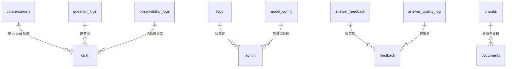

# 04 · 数据库（Database Structure）

> **刷新于 2026-08-07（终校至 Q2-15）**：增补 `observability_logs` 集合与"观测取数纪律"。命名冲突标注仍如实保留（代码为真实来源）。

## 集合总表（代码真实提取）

| 集合名（代码） | 定义处 | 用途 |
|---------------|--------|------|
| `logs` | admin/index.js, chat/index.js | 运行日志 |
| `model_config` | admin/index.js, chat/index.js | 模型/密钥配置（**联网搜索复用此集合的百炼模型**） |
| `question_logs` | admin/index.js, chat/index.js | 意图分类日志 |
| `answer_feedback` | admin/index.js, feedback/index.js | 回答反馈 |
| `answer_quality_log` | admin/index.js, feedback/index.js | 质量日志 |
| `conversations` | history/index.js（COLLECTION="conversations"） | 会话历史 |
| `chunks` | chat/rag.js, ingest/index.js | 知识分块 |
| `documents` | ingest/index.js | 文档源 |
| `observability_logs` | chat（KNOWLEDGE_OBSERVABILITY_STORE=cloud 生效） | 轨道派发/观测样本（Phase R 起） |

> 联网搜索结果**不入库**（仅 runtime context，由 `freshnessRuntimeGuard.js` 保证），故无独立"搜索结果"集合。

## ⚠️ 与任务清单的命名不一致（必须指出，不得猜测）

| 任务书要求 | 代码实际 | 状态 |
|-----------|---------|------|
| `quality_logs` | `answer_quality_log` | **命名不一致** |
| `metadata`（作为独立集合） | 仅作为 `documents`/`chunks` 的**字段**，非独立集合 | **文档与代码冲突** |
| `conversation` | `conversations`（history 云函数） | **命名不一致** |
| `history` | `conversations`（history 云函数） | **命名不一致** |

> **规则**：代码为真实来源。上表标注的 4 处冲突**未擅自修改**，仅如实记录，等待确认。

## 观测取数纪律（违反即假故障）

1. 判"停滞"**禁 `find`+`limit`**（会漏看/误判），须 `$group` 聚合或 `sort:{createTime:-1}`。
2. 单集合结论**必须交叉对账** `logs` / `question_logs` / `observability_logs`（同次请求同步写，逐日条数须相等）。
3. 「疑似」**不得**作为 CR 立项前提，须先验证（CR-009 即因 `find+limit` 误判而 VOID）。
4. 过滤日期用 `{"$date":{"$numberLong":"<ms>"}}`。
5. `tcb fn log` CLI 3.6.4 不可用 → 改用数据库对账；`tcb fn detail` 可吐线上源码验"云端≟本地"。

## 关系图



## 字段示例（conversations）

```js
{
  _id: "conv_xxx",
  openid: "obmZT3...",   // 用户真实 openid（云开发格式）
  title: "默认标题",
  messages: [],          // 对话轮次
  createTime: db.serverDate(),
  updateTime: db.serverDate()
}
```
