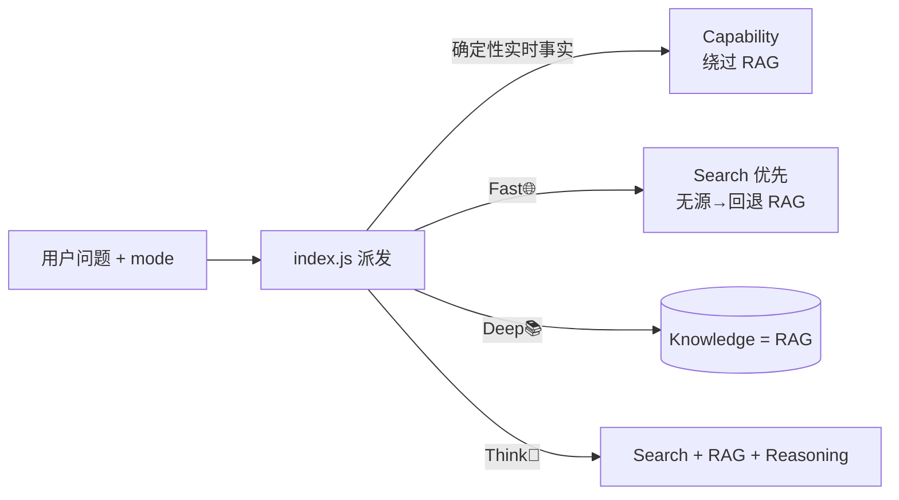
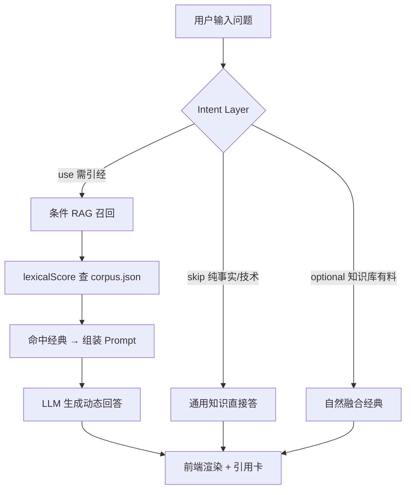
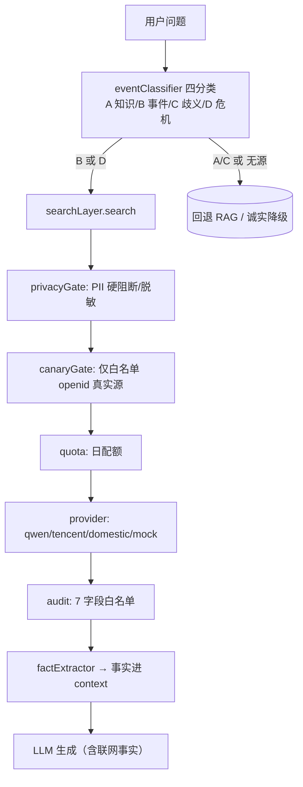

# 05 · RAG 与检索流程（Knowledge 轨道 + Freshness 在线搜索）

> **刷新于 2026-08-07（终校至 Q2-15）**：RAG 属 Knowledge 轨道；另补 Freshness 在线搜索（联网）流程。

## 三层能力 / 四模式与检索位置

- **Capability**：时间/天气等，直接实时取数，不进 RAG。
- **Knowledge（本文 RAG 部分）**：经典思辨，走 corpus.json + RAG。
- **Freshness（联网搜索）**：事件背景/时效内容，走 `providers/search/`，结果只作 runtime context。

## Knowledge 轨道（RAG）完整链路

## Freshness 轨道（在线搜索）链路

- **事实隔离**：`qwenSearch` 只取百炼响应的 `search_results` 数组，**丢弃** `message.content`（杜绝模型综合编造）；`freshnessRuntimeGuard.js` 校验搜索结果不进 corpus/embedding。
- **`data_route`**：`domestic`（国内源，零跨境）/ `blocked`（隐私/合规拦截）。tavily/bing/serp 为跨境，已禁用。
- **canary**：仅 `SEARCH_CANARY_OPENIDS`（=管理员 openid）走真实源，其余走 mock/RAG。
- **失败 fail-soft**：`no_endpoint`（model_config 未配）→ 诚实降级；`no_results` → RAG 兜底；超配额 → `quota_exceeded`。

## 各环节职责（RAG）

| 环节 | 文件 | 说明 |
|------|------|------|
| **Intent** | `intent.js`（❄️冻结） | `classifyIntent(query)` → `{type, knowledgePolicy, format}` |
| **Question Bridge** | `corpus.json` 的 `question_bridge` | 概念↔用户语↔经典映射（⚠️ Phase G 起未被代码读取，待 G-2） |
| **Embedding** | 云端向量（由 chat 函数服务端查） | 语义召回；向量数由 corpus 条目数派生（22） |
| **Chunk** | `chunks` 集合 | 经典文本分块 |
| **Ranking** | `lexicalScore` | 关键词 + 概念加权排序 |
| **路由** | `knowledgeRouter.js`（❄️冻结） | Knowledge 轨道内部召回编排 |
| **Prompt** | system/history/citation | 五段式输出契约 |
| **Fallback** | 空检索 + 危机提示 | 无料时不编造 |
| **Weak Recall** | `frameTitles` 偏置 | 长尾经典抬升 |

## 不变量（Phase H 离线校验 8/8 + Q1-B/Q2-15 反幻觉）

1. skip 路径**不**引经
2. use 空检索**不**编造
3. use 有料**可**选论证，但**不**为引经而引经
4. 危机/情绪提示注入
5. 上下文 ≤ 20 条（10 轮）
6. 冷降级（无事实源）走 WenDao 反思增强，不编造（Q1-B）
7. 传记身份问法（"XX是谁"）→ 触发联网核实，无源诚实降级，**绝不编造学历/院校/出生**（Q2-15）
8. 联网结果只作 context，不进 corpus/embedding/长期缓存
