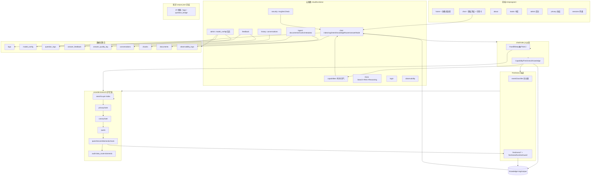

# PROJECT_MAP.md · 一张图看懂整个项目

> **刷新于 2026-08-07（终校至 Q2-15）**：增加 Freshness/`providers/search/` 护栏链、Think 模式、四模式派发、`security`/`observability` 节点。



## 模块速查

| 想改什么 | 去哪 |
|---------|------|
| 前端聊天 UI / 四模式 | `miniprogram/pages/chat/chat.js` |
| 对话派发 / 路由 | `cloudfunctions/chat/index.js`（**非冻结**） |
| 实时能力（时间/天气） | `cloudfunctions/capabilities/router.js`（`CAPABILITY_ENABLED`） |
| 事件分类 / 降级 / 输出守卫 | `cloudfunctions/chat/freshness/{eventClassifier,downgrade,responder}.js` |
| 在线搜索护栏链 | `cloudfunctions/chat/providers/search/{index,canaryGate,privacyGate}.js` |
| 搜索 provider（百炼/腾讯/国内） | `cloudfunctions/chat/providers/search/{qwenSearch,tencentWsaSearch,domesticApiSearch}.js` |
| 隔离守卫 | `cloudfunctions/chat/freshnessRuntimeGuard.js` |
| 经典召回源（冻结） | `cloudfunctions/chat/corpus.json`（SHA256 守门） |
| RAG / 意图 / 路由（冻结） | `cloudfunctions/chat/{rag,intent,knowledgeRouter}.js` |
| 会话历史 | `cloudfunctions/history/index.js`（COLLECTION="conversations"） |
| 知识入库 | `cloudfunctions/ingest/index.js`（documents/chunks/metadata） |
| 模型/日志管理 | `cloudfunctions/admin/index.js`（model_config/logs/question_logs） |
| 部署配置（必读） | `cloudbaserc.json`（envVariables/runtime/timeout/memorySize） |
```
