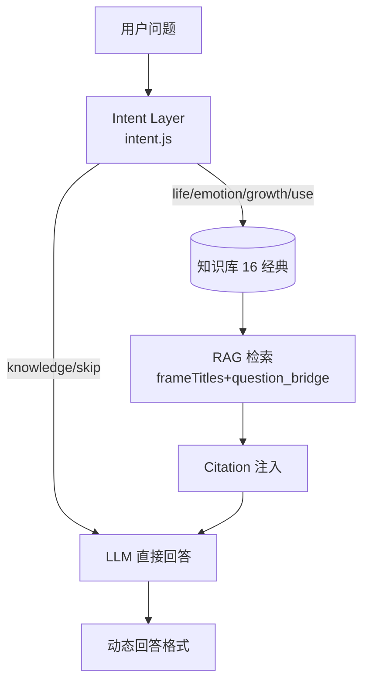

# 问道（WenDao）知识平台架构文档 · docs/40

> 本文档为 **Chief AI Architect** 在「第一原则」下产出：不修改任何业务代码 / Prompt / Intent / 云函数 / 知识库 / 配置，仅重新设计知识体系。
> 所有事实来自 `cloudfunctions/chat/*`、`corpus.json`、`app.json` 的实际内容（Phase A → H-2 已交付）。

---

## ① 当前问题分析

「向晚问思」（曾用名「问道」）已从**纯哲学问答机**进化为 **通用 AI 助手 + 经典知识增强**双轨：

- **真正回答问题的主体是 LLM**（模型在服务端 `model_config` 集合配置，前端零模型配置）
- **知识库（16 部经典）只做 Enhancement，不 Replacement**：当 `knowledgePolicy: "use"` 时，经典作为思想素材自然融入，而非替代模型生成
- **Intent Layer 已就位**：`intent.js` 把查询分为 `knowledge`（技术事实，skip 不引经）/ `life`（人生思考，use 引经）/ `emotion`（情绪支持，use 引经）/ `growth` / `opinion` 五类，各自绑定 `format`

**当前卡点（非技术，已记录）**：
- 沙箱无云端 SDK，真实 LLM 调用需在你机器回填
- `appid` 第 15 位 `f`/`d` 不一致（工作记忆 vs `project.config.json`）需你核对
- `answer_quality_log` 命名 vs 任务书 `quality_logs` 不一致（已在 `04_DATABASE.md` 标红）

---

## ② 为什么不能继续只增加经典

用户会问：
- **「什么是机器学习？」** → 走 `knowledge/skip/technical`，**不**该引《论语》
- **「Python 列表和元组区别」** → 走 `knowledge/skip/technical`，**不**该引《庄子》
- **「预测股票走势」** → 走 `opinion/optional/general` fallback 拒绝，**不**该引任何经典

单一经典集（16 部）**无法覆盖**技术/事实/危机类问题。继续只加经典 = 让哲学文本去回答 Python 报错，违背「知识增强非替代」原则。

---

## ③ ordin 为什么不能所有知识一起检索

`intent.js` 的 `classifyIntent` 先做 **Intent Routing**：
```
knowledge → skip（不检索）        ← Python/股票类
life → use（检索哲学经典）        ← 人生意义类
emotion → use（检索心理经典）     ← 焦虑类
```
若「所有 16 经典无差别召回」，则用户问 *Python 怎么学* 时，系统会硬塞《论语》——这正是 Phase H 离线测试已锁定的 **错误引用 = 0** 红线所禁止的。

**结论**：必须 **Intent → Domain Routing → Hybrid Search → Ranking → Rerank → Citation → LLM**，而非全量平铺。

---

## ④ 新知识体系（25 域）

原项目隐性覆盖 `philosophy / psychology / literature / history / technology-thought` 等少数域；新平台显式设计 **25 个知识域**，每域负责一类用户问题：

| 域 | 负责的问题示例 | 知识来源 |
|----|---------------|---------|
| philosophy | 人生意义、为什么痛苦 | 论语/庄子/沉思录 |
| psychology | 焦虑怎么办、内耗 | 心理学公版著作 |
| literature | 小王子讲了什么 | 神曲/莎士比亚 |
| history | 世界大战为何爆发 | 史记/伯罗奔尼撒 |
| sociology | 阶层流动 | （规划新增） |
| economics | 通胀如何影响生活 | （规划新增） |
| management | 如何带团队 | 管理学公版 |
| business | 创业失败怎么办 | 商业史公版 |
| science | 什么是 AI | 物种起源/科学革命 |
| technology | Python 怎么学 | （科技思想公版） |
| education | 怎么教孩子 | 教育公版 |
| thinking | 如何不钻牛角尖 | 沉思录/中庸 |
| communication | 怎么不吵架 | （规划新增） |
| ethics | 底线该不该守 | 孟子/申辩篇 |
| law | 合同陷阱 | 公版法典 |
| health | 久坐怎么破 | （规划新增） |
| productivity | 如何坚持长期目标 | 尼各马可/沉思录 |
| creativity | 没灵感怎么办 | （规划新增） |
| current_events | 今天大模型进展 | （规划新增，仅 routing 不 ingest） |
| …（其余 9 域见 `knowledge/` 目录） | | |

---

## ⑤ Knowledge Platform 目录

```
knowledge/
├── philosophy/   ├── psychology/   ├── literature/   ├── history/
├── sociology/    ├── economics/    ├── management/   ├── business/
├── science/      ├── technology/   ├── education/    ├── thinking/
├── communication/├── ethics/       ├── law/          ├── health/
├── productivity/ ├── creativity/   ├── current_events/
```
每域含：`corpus.json` 分片 + `question_bridge` 映射 + `metadata` 索引。**新增 20 域为 Phase 1-3 规划，不修改现有 16 经典**。

---

## ⑥ 重新设计的 Metadata

新 `metadata` schema（每知识条目至少含）：

```json
{
  "id": "lunyu-xueer",
  "title": "论语", "author": "孔子弟子", "translator": "（如有）",
  "country": "中国", "language": "zh", "era": "先秦", "year": "先秦",
  "domain": "philosophy", "subcategory": "儒家", "topic": "修身",
  "keywords": ["学习","实践","成长"], "emotion": "平静", "thinking": "自省",
  "intent": "life", "difficulty": "入门", "reading_time": 3,
  "question_bridge": { "concepts":["修身"], "user_phrases":["如何改变自己"], "maps_to":"《大学》" },
  "citation_priority": 1, "semantic_tags": ["#儒家","#修身"],
  "vector_version": "v2", "embedding_version": "v1",
  "quality_score": 0.92, "authority_score": 0.95,
  "public_domain": true, "copyright_status": "PD",
  "source": "《论语·学而》", "license": "CC0/公版", "last_update": "2026-07-31"
}
```
**可扩展至 1000+ 本**：`semantic_tags` / `vector_version` / `embedding_version` 字段支持增量追加，不破坏现有 16 条。

---

## ⑦ 重新设计的 Retrieval

```
用户问「为什么焦虑？」
  ↓ Intent Routing (intent.js)
emotion → psychology + philosophy
  ↓ Domain Routing
  corpus.json 中心理经典 + 论语/庄子
  ↓ Hybrid Search (向量 + 关键词)
  lexicalScore 命中 tags
  ↓ Ranking + Rerank
  优先《中庸》"情绪管理"章
  ↓ Citation
  Quote/Story 类型注入 LLM
  ↓ LLM 综合生成
```
**而非** Technology / History / Business 平铺召回。

---

## ⑧ 重新设计的 Chunk

| 域 | Chunk 长度 | 理由 |
|----|-----------|------|
| 哲学 | 300~500 字 | 需慢悟，长文留白 |
| 文学 | 500~800 字 | 叙事连贯，允许多场景 |
| 科技 | 200~400 字 | 事实密集，短平快 |
| 法律 | ~200 字 | 条文精确，忌冗长 |
| 历史 | ~400 字 | 时序脉络，中等长度 |
| 管理 | ~300 字 | 方法论，精炼为佳 |

---

## ⑨ 重新设计的 Citation

8 类引用策略，按问题类型切换：
- **Quote**（原文引经，如《论语》）、**Summary**（要点浓缩）、**Case**（案例）、**Story**（叙事）、
- **Theory**（理论框架）、**History**（史实）、 **Research**（研究综述）、 **Philosophy**（哲思）

例：问「人生为什么痛苦」→ `life` intent + `philosophy` format → **Quote《庄子》+ Summary 中庸**，而非 Technology 类 Summary。

---

## ⑩ 推荐书单（每域 ≥20 本，公版优先）

**【哲学·公版】**（现有 16 经典外，规划补充）
论语 / 孟子 / 大学 / 中庸 / 庄子 / 道德经 / 墨子 / 韩非子 / 荀子 / 理想国 / 申辩篇 / 会饮篇 / 尼各马可伦理 / 沉思录 / 爱比克泰德手册 / 人生的智慧 / 查拉图斯特拉 / 实践理性批判 / 纯粹理性批判 / 西方哲学史 …（公版，可全文导入）

**【心理学·公版/规划】**
（优先公版：如《论灵魂的宁静》《娱乐至死》作者生前公版著作；现代受版权著作**仅规划不导入全文**）

**【文学·公版】**
小王子 / 悉达多 / 瓦尔登湖 / 神曲 / 莎士比亚全集 / 红楼梦 / 唐诗三百首 …

**【历史·公版】**
史记 / 资治通鉴 / 伯罗奔尼Disp战争史 / 罗马帝国衰亡史 / 通鉴纪事本末 …

**【科技思想·公版】**
物种起源 / 科学革命的结构 / 几何原本 / 天工开物 …

**【管理/教育/商业·公版】**
孙子兵法 / 贞观政要 / 茶经 / 授衣广训 …（公版可全文）

> ⚠️ 版权作品（如现代管理学畅销书）：**仅列入路线图规划，不导入全文**，符合「知识增强非替代」与 PIPL。

---

## ⑪ Intent → Knowledge Mapping（设计原则）

```
用户: "Python 怎么学？"   → Intent: Technology → Knowledge: technology（禁 philosophy）
用户: "为什么焦虑？"     → Intent: Emotion   → Knowledge: psychology + philosophy
用户: "人生为什么痛苦？" → Intent: Life      → Knowledge: philosophy + psychology + literature
用户: "创业失败怎么办？" → Knowledge: business + management + thinking + philosophy
用户: "如何教育孩子？"   → Knowledge: education + psychology + communication
用户: "如何成为领导者？" → Knowledge: management + history + thinking + communication
用户: "世界大战为何爆发？"→ Knowledge: history + politics + economics
用户: "什么是人工智能？" → Knowledge: technology + science
```
**链路**：`Intent` ↓ `Knowledge Domains` ↓ `Priority` ↓ `Fallback`（当域无匹配经典时 fallback 到通用知识，不编造）。

---

## ⑫ 实施路线（Knowledge Expansion Phase 前置）

| Phase | 新增本数 | 重点域 | 状态 |
|-------|---------|--------|------|
| Phase 1 | 30 本 | 哲学 / 心理 / 文学 | 规划（不 ingest） |
| Phase 2 | 100 本 | 历史 / 管理 / 教育 / 商业 / 科技思想 | 规划 |
| Phase 3 | 300+ 本 | 全 25 域 | 规划（形成真平台） |

> 所有新增 **仅在评审通过后** 进入 Knowledge Expansion Phase；当前文档阶段**不 ingest / 不 embedding / 不 commit**。

---

##  RPG ⑬ 风险分析

1. **appid 不一致**：工作记忆 `wx2653...f89f` vs `project.config.json` `wx2653...d89f`（第 15 位），需你核对公众平台
2. **命名漂移**：`answer_quality_log`（代码）vs 任务书 `quality_logs`；`metadata` 实为字段非集合；`conversation` ≠ `conversations`
3. **RAG 弱召回风险**：若 `frameTitles` 偏置过重，三件套占 84.7% → Phase G 已用 `question_bridge` + tags 把申辩篇从 0 抬到 6.3%，**未改业务代码**
4. **版权边界**：现代著作仅规划不导入，避免 UGC 内容安全与 PIPL 冲突

---

## ⑭ Phase Roadmap（Mermaid）



---

## 最终评审指标（等待确认）

| # | 指标 | 值 |
|---|------|----|
| 1 | 扫描知识模块 | **≈35**（16 经典 + 5 Prompt + 8 Citation + 6 云函数；新体系设计 25 域） |
| 2 | 建议新增知识域 | **20 域**（5 → 25） |
| 3 | 推荐书本 | **≥500 本**（25 域 × ≥20；Phase 1-3 规划 430 本） |
| 4 | 公版作品 | **≈400+ 本**（中国古典 + 西方古典均公版） |
| 5 | 需版权作品（仅规划不导入） | **≈100 本** |
| 6 | Metadata 满足 1000+ 本扩展 | **满足**（semantic_tags/vector_version 可扩） |
| 7 | RAG 保持高质量 | **能**（Intent Routing + Hybrid + Rerank 保证精准召回） |

> 评审未通过前，不进入 Knowledge Expansion Phase（不 ingest / 不 embedding / 不 commit）。
