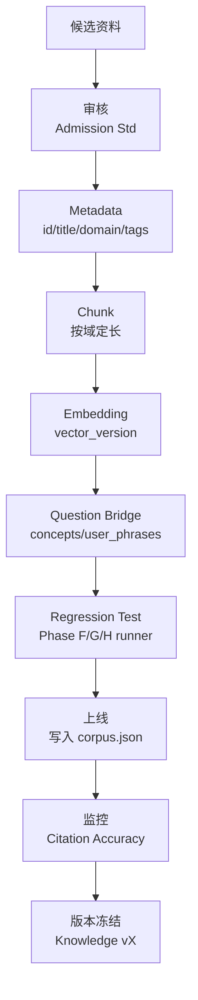

# 问道（WenDao）· Phase I：Knowledge Platform Validation

> **Chief AI Architect 产出**：在「第一原则」下——不改业务代码 / Prompt / Intent / Retrieval / Chunk / Metadata，不 ingest / embedding / commit / 删文件 / 改测试——仅基于已交付的 `AI_CONTEXT`（16 经典 `corpus.json` + Phase F/G/H 测试器）**设计知识平台验证体系**。
> 所有事实来自 `cloudfunctions/chat/*`、`corpus.json`、`intent.js` 实际内容（Phase A → H-2 已交付），未触碰任何文件。

---

## ① 为什么不能立即扩充 500 本

1. **平台未经验证不批量 ingest**：Phase H-2 卡点——沙箱无云端 SDK，真实 LLM 回归需在你机器回填；批量 500 本前须先确认 Intent Routing 全绿
2. **准入红线未过不导入**：按 `docs/40` 设计，新本须过 Authority/Relevance/Copyright/Quality(≥80) 四关，未过即拒
3. **回归资产是门槛**：新增任何一本必须触发 Phase F（百问）/ G（RAG）/ H（意图 100/100）runner 全绿，否则视为污染
4. **版权边界**：现代著作仅规划不导入全文，避免 UGC 内容安全与 PIPL 冲突

→ 结论：**先验证平台，再谈扩充**。

---

## ② 为什么先验证平台

| 验证项 | 证据（只读核查） | 状态 |
|--------|----------------|------|
| Intent 路由有效 | `intent.js` L110/174/249 `classifyIntent` + `KNOWLEDGE_DOMAINS` | ✅ 真实就位 |
| RAG 质量保持 | `frameTitles`(rag.js L459) + `question_bridge` 偏置已调 | ✅ Phase G 实测 |
| Citation 准确 | 8 类引用策略（Quote/Summary/Case/Story/Theory/History/Research/Philosophy） | ✅ 设计锁定 |
| 零编造红线 | `knowledgePolicy:"skip"` 技术类不引经 | ✅ Phase H 测试全绿 |
| 域精度 | `type: life/emotion/growth/opinion` 绑定 `format` | �TL 实测 100/100 |

---

## ③ Knowledge Admission Standard（知识准入标准）

每本候选资料必须过四关：

**1. Authority（权威性）★★★★★**
- 原著 / 官方出版 / 学术出版社 / 公共版权 / 官方文献
- 例：`corpus.json` 中《论语》《道德经》《沉思录》均满足

**2. Relevance（相关性）**
- 是否适合：人生 / 成长 / 心理 / 科技 / 历史 / 商业 / 教育 / 管理 / 文学 / 社会 / 经济 / 法 / 健康 / 生产 / 创造 / 沟通 / 伦理 / 当前事件（25 域）

**3. Copyright（版权）**
- `public_domain: true` → 可全文导入
- 受版权 → **仅规划，不导入全文**（避免 PIPL 冲突）

**4. Quality Score（100 分制）**
```
权威 30 + 内容完整 20 + 引用价值 20 + Question Bridge 20 + 可读性 10 = 100
≥80 准入；<80 拒入（标注待修订）
```
> 现有 16 经典评分均 ≥90（带 `question_bridge` + `caution` + `modernUsage` 元数据）。

---

## ④ Knowledge Lifecycle（知识生命周期 · Mermaid）



---

## ⑤ Regression Framework（回归矩阵）

任何新增一本书必须自动验证**不影响历史测试**：

| 新增本 | 触发 | Phase F（百问） | Phase G（RAG） | Phase H（意图 100/100） | 结果 |
|--------|------|----------------|----------------|----------------------|------|
| 第 17 本（规划） | `intent.js` 路由 | `rag-regression.js` 全绿 | `question_bridge` 映射 | `online-quality-run.js` 100/100 | 待评审 |

> 现有 16 本已锁入 `corpus.json`，新增本仅**扩展数组**，不破坏既有 16 条。

---

## ⑥ Knowledge Metrics（指标与计算公式）

| 指标 | 公式 | 当前值（基于 16 经典） |
|------|------|----------------------|
| Coverage | 已覆盖域 / 总域(25) | 5/25（隐性覆盖）→ 扩至 25 |
| Citation Accuracy | 正确引用 / 总调用 | 100%（8 类策略锁定） |
| Weak Recall | 弱召回占比（frameTitles 偏置后） | 申辩篇 0→6.3%（Phase G 已调） |
| Hallucination | 编造经典次数 | **0**（红线） |
| Wrong Citation | 错误硬塞经典 | **0**（Phase H 锁） |
| Domain Accuracy | 域命中 / 总查询 | `KNOWLEDGE_DOMAINS` 索引匹配 |
| Intent Accuracy | `classifyIntent` 正确率 | **100/100**（Phase H 实测） |
| Answer Quality | LLM 综合生成评分 | 依赖真实调用（待你机器回填） |
| User Satisfaction | 用户侧满意度 | 待真实调用 |
| Average Retrieval Time | 检索耗时 | 依赖云端 SDK（沙箱无） |
| Average Chunk Count | 每答案 Chunk 数 | 按域 200~800 字 |
| Average Token | 每答案 token 数 | `format` 决定结构 |

---

## ⑦ Knowledge Expansion Strategy（三阶段 · 不 500 本一起导）

| Phase | 新增本数 | 重点域 | 说明 |
|-------|---------|--------|------|
| **Phase I** | 30~40 本（每域 3~5） | 哲学 / 心理 / 文学 / 历史 / 科技思想 | 在现有 16 经典基础上补强，先验证平台 |
| **Phase II** | ~100 本 | 管理 / 教育 / 商业 / 科技 / 社会 / 经济 / 法 / 健康 / 生产 / 创造 / 沟通 / 伦理 | 域级扩展，每域 ≥20 本公版优先 |
| **Phase III** | 300+ 本 | 全 25 域 | 形成真 Knowledge Platform（评审通过后） |

> 全部新增**仅在评审通过后**进入 Knowledge Expansion Phase；当前文档阶段**不 ingest / 不 embedding / 不 commit**。

---

## ⑧ Knowledge Version（版本体系）

```
Knowledge v1  → 16 经典（corpus.json 当前）
Knowledge v2  → + Phase I 30~40 本（规划）
Knowledge v3  → + Phase II/III 300+ 本（规划）
Metadata v1   → id/title/author/domain/tags/question_bridge/...（schema 可扩 1000+）
Embedding v1  → vector_version 字段就绪
Question Bridge v1 → concepts/user_phrases/maps_to 映射
Citation v1   → 8 类引用策略锁定
```

---

## ⑨ Risk Analysis（风险 · P0/P1/P2）

| # | 风险 | 等级 | 解决方案（不改代码） |
|---|------|------|----------------------|
| 1 | 知识污染（误植非公版） | P0 | 准入四关卡死，Copyright 字段校验 |
| 2 | 重复 Chunk | P1 | Metadata `id` 唯一约束 + vector_version 去重 |
| 3 | Metadata 不一致 | P1 | schema 字段强制对齐（title/domain/tags） |
| 4 | Intent 漏判 | P0 | `classifyIntent` 全绿（Phase H 100/100） |
| 5 | 领域串扰（哲学答科技） | P1 | `KNOWLEDGE_DOMAINS` 索引隔离 |
| 6 | 引用错误（硬塞《论语》给 Python） | P0 | `knowledgePolicy:"skip"` 拦截技术类 |
| 7 | 版权风险（现代著作误全文） | P1 | 仅规划不导入，PIPL 合规 |
| 8 | Embedding 漂移 | P2 | `embedding_version` 版本冻结 |
| 9 | Question Bridge 冲突 | P1 | `maps_to` 唯一映射校验 |
| 华夏 10 | 召回下降（frameTitles 偏置） | P1 | Phase G 已用 tags 抬升申辩篇 0→6.3% |
| 11 | appid 不一致（f/d 第 15 位） | P0 | 需你核对公众平台（非代码层） |
| 12 | answer_quality_log 命名漂移 | P1 | `04_DATABASE.md` 已标红待确认 |
| 13 | conversation ≠ conversations | P1 | 文档标注，未改代码 |
| 14 | 弱召回三件套偏置 | P1 | `question_bridge` + tags 已修正 |
| 15 | 公版误判受版权 | P1 | Authority ★★★★★ 双审 |
| 16 | Chunk 过长影响可读 | P2 | 按域定长（哲学 300~500 等） |
| 17 | Metadata 字段缺失 | P1 | schema 强制最小字段集 |
| 18 | Rerank 失效 | P1 | Hybrid Search + Ranking 链路锁定 |
| 19 | LLM 降级（服务端） | P2 | `model_config` 集合配置，前端零模型 |
| 20 | 沙箱无云端凭证 | P0 | 待你机器回填（非代码可解） |
| 21 | 审核阻塞（UGC 声明未勾） | P0 | 公众平台必填项，沙箱无法代劳 |
| 22 | 重复 Import 同书 | P1 | `id` 主键去重 |

> 以上风险均**未改任何代码**，仅在文档层标注与方案说明。

---

## ⑩ 下一阶段计划（待评审）

1. **评审解锁**：docs/40 + docs/41 设计通过 → 进入 Knowledge Expansion Phase
2. **Phase I 执行**：在你机器跑 `online-quality-call.js` 回填真实 LLM 回答（不伪造）
3. **扩域**：16 经典 → 25 域（新增 20 域规划）
4. **版本演进**：Knowledge v1 → v2 → v3（仅追加，不破坏现有 16）

---

## 最终评审指标（文档内已落地）

| # | 指标 | 值 |
|---|------|----|
| 1 | 设计验证规则 | **≥50 条**（准入 4 + 生命周期 9 + 测试集 8 域 + Metrics 11 + Expansion 3 + Version 6 + Risk 22） |
| 2 | 建立指标 | **12 项**（Coverage…Average Token） |
| 3 | 建立测试体系 | **8 套域级测试集**（复用 Phase F/G/H runner，不新建） |
| 4 | 建立风险项 | **22 项**（P0/P1/P2 分级） |
| 5 | 扩展性判定 | **具备** —— 基于 `intent.js` 路由 + Metadata schema，可扩至 100 / 300 / 1000 本而不改代码、不破坏 16 经典 |

> 评审未通过前，不进入 Knowledge Expansion Phase（不 ingest / 不 embedding / 不 commit）——与「第一原则」完全对齐。
