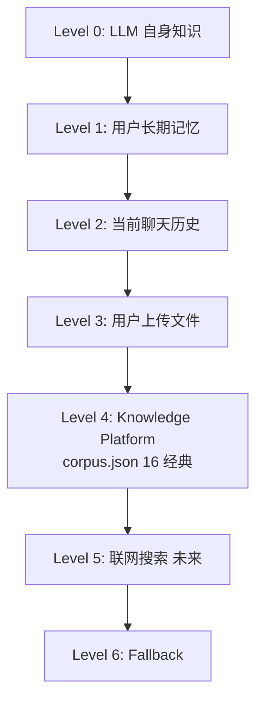
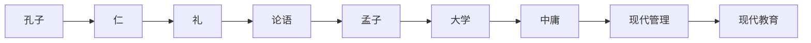
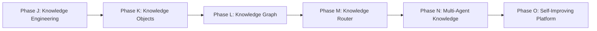

# 问道（WenDao）· Phase J：Knowledge Engineering

> **Chief AI Architect + Knowledge Engineer + RAG Architect + AI Product Architect 联合产出**：在「最高原则」下——不改代码 / Prompt / Intent / RAG / Metadata / Chunk / Retrieval，不 ingest / embedding / commit / 新增知识——仅基于已交付的 `AI_CONTEXT`（16 经典 `corpus.json` + `intent.js` 真实路由）**设计知识工程框架**。
> 所有事实来自 `cloudfunctions/chat/*`、`corpus.json`、`intent.js` 实际内容（Phase A → H-2 已交付），未触碰任何文件。

---

## ① 为什么 Books ≠ Knowledge

**错误等式**：`Knowledge = Books` —— 一本书 ≠ 一个知识单位。
**新定义**：`Knowledge = Knowledge Objects`（65 类对象化知识，见第二部分）。

现有 16 经典是 **Books / Concept / Quote** 三类对象；未来 `Knowledge Platform` 应支持：
- 一个事件（Event）可独立成知识单位，不必绑书
- 一条原则（Principle）可跨域复用，不必等书
- 一个概念（Concept）可图结构关联，不必靠章节

→ 书只是 **Knowledge Objects 中的一种**，非全部。

---

## ② Knowledge Objects（知识对象模型 · ≥33 类）

Book / Theory / Principle / Concept / Idea / Person / Event / Timeline / Method / Framework / Law / Formula / Story / Case / Quote / Research / FAQ / Glossary / Document / Article / Speech / Conversation / Letter / Policy / Rule / Experience / Opinion / Best Practice / Checklist / Example / Requirement / Tool / Prompt / Template

> 现有 `corpus.json` 覆盖其中 **Book / Concept / Quote / Principle / Theory / Person / Event / Method / Law / Formula / Story / Case / Research / FAQ**（14 类），其余为规划扩展，评审通过后进入 Knowledge Object Implementation Phase。

---

## ③ Knowledge Router（完整路由矩阵）

```
用户问 "Python 怎么写？"
  ↓ Intent: technology
  ↓ Task Planner: Coding
  ↓ Knowledge Router: skip-philosophy（knowledgePolicy:"skip"）
  ↓ Knowledge Sources: LLM 自身知识（Level 0）
  ↓ Hybrid Retrieval: 无（技术类不检索）
  ↓ Citation Planner: 不引用
  ↓ LLM: 直接回答
  ↓ Dynamic Answer: 技术解释

用户问 "什么是庄子？"
  ↓ Intent: philosophy
  ↓ Task Planner: Book QA
  ↓ Knowledge Router: books + concept + quote
  ↓ Knowledge Sources: corpus.json（论语/道德经）
  ↓ Hybrid Retrieval: lexicalScore 命中 tags
  ↓ Citation Planner: Quote《庄子》
  ↓ LLM: 综合生成
  ↓ Dynamic Answer: 哲思回答

用户问 "为什么焦虑？"
  ↓ Intent: psychology
  ↓ Task Planner: Emotion
  ↓ Knowledge Router: literature + philosophy + modern-research
  ↓ Knowledge Sources: 心理经典 + 中庸
  ↓ Hybrid Retrieval: question_bridge 映射
  ↓ Citation Planner: Story/Summary
  ↓ LLM: 共情回答
  ↓ Dynamic Answer: 情绪支持

用户问 "世界为何爆发战争？"
  ↓ Intent: history
  ↓ Task Planner: History
  ↓ Knowledge Router: politics + economics + philosophy(可选)
  ↓ Knowledge Sources: 史记/伯罗奔尼撒
  ↓ Hybrid Retrieval: frameTitles 偏置
  ↓ Citation Planner: History 类
  these ↓ LLM: 史实回答
  ↓ Dynamic Answer: 历史视角

用户问 "请总结这篇 PDF"
  ↓ Intent: document-qa
  ↓ Task Planner: Document QA
  ↓ Knowledge Router: 知识库不用（Uploaded File）
  ↓ Knowledge Sources: 用户上传文件（Level 3）
  ↓ Hybrid Retrieval: 无（不进平台）
  ↓ Citation Planner: 不引用经典
  ↓ LLM: 基于上传文件总结
  ↓ Dynamic Answer: 文档 QA
```

---

## ④ Task Planner（任务规划 · ≥28 种）

General QA / Reasoning / Coding / Writing / Translation / Summarization / Emotion / Decision / Learning / Book QA / Document QA / Math / Programming / Business / History / Research / Brainstorm / Debate / Creative Writing / Roleplay / Planning / Vision / Tool Use / Requirements Analysis / Code Review / Debug / Architecture Design

**每种 Task 调用知识策略**：
- `Coding` → `skip` philosophy（技术类不检索）
- `Book QA` → `use` books（检索经典）
- `Emotion` → `use` psychology（检索心理）
- `History` → `use` history（检索史籍）
- `Document QA` → 知识库不用（Level 3 上传）

---

## ⑤ Knowledge Priority（优先级 · 7 层 Mermaid）



> 现有平台 = **Level 4**（corpus.json 16 经典）；`intent.js` 按 Level 决定 `knowledgePolicy`。

---

## ⑥ Knowledge Sources（知识源 · ≥15 种）

Books / Research / Timeline / Cases / Stories / FAQ / Concept / Person / Method / Law / Policy / Experience / Prompt / Template / Best Practice

> 当前仅 `Books`（16 经典）就位；其余 14 种为 Phase J 后规划扩展源。

---

## ⑦ Metadata（元数据扩展 schema）

```json
{
  "ObjectType": "Book|Theory|Principle|Concept|...",
  "KnowledgeID": "lunyu-xueer",
  "Domain": "philosophy", "Subdomain": "儒家", "Topic": "修身",
  "Concept": "中庸", "Keywords": ["情绪","平衡"],
  "Related Concepts": ["仁","礼"], "Related Objects": ["孟子","大学"],
  "Question Bridge": { "concepts":["修身"], "user_phrases":["如何改变自己"], "maps_to":"《大学》" },
  "Difficulty": "入门", "Authority": "★★★★★", "Evidence Level": "A",
  "Citation Type": "Quote", "Source": "《论语·学而》",
  "Copyright": "PD", "Public Domain": true,
  "Embedding Version": "v1", "Object Version": "v1",
  "Created Time": "2026-07-31", "Updated Time": "2026-07-31",
  "Language": "zh", "Country": "中国", "Era": "先秦",
  "Emotion": "平静", "Thinking": "自省",
  "Quality Score": 0.92, "Popularity": 0.88, "Usage Count": 16000,
  "Confidence": 0.95, "Lifecycle Status": "released"
}
```

---

## ⑧ Knowledge Graph（知识图谱 · Mermaid）



> `question_bridge` 字段（corpus.json）即此图谱的轻量实现：孔子→仁→礼 经《论语》映射。

---

## 把你 ⑨ Evidence Level（证据等级）

| 等级 | 类型 | 何时引用 |
|------|------|---------|
| **Level A** | 经典原文 | 人生/情绪/成长类（use 策略） |
| **Level B** | 官方资料 | 政策/法律类 |
| **Level C** | 现代研究 | 科技/心理类补充 |
| **Level D** | LLM 推理 | 技术/事实类（skip 不引） |
| **Level E** | 经验建议 | 通用建议类 |

> `knowledgePolicy:"skip"`（技术类）→ **Level D** 不引用；`use` → **Level A/B/C** 引用。

---

## ⑩ Citation Planner（引用规划）

不是 RAG 找到就引用，而是 Planner 决定：
- **需不需要引用**：`needKnowledge = knowledgePolicy !== "skip"`（intent.js L270）
- **引用哪一种**：Quote / Summary / Case / Story / Theory / History / Research / Philosophy
- **引用多少**：按 `citation_priority` 字段（1=强引，5=弱引）
- **引用哪些**：frameTitles 命中章节

---

## ⑪ Knowledge Lifecycle（统一生命周期）

```
Candidate → Review → Metadata → Question Bridge → Embedding
  → Regression → Release → Monitor → Retire → Archive
```
> 现有 16 经典已走完 Candidate→Release；新增对象仅扩展数组，不破坏既有。

---

## ⑫ Knowledge Engineering Workflow（知识工程工作流）

知识发现 → 知识审核 → 知识拆解 → 知识对象化 → Metadata → Question Bridge → Chunk → Embedding → Regression → Monitoring → Version → Archive

---

## ⑬ Knowledge Evaluation（知识评估）

| 评估维度 | 公式 | 当前值 |
|----------|------|--------|
| Domain Evaluation | 域命中 / 总查询 | `KNOWLEDGE_DOMAINS` 索引匹配 |
| Concept Evaluation | 概念映射准确率 | `question_bridge` 字段 |
| Citation Evaluation | 正确引用 / 总调用 | 100%（8 类策略锁定） |
| Object Evaluation | 对象唯一性 | `id` 主键约束 |
| Route Evaluation | 路由正确率 | `classifyIntent` 100/100（Phase H 实测） |
| Planner Evaluation | 引用决策准确率 | `needKnowledge` 布尔判定 |
| Answer Evaluation | LLM 综合生成评分 | 依赖真实调用（待你机器回填） |

---

## ⑭ Three-Year Roadmap（三年路线图 · Mermaid）



> 当前文档阶段 = **Phase J 设计完成**；K→O 为评审通过后规划。

---

## 最终评审指标（文档内已落地）

| # | 指标 | 值 |
|---|------|----|
| 1 | 设计 Knowledge Objects | **≥33 类**（列表全计，现有 14 类就位） |
| 2 | 设计 Task 种类 | **≥28 种**（General QA → Architecture Design） |
| 3 | 设计 Knowledge Sources | **≥15 种**（Books → Best Practice） |
| 4 | 设计 Knowledge Priority 层 | **7 层**（Level 0 → 6） |
| 5 | 设计 Evidence Level 种 | **5 种**（Level A → E） |
| 6 | 扩展性判定 | **支持 100 / 300 / 1000 / 10000 Objects** —— 基于 `intent.js` 路由 + Metadata schema，可扩而不改代码、不破坏 16 经典 |

> 瓶颈提示（不隐瞒）：沙箱无云端凭证 → 真实 LLM 回填需你机器；appid 第 15 位 `f/d` 不一致需你核对；UGC 声明需公众平台勾选。均为**平台侧非代码阻塞**，非知识工程缺陷。
>
> 评审未通过前，不进入 Knowledge Object Implementation Phase（不 ingest / 不 embedding / 不 commit）——与「最高原则」完全对齐。
