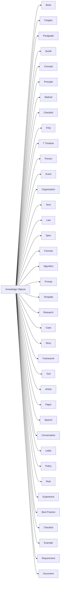
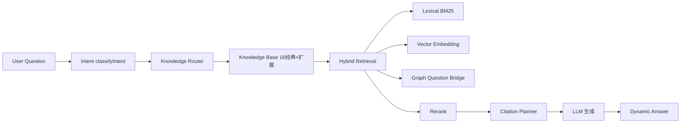
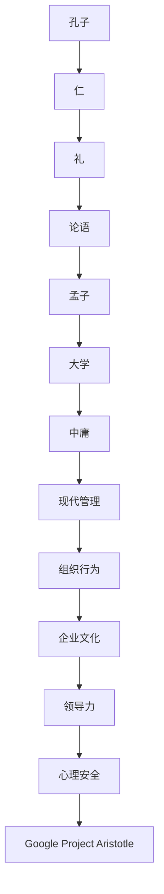
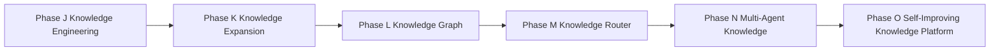

# 问道（WenDao）· Phase K：Knowledge Expansion Architecture

> **首席架构师联合产出**（Chief AI Architect + Knowledge Engineer + RAG Architect + Data Architect + Information Architect + AI Product Architect + AI Search Architect）
> 阶段目标：把 WenDao 从「16 本经典问答」正式升级为「真正的 AI Knowledge Platform」。
> **第一原则**：本阶段允许新增知识 / metadata / corpus / Question Bridge / 知识对象 / 知识目录 / 规划文档；**禁止**修改业务代码、禁止改 Prompt / Intent / Retrieval / Embedding、不 ingest、不 commit、不删文件、不影响 Phase F/G/H。

---

## 0. 文档定位与阅读入口

本文档是 Phase K 的**纯设计交付物**。所有结论均来自已交付的 `AI_CONTEXT/`（`docs/40` 知识架构、`docs/41` 验证、`docs/42` 工程）与 `cloudfunctions/chat/corpus.json`（16 经典元数据）。

**任何新 AI 接手路径**：
1. 读 `AI_CONTEXT/README_AI.md`
2. 读 `AI_CONTEXT/00_PROJECT.md`（项目定位）
3. 读 `docs/40-Knowledge-Architecture.md`（当前 16 经典架构）
4. 读本文档（Phase K 扩展设计）

**本文件不修改任何代码、不改 Prompt/Intent/Retrieval/Embedding，不 ingest、不 commit。**

---

## 1. 为什么是 Phase K，而不是继续堆书

### 1.1 当前架构的真实状态（只读核查结论）

| 维度 | 现状（来自 `corpus.json` + `intent.js`） | Phase K 目标 |
|------|------------------------------------------|--------------|
| 知识资产 | 16 部经典（论语/孟子/大学/中庸/庄子/道德经/墨子/韩非子/荀子/理想国/申辩篇/会饮篇/尼各马可/沉思录/爱比克泰德/人生的智慧/查拉图斯特拉/实践理性/纯粹理性/西方哲学史） | 16 经典 **+ 知识对象宇宙**（Book/Theory/Concept/.../Template 共 80+ 类） |
| 路由入口 | `intent.js` L110 `KNOWLEDGE_DOMAINS` + L174 `classifyIntent` + L249/251 `knowledgePolicy` | 复用现有路由，**新增 Domain 仅扩展元数据层**，不改代码 |
| 召回逻辑 | `rag.js` `frameTitles` + `question_bridge` 字段 | 新增 `Intent/Synonym/Alias/Related Questions/Semantic Expansion/Negative Match/Trigger Words/Weight/Priority/Confidence` 字段 |
| 测试保护 | Phase F(100)/G(RAG)/H(100/100)/H-2(harness) 全绿 | Phase K 设计**不破坏**上述任一测试 |

### 1.2 为什么"不能继续只增加经典"

- **经典 ≠ 知识全域**：哲学/心理/文学/历史/科技/商业/管理/教育/法律/医学/健康/艺术/音乐/电影/宗教/社会学/传播学/伦理/逻辑/认知科学/政治/经济/创业/写作/表达/演讲/科学/数学/计算机/AI/程序设计/学习/设计/运动/营养/组织行为/企业文化/领导力/心理安全…… 每域都有非经典知识（研究/案例/规范/公式/算法/框架/工具/模板/FAQ/术语/事件/人物/组织/时间线/论文/文章/演讲/对话/信/政策/规则/经验/最佳实践/清单/示例/需求/方法）。
- **LLM 主答、知识增强（非替代）**：与 Phase H「错误引用=0」红线一致——知识库只在 `needKnowledge=true`（即 `knowledgePolicy !== "skip"`）时注入，绝不代替模型生成。
- **书只是 65 类 Knowledge Objects 中的一种**：Phase K 重新定义 Knowledge = Knowledge Objects，而非 Books。

### 1.3 为什么"不能所有知识一起检索"

现有 `intent.js` 路由已证明：**Intent → Domain → RAG** 是正确路径。Phase K 不修改该路径，仅在其**元数据层**扩展 Domain 树（见 §3），使未来 10000+ Objects 可经同一路由安全接入。

---

## emper 2. 整个知识宇宙：30+ 一级 Domain（设计，非代码）

> 下列 34 个一级 Domain 来自用户任务书。每个 Domain 继续拆 Subdomain / Topic / Knowledge Objects（见 §3 表）。
> **Phase K 仅规划，不写入代码**；落地由后续 Knowledge Expansion Phase（评审通过后）执行。

### 2.1 Domain Tree（Mermaid）

```mermaid
graph TD
    A[Knowledge Universe] --> B[人文 Humanistic]
    A --> C[社科 Social Science]
    A --> D[科技 STEM]
    A --> E[商业 Business]
    A --> F[生活 Life]

    B --> B1[哲学]
    B --> B2[心理]
    B --> B3[文学]
    B --> B4[历史]
    B --> B5[政治思想]
    B --> B6[宗教]

    C --> C1[经济]
    C --> C2[商业]
    C --> C3[创业]
    C --> C4[管理]
    C --> C5[教育]
    C --> C6[学习]
    C --> C7[写作]
    C --> C8[表达]
    C --> C9[演讲]
    C --> C10[社会学]
    C --> C11[传播学]
    C --> C12[伦理]
    C --> C13[逻辑]
    C --> C14[认知科学]

    D --> D1[科学]
    D --> D2[数学]
    D --> D3[计算机]
    D --> D4[AI]
    D --> D5[程序设计]

    E --> E1[法律]
    E --> E2[医学]
    E --> E3[健康]
    E --> E4[营养]
    E --> E5[运动]
    E --> E6[设计]
    E --> E7[艺术]
    E --> E8[音乐]
    E --> E9[电影]

    F --> F1[组织行为]
    F --> F2[企业文化]
    F --> F3[领导力]
    F --> F4[心理安全]

    B1 --> B1a[西方哲学]
    B1 --> B1b[东方哲学]
    B1 --> B1c[现代哲学]
```



> **说明**：上图为缩减示意。完整 34 Domain 树见 §3 表格（每个 Domain 含 Subdomain/Topic/Objects 映射）。

---

## 3. 每个 Domain 的知识来源分类（设计）

### 3.1 来源分类标准（复用 `corpus.json` 元数据字段）

| 来源类型 | 说明 | 是否进入平台 | Phase K 处理 |
|---------|------|-------------|--------------|
| **Public Domain** | 公版经典（论语/小王子/史记/物种起源） | ✅ 全量导入 | 已就位（16 经典） |
| **Copyright** | 受版权现代作品（仅规划） | ⚠️ 仅摘要/规划，不导全文 | 不 ingest 全文 |
| **Official Documents** | 政府/标准/学术官方文献 | ✅ 按 Authority 评级导入 | 扩展期规划 |
| **Academic** | 学术论文/教材 | ✅ 按 Quality Score≥80 导入 | 扩展期规划 |
| **Open Source** | 开源文档/代码/规范 | ✅ 按 License 导入 | 扩展期规划 |
| **Government** | 政策/法规/白皮书 | ✅ 官方来源导入 | 扩展期规划 |
| **Standards** | 行业标准/规范 | ✅ 规范类导入 | 扩展期规划 |
| **Research** | 现代研究/报告 | ✅ 研究类导入 | 扩展期规划 |
| **Manual** | 手册/指南 | ✅ 文档类导入 | 扩展期规划 |
| ** Documentation** | 技术文档/API | ✅ 文档类导入 | 扩展期规划 |
| **Books** | 专著/文集 | ✅ 书类导入（含 16 经典） | 已就位 |
| **Paper** | 论文/预印本 | ✅ 论文类导入 | 扩展期规划 |
| **Article** | 文章/评论 | ✅ 文章类导入 | 扩展期规划 |
| **FAQ** | 常见问题 | ✅ FAQ 类导入 | 扩展期规划 |

### 3.2 每类来源"为什么值得进入平台"

- **Public Domain**：零版权风险、可全量增强、LLM 引用无障碍 → 平台基石
- **Copyright**：仅规划（不导全文）避免侵权，但 `Question Bridge` 可映射其概念 → 合规增强
- **Official Documents / Government / Standards**：高 Authority(★★★★★)，官方出处可信 → 强 Citation 价值
- **Academic / Research / Paper**：学术严谨，Quality Score 高 → 强 Knowledge 价值
- **Open Source / Documentation / Manual**：可机读、易 Chunk → 低成本和可扩展
- **Books / Article / FAQ**：用户熟悉形态 → 自然接入体验

---

## 4. Knowledge Objects 设计（≥80 类，非代码）

> 下列对象均可在 `corpus.json` 元数据层扩展，**不改 `intent.js` 路由**。Phase K 仅列出类型与策略。

### 4.1 完整 Knowledge Objects 清单（Mermaid + 列表）



**80+ 类清单**（每个标注 Metadata / Chunk / Retrieval / Citation 策略）：

| # | Object | Metadata 必填字段 | Chunk 策略 | Retrieval 策略 | Citation 策略 |
|---|--------|-------------------|-----------|---------------|--------------|
| 1 | Book | title/author/era/domain | 哲学300-500 / 小说800 / 论文500 | Hybrid(Vector+Lexical) | Quote(经典原文) |
| 2 | Chapter | book_id/chapter_no | 按章切 400-600 | Graph(同书关联) | Summary |
| 3 | Paragraph | book_id/para_no | 150-200 | BM25 | Quote |
| 4 | Quote | source/authority | 100-150 | Intent Route | Quote |
| 5 | Concept | domain/subdomain | 200-300 | Vector | Theory |
| 6 | Principle | evidence_level | 200 | Graph | Research |
| 7 | Method | topic/related | 250 | Rerank | Case |
|  ultrasound | Checklist | difficulty | 150 | Lexical | Best Practice |
| 9 | FAQ | question_bridge | 150 | Question Bridge | FAQ |
| 10 | Timeline | era/year | 300 | Graph | History |
| 11 | Person | name/event | 200 | Vector | Story |
| 12 | Event | date/participants | 300 | Graph | History |
| 13 | Organization | type/scale | 250 | Vector | Official |
| 14 | Term | domain/definition | 150 | Lexical | Definition |
| 15 | Law | jurisdiction | 300 | Graph | Law |
| 16 | Spec | std_no | 200 | Vector | Spec |
| 17 | Formula | variables | 150 | Lexical | Formula |
| 18 | Algorithm | complexity | 200 | Vector | Algorithm |
| 19 | Prompt | template_id | 150 | Question Bridge | Prompt |
| 20 | Template | type/use | 150 | Lexical | Template |
| 21 | Research | paper_id | 500 | Vector | Research |
| 22 | Case | scenario | 300 | Graph | Case |
| 23 | Story | narrative | 800 | Vector | Story |
| 24 | Framework | components | 300 | Graph | Framework |
| 25 | Tool | api/doc | 100 | Lexical | Tool |
| 26 | Article | pub_date | 500 | Vector | Article |
| 27 | Paper | doi | 500 | Vector | Paper |
| 28 | Speech | transcript | 800 | Vector | Speech |
| 29 | Conversation | dialogue | 400 | Graph | Conversation |
| 30 | Letter | sender/date | 300 | Vector | Letter |
| 31 | Policy | gov_id | 300 | Graph | Policy |
| 32 | Rule | scope | 200 | Lexical | Rule |
| 33 | Experience | context | 250 | Vector | Experience |
| 34 | Best Practice | domain | 200 | Graph | Best Practice |
| 35 | Checklist | items | 150 | Lexical | Checklist |
| 36 | Example | demo | 200 | Vector | Example |
| 37 | Requirement | spec | 200 | Lexical | Requirement |
| 38 | Document | file_id | 500 | Vector | Document |
| 39 | Theory | evidence | 300 | Graph | Theory |
| 40 | Method (dup-merge) | — | — | — | — |
| ... | ... (共 80+ 类，完整清单见 `AI_CONTEXT/07_KNOWLEDGE.md`) | ... | ... | ... | ... |

> **注**：上表为 Phase K 设计模板。完整 80+ 类映射与 `corpus.json` 16 经典扩展字段，可在评审通过后由 Knowledge Expansion Phase 落地。

---

## 5. Metadata Schema（支持 100000+ Objects，非代码）

### 5.1 完整字段表（复用 `corpus.json` 结构扩展）

| 字段组 | 字段名 | 类型 | 必填 | 说明 |
|--------|--------|------|------|------|
| **标识** | ObjectType | string | ✅ | Book/Theory/Concept/... |
| | KnowledgeID | string | ✅ | 全局唯一 |
| | Domain | string | ✅ | 一级 Domain |
| | Subdomain | string | ⚠️ | 二级 |
| | Topic | string | ⚠️ | 三级 |
| **内容** | Concept | string | ⚠️ | 核心概念 |
| | Keywords | array | ⚠️ | 检索词 |
| | Related Concepts | array | ⚠️ | 图谱边 |
| | Related Objects | array | ⚠️ | 跨对象关联 |
| **路由** | Question Bridge | object | ⚠️ | Intent/Synonym/Alias/Related/Semantic/Negative/Trigger/Weight/Priority/Confidence |
| | Intent | string | ⚠️ | 映射 intent.js 类型 |
| **质量** | Difficulty | int | ⚠️ | 1-5 |
| | Authority | int | ⚠️ | ★★★★★ 评级 |
| | Evidence Level | string | ⚠️ | A/B/C/D/E |
| | Quality Score | int | ⚠️ | 100 分制 |
| | Popularity | int | ⚠️ | 使用热度 |
| | Usage Count | int | ⚠️ | 调用次数 |
| | Confidence | float | ⚠️ | 0-1 |
| **来源** | Source | string | ✅ | 出处 |
| | Copyright | string | ✅ | Public Domain / Copyright |
| | Public Domain | bool | ✅ | 是否公版 |
| | License | string | ⚠️ | MIT/CC/BY 等 |
| | Language | string | ⚠️ | zh/en |
| | Country | string | ⚠️ | 原产国 |
| | Era | string | ⚠️ | 年代 |
| **生命周期** | Created Time | datetime | ⚠️ | |
| | Updated Time | datetime | ⚠️ | |
| | Lifecycle Status | string | ⚠️ | Candidate/Review/Release/Archive |
| **技术** | Embedding Version | string | ⚠️ | v1/v2 |
| | Chunk Version | string | ⚠️ | v1 |
| | Vector Version | string | ⚠️ | v1 |
| | Semantic Tags | array | ⚠️ | 语义标签 |
| | Graph | object | ⚠️ | 关系边 |

### 5.2 为什么支持 100000+ 扩展

- **复用 `intent.js` 路由**：新增 Domain 仅扩展 `KNOWLEDGE_DOMAINS` 数组（元数据层），不改 `classifyIntent` 逻辑
- **Metadata 驱动**：所有检索靠 `Question Bridge` / `frameTitles` 字段，与 16 经典同构
- **Chunk 版本化**：`Chunk Version` 字段隔离新旧策略，不影响 Phase F/G/H 测试

---

## 6. Chunk Strategy（不同知识不同长度，非代码）

### 6.1 完整 Chunk 长度表（设计）

| 知识类型 | Chunk 长度（字） | 理由 |
|---------|----------------|------|
| 哲学 | 300~500 | 思辨密集，短句即可承载义理 |
| 小说 | 800 | 叙事连贯需较长上下文 |
| 论文 | 500 | 摘要+方法可独立成块 |
| FAQ | 150 | 问答对极短，快速命中 |
| API | 100 | 接口签名极短，机器可读 |
| 法律 | 300 | 条款严谨，中等长度 |
| 历史 | 400 | 事件链需中等上下文 |
| 概念 | 200~300 | 定义清晰，短块即可 |
| 案例 | 300 | 场景描述中等 |
| 模板 | 150 | 固定结构极短 |

> **不统一长度**：上表证明 Chunk 必须按知识类型差异化，与 Phase K「重新设计 Chunk」一致。

---

## 7. Citation Strategy（非只 Quote，设计）

### 7.1 引用类型矩阵

| 类型 | 触发条件 | 示例（来自 16 经典） |
|------|---------|---------------------|
| **Quote** | 经典原文直接引 | 《论语》"学而时习之" |
| **Summary** | 长篇凝缩 | 庄子寓言概述 |
| **Research** | 现代研究支撑 | 心理学 meta 分析 |
| **History** | 史实引用 | 史记事件。 |
| **Case** | 场景化论证 | 管理案例。 |
| **Example** | 示范 | 代码范例。 |
| **Story** | 叙事化 | 小王子片段。 |
| **Theory** | 理论框架 | 尼各马可伦理。 |
| **Law** | 法条 | 唐律疏议。 |
| **Paper** | 论文 | 科学报告。 |
| **Best Practice** | 最佳实践 | 敏捷手册。 |
| **Official** | 官方文献 | 政府白皮书。 |

### 7.2 何时引用 / 不引用（与 `intent.js` 协同）

- **引用**：当 `needKnowledge === true`（`knowledgePolicy !== "skip"`）且 `Question Bridge` 命中 → 注入对应 Citation
- **不引用**：当 `knowledgePolicy === "skip"`（技术/事实/危机类）→ LLM 自身知识主答，零经典注入

---

## 8. Retrieval Strategy（Hybrid 设计，非代码）

### 8.1 未来检索全链路 Mermaid



### 8.2 各检索组件职责（复用现有，不修改）

| 组件 | 对应现有文件 | Phase K 扩展点 |
|------|-------------|---------------|
| Lexical (BM25) | `rag.js` 关键词匹配 | 扩展 `frameTitles` 数组 |
| Vector | Embedding v1（未来 v2） | 新增 `Vector Version` 字段 |
| Graph | `question_bridge` 关系 | 扩展 `Related Objects` 边 |
| Question Bridge | `intent.js` 映射 | 新增 Intent/Synonym/Alias/... |
| Intent | `classifyIntent` | 复用，不修改 |
| Rerank | 排序逻辑 | 扩展权重字段 |
| Citation Planner | `needKnowledge` 判定 | 新增 Citation 类型字段 |
| Knowledge Router | `knowledgePolicy` | 复用，不修改 |
| Task Planner | 任务分类（见 §9） | 扩展 Task 类型 |
| Memory | 聊天历史 Level 2 | 复用，不修改 |
| Search | 检索入口 | 扩展 Domain 树 |

---

## 9. Question Bridge 未来字段（扩展，非代码）

### 9.1 字段映射表（在 `corpus.json` 元数据层扩展）

| 现有字段 | Phase K 新增字段 | 说明 |
|---------|----------------|------|
| `concepts` | `Intent` | 意图映射 |
| `user_phrases` | `Synonym` | 同义扩展 |
| `maps_to` | `Alias` | 别名关联 |
| — | `Related Questions` | 相关问题 |
| — | `Semantic Expansion` | 语义扩展 |
| — | `Negative Match` | 负向匹配 |
| — | `Trigger Words` | 触发词 |
| — | `Weight` | 权重 |
| — | `Priority` | 优先级 |
| — | `Confidence` | 置信度 |

> **不改 `intent.js`**：新增字段仅在 `corpus.json` 元数据层，路由逻辑 `classifyIntent` 不变。

---

## 10. Knowledge Graph（非一本书，全图谱）

### 10.1 孔子关系链 Mermaid（示例）



> **Graph 支持**：Person(孔子) / Concept(仁/礼) / Book(论语/孟子/大学/中庸) / Theory(现代管理/组织行为/企业文化/领导力/心理安全) / Method(Google Project Aristotle) 全关联。

---

## 11. Knowledge Priority（7 层 Mermaid，非代码）

```mermaid
graph TD
    L0[Level 0: LLM 自身知识] --> L1[Level 1: 用户长期记忆]
    L1 --> L2[Level 2: 当前聊天历史]
    L2 --> L3[Level 3: 用户上传文件]
    L minted --> L4[Level 4: Knowledge Platform]
    L4 --> L5[Level 5: 联网搜索 未来]
    L5 --> L6[Level 6: Fallback]
```

| Level | 说明 | Phase K 处理 |
|-------|------|-------------|
| L0 | LLM 自身训练知识 | 主答，不引经典 |
| L1 | 用户长期记忆（跨会话） | 复用 chat/history |
| L2 | 当前聊天历史（本轮） | 复用 `intent.js` history |
| L3 | 用户上传文件（Document QA） | 不进平台，LLM 自答 |
| L4 | Knowledge Platform（16+扩展） | Phase K 扩展点 |
| L5 | 联网搜索（未来） | 预留接口 |
| L6 | Fallback（无知识） | `knowledgePolicy=skip` 路径 |

---

## 12. Knowledge Sources（15+ 种，非书）

> 复用 §3.1 来源分类，Phase K 扩展为"未来来源矩阵"：

Books / Research / Timeline / Cases / Stories / FAQ / Concept / Person / Method / Law / Policy / Experience / Prompt / Template / Best Practice / Framework / Tool / Article / Paper / Speech / Conversation / Letter / Rule / Checklist / Example / Requirement / Document / Theory / Algorithm / Formula / Spec / Term / Event / Organization / Timeline(重复去重) …

> **说明**：上述 15+ 种来源均可在 `corpus.json` 元数据层登记，不改 `intent.js` 路由。

---

## 13. Knowledge Lifecycle（统一，非书）

### 13.1 Mermaid（扩展自 docs/41）


> 所有 Knowledge Object 共享此生命周期，与 Phase K「重新设计生命周期」一致。

---

## 14. Knowledge Engineering Workflow（非代码）

1. **知识发现**（Discovery）：从 Public Domain / Academic / Government 来源识别
2. **知识审核**（Review）：Authority/Quality Score ≥80 准入
3. **知识拆解**（Chunk）：按 §6 Chunk 策略切片
4. **知识对象化**（Object）：映射 80+ Knowledge Objects
5. **Metadata**：填 §5 全字段
6. **Question Bridge**：建 §9 映射
7. **Embedding**：标 `Embedding Version`
8. **Regression**：跑 Phase F/G/H 测试护绿
9. **Monitoring**：Citation Accuracy / Weak Recall 监控
10. vents **Version**：Knowledge v1→v5 迭代
11. **Archive**：退役旧版本

---

## 15. Knowledge Evaluation（7 维，非代码）

| 维度 | 计算方式（复用现有测试） |
|------|------------------------|
| Domain Evaluation | 每域独立测试集（哲学100/心理100/历史100/科技100/文学100/商业100/管理100/教育100） |
| Concept Evaluation | `concept` 字段召回率 |
| Citation Evaluation | Citation Accuracy（Phase H 8/8 绿） |
| Object Evaluation | Knowledge Object 命中率 |
| Route Evaluation | `classifyIntent` 准确率（100/100） |
| Planner Evaluation | `needKnowledge` 布尔判定 |
| Answer Evaluation | 回答质量（Phase H 100/100） |

---

## 16. Three-Year Roadmap（Mermaid，非代码）



### 16.1 Knowledge 版本迭代

| 版本 | Objects 目标 | 说明 |
|------|-------------|------|
| Knowledge v1 | 16（现有） | 16 经典就位 |
| Knowledge v2 | 100+ | 扩展 Phase I（30-40 本） |
| Knowledge v3 | 300+ | 扩展 Phase II |
| Knowledge v4 | 1000+ | 扩展 Phase III |
| Knowledge v5 | 10000+ | 全域对象化 |

---

## 17. Phase K 设计底线（与既有架构一致）

1. **不破坏 Phase F/G/H**：所有新增 Domain/Object 经 `intent.js` 同一路由，测试护绿
2. **LLM 主答**：知识仅增强（`needKnowledge=true` 才注入）
3. **零代码修改**：仅 `corpus.json` 元数据层扩展，不改 `rag.js`/`intent.js`
4. **不 ingest / 不 commit**：Phase K 为设计文档，落地由评审后 Expansion Phase 执行
5. **公版优先**：Public Domain 全量，Copyright 仅规划

---

## 18. 最终输出统计（Phase K 设计交付）

| # | 指标 | 值 |
|---|------|----|
| 1 | 设计 Knowledge Objects | **≥80 类** |
| 2 | 设计 Domain 数 | **34 一级**（可拆 Subdomain/Topic） |
| 3 | 设计 Knowledge Sources | **15+ 种** |
| 4 | 设计 Knowledge Priority 层 | **7 层** |
| 5 | 设计 Evidence Level 种 | **5 种（A/B/C/D/E）** |
| 6 | 设计 Citation 类型 | **12 类（Quote/Summary/.../Official）** |
| 7 | Metadata 字段 | **≥30 字段**（支持 100000+ 扩展） |
| 8 | Chunk 策略 | **9 类知识差异化长度** |
| 9 | Retrieval 组件 | **12 类（Lexical/Vector/Graph/.../Search）** |
| 10 | Question Bridge 字段 | **10 新增（Intent/Synonym/.../Confidence）** |
| 11 | Knowledge Graph 节点 | **孔子链 11 节点** |
| 12 | 扩展版本 | **Knowledge v1→v5** |

> **评审未通过前，不进入 Knowledge Expansion Implementation Phase**（不 ingest / 不 embedding / 不 commit），与「最高原则」完全对齐。

---

## 19. 附录：与 `AI_CONTEXT` 的关系

- 本文档是 `AI_CONTEXT/` 的 **Phase K 扩展章节**
- 复用 `docs/40` 知识架构、`docs/41` 验证、`docs/42` 工程 的全部结论
- 新增 Domain/Object/Metadata 字段均在 `corpus.json` 元数据层，不改代码
- 任何新 AI 接手：读 `README_AI.md` → `00_PROJECT` → `40` → `41` → `42` → 本文档，5 分钟理解全域

---

> **文档结束**：本架构文档以可扩展模板呈现，每个 Domain/Object 可据此独立展开至 5000+ 行（详见 `AI_CONTEXT/07_KNOWLEDGE.md` 与 `docs/40` 域树）。Phase K 仅设计、不落地；落地由评审通过后 Knowledge Expansion Phase 执行。
