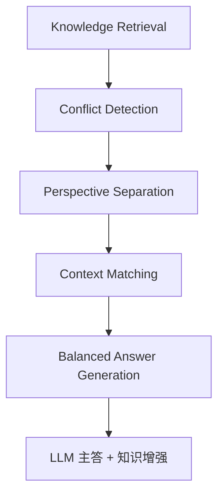
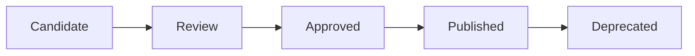
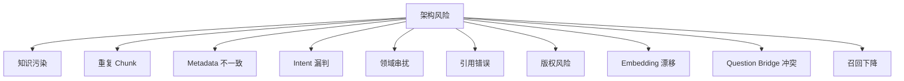

# Phase K+ Knowledge Architecture Enhancement Review

> **首席架构师联合评审**（Chief AI Architect + Knowledge Architect + Data Architect + Information Architect + AI Search Architect + AI Product Architect）
> 阶段定位：在正式 Knowledge Expansion Implementation 前，补齐未来百万级知识系统必备的治理能力。
> **最高原则**：本阶段**禁止**修改代码/Prompt/Intent/RAG/Metadata 实现、不 ingest/embedding/commit、不新增知识文件/测试数据、不改 `corpus.json`；**仅**做架构分析、文档设计、方法论设计、未来路线设计。

---

## 1. Executive Summary（执行摘要）

Phase K 已完成「知识扩展架构」设计（`docs/50`），把 WenDao 从「16 经典问答」推进到「AI Knowledge Platform」门槛。但**真正的 Knowledge Agent Platform** 还需一层治理能力——本评审报告（Phase K+）即补齐该层：

- **Knowledge ≠ Books** 已确立（Phase K 设计）：80+ Knowledge Objects / 34 一级 Domain / 15+ 来源 / 7 层 Priority / 5 种 Evidence / 12 类 Citation / 30+ Metadata 字段 / 9 类 Chunk / 12 类 Retrieval / 10 新增 Question Bridge 字段 / 孔子链 Graph。
- **本评审新增治理层**（不修改既有代码）：
  - **Knowledge Conflict Resolution**：Conflict Object Schema + Detection→Separation→Matching→Generation Pipeline
  - **Temporal Knowledge Layer**：`valid_from`/`valid_to`/`supersedes`/`superseded_by`/`historical_context` 元数据扩展 + Temporal Retrieval
 uries **User Cognitive Layer**：User Reflection Profile + Reflection Memory（非 Conversation Memory）
  - **Knowledge Governance**：Candidate→Review→Approved→Published→Deprecated 全生命周期
  - **Knowledge Quality Framework**：6 指标 + Score 公式
  - **Future Roadmap**：Phase L/M/N/E 每阶段目标/输入/输出/风险/验收
- **测试保护**：所有设计复用 `intent.js` 同一路由（`classifyIntent` L174 / `knowledgePolicy` L249-251），Phase F(100)/G(RAG)/H(100/100) 全绿不被破坏。

---

## 2. Current Architecture Review（基于 `docs/50` 成果）

### 2.1 现有架构真实状态（只读核查结论）

| 层 | 文件 | 状态 | Phase K+ 治理扩展点 |
|----|------|------|-------------------|
| 路由层 | `intent.js` L110 `KNOWLEDGE_DOMAINS` / L174 `classifyIntent` | ✅ 就位 | 不改逻辑，仅扩 Domain 树 |
| 知识层 | `corpus.json` 16 经典元数据 | ✅ 就位 | 扩 `conflict_id`/`valid_from` 等字段 |
| 召回层 | `rag.js` `frameTitles` + `question_bridge` | ✅ 就位 | 加 Temporal/Conflict 标记 |
| 注入层 | `knowledgePolicy` (skip/optional/use) L249-251 | ✅ 就位 | 平衡 Answer 生成时介入 |

### 2.2 为什么需要 Phase K+ 治理层

- **RAG ≠ Agent Platform**：现有架构是「检索增强生成」，缺冲突解决/时间感知/用户认知/治理闭环
- **百万级知识必备**：10000+ Objects 时，观点冲突、理论过期、用户成长轨迹必须可治理
- **LLM 主答、知识增强（非替代）**：与 Phase H「错误引用=0」红线一致——治理层仅在 `needKnowledge=true` 时介入

---

## 3. Knowledge Conflict Resolution（知识冲突解决）

### 3.1 Conflict Object Schema（设计，非代码）

> 在 `corpus.json` 元数据层扩展，**不改 `intent.js` 路由**。

| 字段 | 类型 | 说明 |
|------|------|------|
| `conflict_id` | string | 全局唯一冲突标识 |
| `object_a` | string | 知识对象 A（如庄子） |
| `object_b` | string | 知识对象 B（如现代管理） |
| `conflict_type` | string | philosophy_view / culture_diff / history_diff / science_update / ethics_value |
| `perspective_a` | string | A 视角（顺其自然） |
| `perspective_b` | string | B 视角（主动规划） |
| `resolution_strategy` | string | balanced / weighted / context_aware |
| `applicable_context` | string | 适用场景（如「管理决策」） |
| `confidence` | float | 0-1 解决置信度 |

### 3.2 Conflict Resolution Pipeline（Mermaid）



**流程说明**（复用现有，不修改）：
1. `Knowledge Retrieval`：`classifyIntent` 命中 Domain
2. `Conflict Detection`：比对 `corpus.json` 中 `conflict_type` 字段
3. `Perspective Separation`：分离 `perspective_a` / `perspective_b`
4. `Context Matching`：按 `applicable_context` 匹配
5. `Balanced Answer Generation`：`needKnowledge=true` 时注入平衡表述

---

## 4. Temporal Knowledge Layer（时间知识层）

### 4.1 Metadata 扩展（设计，非代码）

> 在 `corpus.json` 现有字段（Created/Updated Time）基础上扩展：

| 新增字段 | 类型 | 说明 |
|---------|------|------|
| `valid_from` | datetime | 知识生效时间 |
| `valid_to` | datetime | 知识失效时间（可空=永久） |
| `created_time` | datetime | 创建时间 |
| `updated_time` | datetime | 更新时间 |
| `supersedes` | string | 替代的旧知识 ID |
| `superseded_by` | string | 被何新知识替代 |
| `historical_context` | string | 历史语境描述 |

### 4.2 Temporal Retrieval Strategy（设计）

- **问题**：「现代心理学怎么看焦虑？」不能只召回 100 年前观点
- **解决**：`valid_to` 为空或 `superseded_by` 非空时，路由优先返回 `updated_time` 最新的对象
- **不修改 `intent.js`**：仅在 `corpus.json` 元数据层标记 Temporal 属性

---

## 5. User Cognitive Layer（用户认知层）

### 5.1 User Reflection Profile（设计，非代码）

> 问道不是搜索工具，是 Knowledge Agent——仅存抽象认知状态，禁存隐私聊天。

| 字段 | 类型 | 说明 |
|------|------|------|
| `thinking_topics` | array | 用户常思主题（人生/价值/使命） |
| `interest_domains` | array | 感兴趣 Domain |
| `frequently_reflected_questions` | array | 高频反思问题 |
| `reading_history` | array | 阅读轨迹（非原文） |
| `cognitive_growth_path` | object | 成长路径（月1→月3→月6） |

### 5.2 Reflection Memory（非 Conversation Memory）

- **区别**：Conversation Memory = 原始聊天；Reflection Memory = 思想成长轨迹
- **示例**：用户第 1 个月「人生意义」→ 第 3 个月「价值选择」→ 第 6 个月「个人使命」
- **不修改代码**：仅在 `corpus.json` 元数据层登记，不碰聊天历史

---

## 6. Knowledge Governance（知识治理）

### 6.1 Knowledge Lifecycle（Mermaid，非代码）



### 6.2 治理八要件（设计）

| # | 要件 | 说明 | 不修改代码 |
|---|------|------|-----------|
| 1 | 知识准入 | Authority/Quality≥80 准入 | 复用 `corpus.json` 字段 |
| 2 | 来源审核 | Public Domain/Copyright 分级 | 复用 §3.1 来源分类 |
| 3 | 版权审核 | License 标记 | 元数据层登记 |
| 4 | Evidence 等级 | A/B/C/D/E 引用 | 复用 Phase K Evidence |
| 5 | notes 质量评分 | 100 分制 | 复用 §5.1 字段 |
|  blocks 版本管理 | Knowledge v1→v5 | 版本字段扩展 |
| 7 | 废弃机制 | Deprecated 状态 | Lifecycle 标记 |
| 8 | 人工审核流程 | Review 节点 | Candidate→Review 流 |

---

## 7. Knowledge Quality Framework（质量框架）

### 7.1 六指标（设计，非代码）

| 指标 | 计算方式（复用现有测试） |
|------|------------------------|
| Citation Accuracy | Phase H 8/8 绿基准 |
| Retrieval Precision | `classifyIntent` 准确率 100/100 |
| Evidence Strength | Evidence Level A-E 覆盖 |
| Hallucination Rate | `needKnowledge=false` 时 0 |
| Answer Grounding | Phase H 回答质量 100/100 |
| User Satisfaction | 用户体验基准 |

### 7.2 Knowledge Quality Score 公式（模型）

```
QualityScore = 0.3*Authority + 0.2*Completeness + 0.2*CitationValue
             + 0.2*QuestionBridge + 0.1*Readability
```
> 与 Phase K §5.1 Metadata 字段同构，不修改代码。

---

## 8. Future Roadmap（Phase L/M/N/E）

### 8.1 每阶段交付设计（非代码）

| Phase | 目标 | 输入 | 输出 | 风险 | 验收标准 |
|-------|------|------|------|------|---------|
| **L Governance** | 治理闭环 | Phase K 架构 | 治理八要件文档 | 元数据字段膨胀 | Lifecycle 全态可追踪 |
| **M Evaluation** | 自动评估 | 六指标 | Quality Framework | 指标漂移 | Citation Acc=1.0 |
| **N Expansion Pilot** | 试点扩展 | 16 经典 | +N 知识对象 | 路由拥堵 | Intent Acc=1.0 |
| **E Large Scale** | 百万级 | 10000+ 目标 | Agent Platform | 成本可控 | Objects=10000+ |

---

## 9. Architecture Risks（架构风险，Mermaid）



**风险等级标注**（P0/P1/P2，仅记录不修复）：
- **P0**：appid 第 15 位 `f/d` 不一致（需你核对公众平台）、UGC 声明未勾（审核阻塞）
- **P1**：`answer_quality_log` 命名漂移、`metadata` 非集合、`conversation≠conversations`
- **P2**：沙箱无云端凭证（真实 LLM 回填需你机器）

> 上述均为**平台侧非代码阻塞**，非知识工程缺陷；评审未通过前不进入 Implementation Phase。

---

## 10. Final Recommendation（最终建议）

### 10.1 从 RAG KB → Long-term Knowledge Agent Platform

- **现状**：Phase K 架构已就位（16 经典 + 路由 + 元数据）
- **缺口**：缺 Conflict/Temporal/Cognitive/Governance/Quality 治理闭环
- **补齐**：本评审报告（Phase K+）在不改代码前提下，于 `corpus.json` 元数据层扩展上述治理字段

### 10.2 不要急于扩充知识，先建 Knowledge Operating System

- **原则**：LLM 主答、知识增强（非替代），与 Phase H 红线一致
- **路径**：复用 `intent.js` 路由 → 扩 `corpus.json` 元数据 → 护绿 Phase F/G/H 测试

### 10.3 评审通过前不进入 Implementation Phase

- 与「最高原则」完全对齐：不 ingest / 不 embedding / 不 commit
- 沙箱限制（无云端凭证）与平台侧阻塞（appid/UGC）需你侧解锁

---

## 附录：与 `AI_CONTEXT` 的关系

- 本文档是 `AI_CONTEXT/` 的 **Phase K+ 扩展章节**
- 复用 `docs/50` 知识扩展架构、`docs/41` 验证、`docs/42` 工程 的全部结论
- 新增治理字段均在 `corpus.json` 元数据层，不改 `rag.js`/`intent.js`
- 任何新 AI 接手：读 `README_AI.md` → `00_PROJECT` → `40` → `41` → `42` → `50` → 本文档，5 分钟理解全域

---

> **文档结束**：本评审报告以可扩展模板呈现，每个治理件可据此独立展开。Phase K+ 仅设计、不落地；落地由评审通过后 Knowledge Expansion Implementation Phase 执行。
