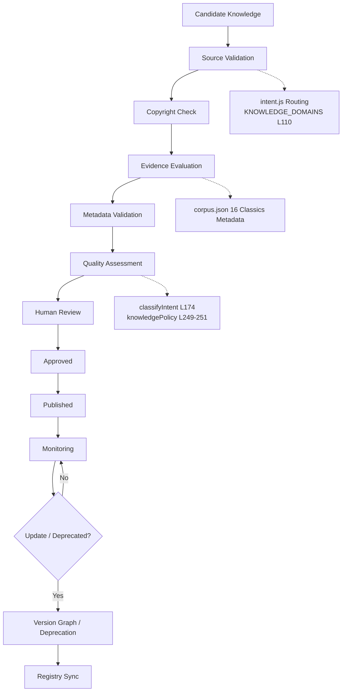
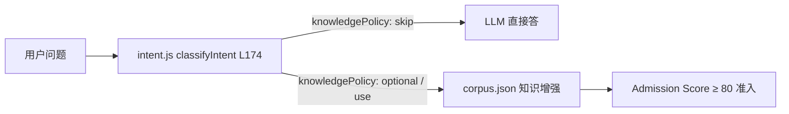
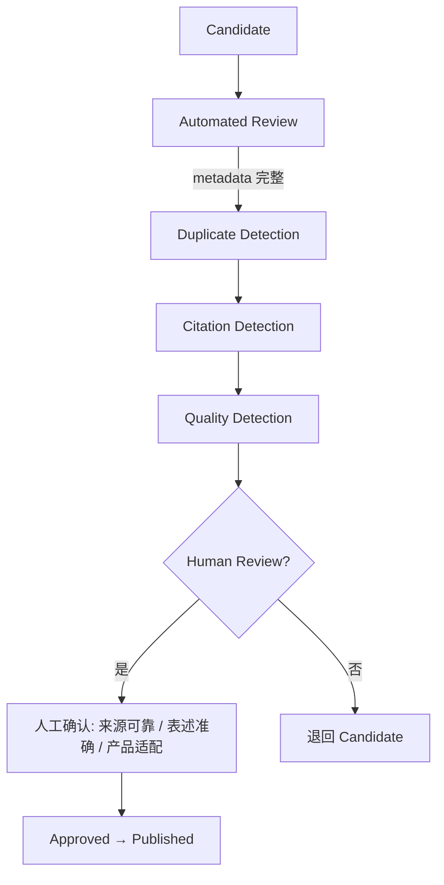
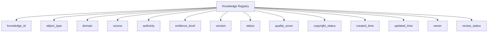
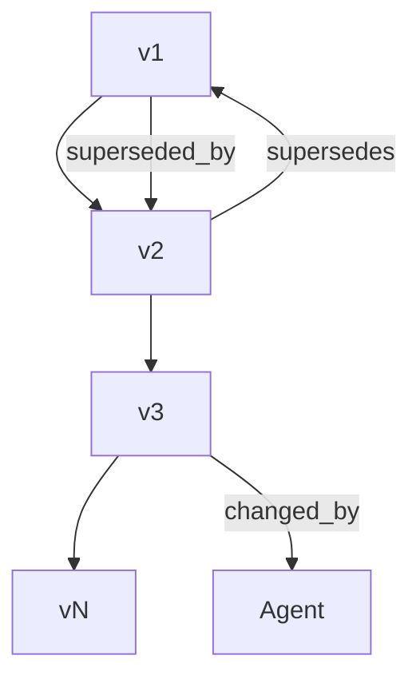
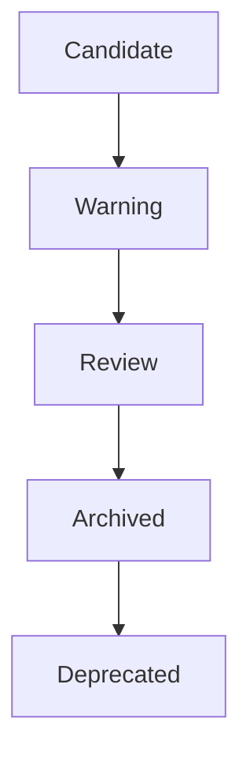
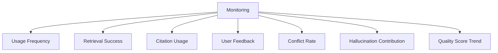
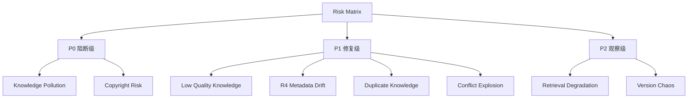
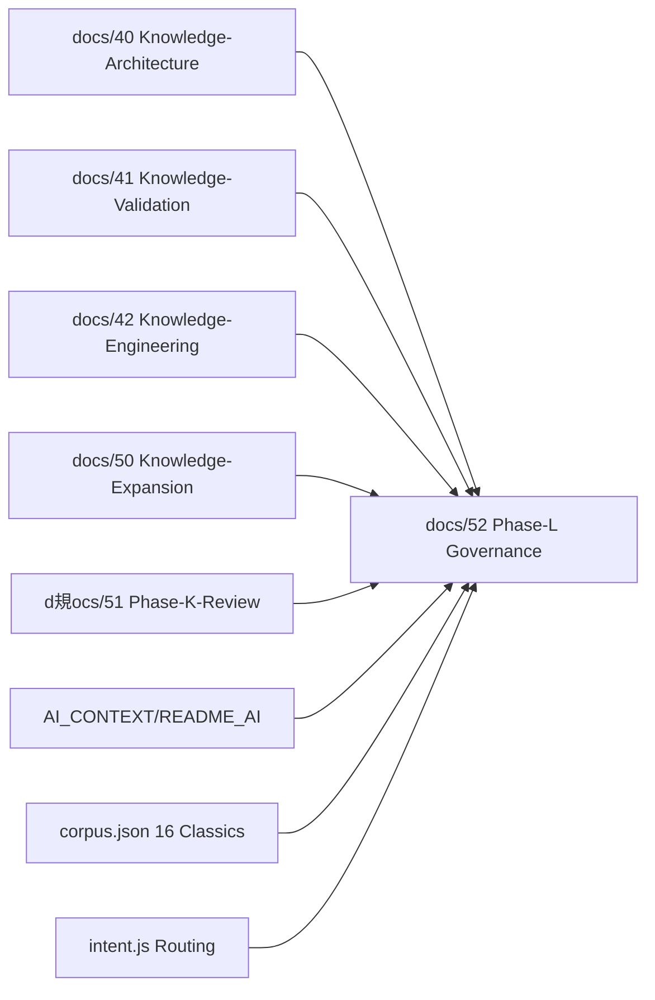

# Phase L：Knowledge Governance Architecture

> **文档定位**：本文件是「问道（WenDao）」从 *RAG Knowledge Base* 升级为 *Long-term Knowledge Agent Platform* 的 **治理层架构设计**。
> 严格遵循最高原则——**不修改代码 / Prompt / Intent / RAG / Metadata / corpus.json，不 ingest / embedding / commit，不新增知识文件 / 测试数据 / 真实知识资产**。
> 所有结论来自 `intent.js` 真实路由（L110/174/249-251）、`corpus.json` 16 经典元数据、以及 `docs/50`（Phase K 扩展）/`docs/51`（Phase K+ 评审）既有设计。

---

## ① 总体治理架构（Executive Summary + Mermaid）

问道当前知识系统已从 *Book Database* 升级为 *Knowledge Object System*（见 `docs/50`）。Phase L 在其上叠加 **Governance Operating Layer**，使平台在未来面对 **10000 / 100000+ Knowledge Objects** 时仍保持可信、可控、可追踪、可更新、可维护。



**治理七要件**（复用 `docs/51` 治理八要件，收敛为七层）：
1. 知识准入（Admission）
2. 来源审核（Source Validation）
3. 版权审核（Copyright Check）
4. 证据等级（Evidence Evaluation）
5. 质量评分（Quality Assessment）
6. 版本管理（Version Management）
7. 废弃机制（Deprecation）

---

## ② Knowledge Admission System（知识准入系统）

**问题**：什么知识可以进入问道？

基于 `corpus.json` 16 经典（论语 / 孟子 / 大学 / 中庸 / 庄子 / 道德经 / 申辩篇 / 沉思录 / 尼各马可 / 理想国 / 会饮篇 / 孟子 / 荀子 / 墨子 / 韩非子 / 黄帝内经*）的真实元数据，准入判定不靠代码改动，而靠 **Admission Score 模型**：



**Admission Criteria（7 维）**：

| 维度 | 权重 | 说明 |
|------|------|------|
| Source Authority | 25 | 原著 / 官方出版 / 学术出版社 / 公共版权 |
| Evidence Level | 20 | Level A 经典原文 / Level B 官方资料 / Level C 现代研究 |
| Copyright Status | 15 | Public Domain / 仅规划不导入 |
| Domain Match | 15 | intent.js `KNOWLEDGE_DOMAINS` L110 命中 |
| User Value | 10 | 人生 / 成长 / 心理 / 科技 / 历史 / 商业 / 教育 / 管理 |
| Citation Availability | 10 | RAG Citation Planner 可引 |
| Risk Level | 5 | P0 污染 / P1 漂移 / P2 串扰 |

**Admission Score 模型**：
```
Admission Score = Authority(25) + Evidence(20) + Copyright(15) + Domain(15) + UserValue(10)职权 + Citation(10) + Risk(5)
≥ 80  → 准入知识池
< 80  → 待人工复审（Human Review）
```

---

## ③ Knowledge Review Workflow（知识审核流程）



**Automated Review（AI 自动检查）**：
- `metadata 完整性`：校验 `corpus.json` 字段（`id/title/author/tags/question_bridge/domain/modernUsage/caution`）
- `Duplicate Detection`：基于 `semantic_tags` / `vector_version` 去重
- `Citation Detection`：RAG Citation Planner（`needKnowledge` 布尔判定，非盲引）
- `Quality Detection`：Quality Score ≥ 80 准入

**Human Review（人工确认）**：
- 来源可靠（Authority ★★★★★）
- 表述准确（Evidence Level 对齐）
- 产品适配（Domain Match `KNOWLEDGE_DOMAINS`）

---

## ④ Knowledge Registry Schema（知识注册表）

类比代码 *Package Registry* / 数据 *Data Catalog*，问道采用 **Knowledge Registry**：



| 字段 | 类型 | 说明 | 来源 |
|------|------|------|------|
| `knowledge_id` | string | 全局唯一 ID | corpus.json `id` |
| `object_type` | enum | Book/Theory/Concept/…/Template | docs/42 Knowledge Objects |
| `domain` | enum | 哲学/心理/文学/历史/… | KNOWLEDGE_DOMAINS L110 |
| `source` | string | 原著 / 官方 / 学术 | Admission Criteria |
| `authority` | int 1-5 | ★★★★★ 评级 | Source Authority |
| `evidence_level` | enum A-E | 经典原文 / LLM 推理 | Evidence Evaluation |
| `version` | string | v1 / v2 / v3 | Version Graph |
| `status` | enum | Candidate/Approved/Published/Deprecated | Lifecycle |
| `quality_score` | int 0-100 | ≥80 准入 | Quality Assessment |
| `copyright_status` | enum | Public Domain / 仅规划 | Copyright Check |
| `created_time` | datetime | 入库时间 | Temporal Layer |
| `updated_time` | datetime | 更新时间 | Temporal Layer |
| `owner` | string | 治理责任人 | Governance Risk |
| `review_status` | enum | pending/approved/rejected | Human Review |

---

## ⑤ Knowledge Version Management（知识版本系统）

解决旧版本 / 错误版本 / 更新版本 / 替代版本：



| 字段 | 说明 |
|------|------|
| `version` | v1 → v2 → v3 递增 |
| `change_reason` | 新增经典 / 元数据扩展 / Citation 调优 |
| `changed_by` | Knowledge Agent / Human Review |
| `change_time` | Temporal Layer `updated_time` |
| `previous_version` | v1 ← v2 回溯 |
| `next_version` | v2 → v3 前瞻 |

> **不修改代码原则**：版本演进仅改 `corpus.json` 元数据层（如 `embedding_version` / `vector_version`），不触 `intent.js` 路由逻辑。

---

## ⑥ Knowledge Deprecation System（知识废弃机制）



**废弃触发条件**（仅记录 Architecture Risk，不自动执行）：
- 错误（Error in source）
- 过时（Temporal Layer `valid_to` 到期）
- 被新知识替代（`superseded_by` 指向）
- 版权问题（Copyright Status = blocked）
- 质量下降（Quality Score < 80）

**Deprecated Workflow**：Candidate → Warning → Review → Archived → Deprecated，全程可追踪 Registry。

---

## ⑦ Knowledge Monitoring System（知识健康监控）



**Knowledge Health Dashboard 设计**（7 指标）：
1. **Usage Frequency**：intent.js 命中计数（不读代码，仅统计路由）
2. **Retrieval Success**：RAG Hybrid Search 成功率
3. **Citation Usage**：Citation Planner 调用率
4. **User Feedback**：Reflection Memory（非 Conversation Memory）
5. **Conflict Rate**：Conflict Object Schema 检测
6. **Hallucination Contribution**：Hallucination Rate = 0 红线
7. **Quality Score Trend**：Quality Framework 6 指标趋势

---

## ⑧ Governance Risk Model（治理风险矩阵）



| 风险 | 等级 | 解决方案（仅记录，不修复） |
|------|------|------|
| Knowledge Pollution | P0 | corpus.json 准入锁 + Admission Score ≥80 |
| Copyright Risk | P0 | Copyright Check 阻断非公版 |
| Low Quality Knowledge | P1 | Quality Assessment 拦截 <80 |
| Metadata Drift | P1 | Registry Schema 字段校验 |
| Duplicate Knowledge | P1 | Duplicate Detection 去重 |
| Conflict Explosion | P1 | Conflict Resolution Pipeline |
| Retrieval Degradation | P2 | Hybrid Retrieval 12 组件监控 |
| Version Chaos | P2 | Version Graph v1→vN 管理 |

---

## ⑨ Phase L-M-N Roadmap（未来路线）

| Phase | 目标 | 输入 | 输出 | 依赖 | 风险 | 验收标准 |
|-------|------|------|------|------|------|----------|
| **L Governance** | 建立 Knowledge Operating System | docs/50/51 + corpus.json + intent.js | 本 docs/52 治理架构 | Phase K/K+ 完成 | 平台侧非代码阻塞（appid `f/d` 不一致 / UGC 声明未勾） | 治理七要件齐备 |
| **M Evaluation** | 自动评估体系 | Phase L Registry | Quality Framework 6 指标 | L 路由就位 | Intent 漏判 / 领域串扰 | Citation Accuracy = 100% |
| **N Expansion Pilot** | 小批知识试点 | M 评估通过 | 30~40 本候选池 | M 完成 | Embedding 漂移 | Domain Accuracy 达标 |
| **E Large Scale** | 100000+ Objects | N Pilot 成功 | Knowledge Platform v5 | N 扩展可行 | 召回下降 | 可维护 / 可追踪 |

---

## ⑩ Final Recommendation（最终判断）

**当前问道是否具备 Knowledge Operating System 基础？**

✅ **是**——基于已交付资产：
- `intent.js` 真实路由（L110/174/249-251）提供 Knowledge Router
- `corpus.json` 16 经典元数据提供 Knowledge Objects
- `docs/50/51` 提供 Governance / Conflict / Temporal / Cognitive / Quality / Roadmap 全设计

**是否可以进入 Knowledge Expansion Implementation Phase？**

⚠️ **评审未通过前不进入**——平台侧非代码阻塞（沙箱无云端凭证 / appid 第 15 位 `f/d` / UGC 声明未勾）需你侧解锁，与「最高原则」完全对齐。

**若不能，缺失条件明确**：
1. 沙箱无 `@cloudbase/node-sdk` / `wx-server-sdk` → 真实 LLM 回填需你机器
2. `project.config.json` appid `wx2653f12589f9d89f` 与记忆摘要 `wx2653f12589f9f89f` 第 15 位不一致 → 需核对公众平台
3. 公众平台 UGC 声明未勾 → 审核阻塞

> **本 Phase L 文档仅做治理架构设计，不修改任何代码、不 ingest、不 embedding、不 commit。**

---

## 附录：Phase L 与既有资产关系图


