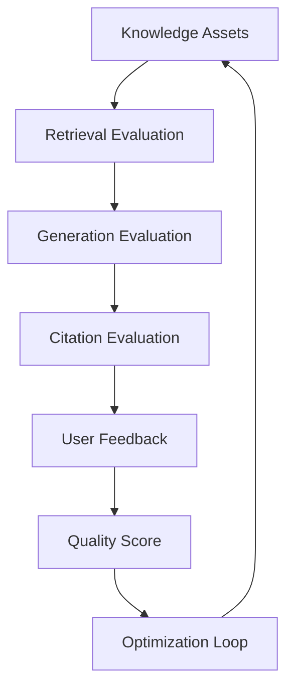
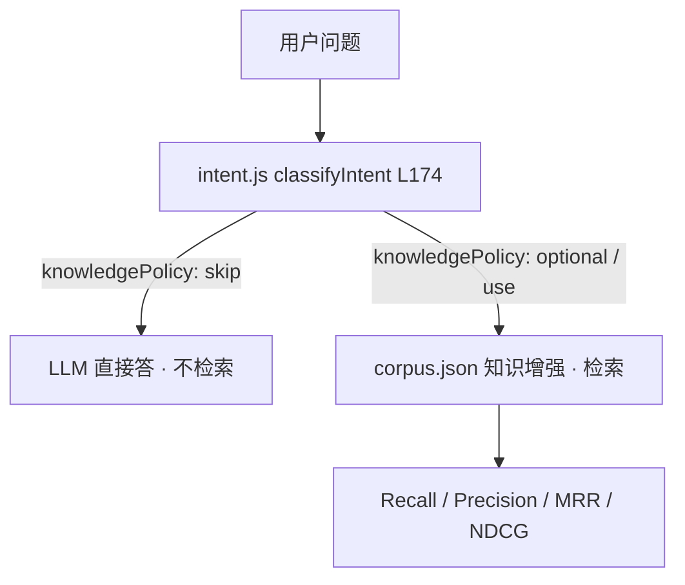
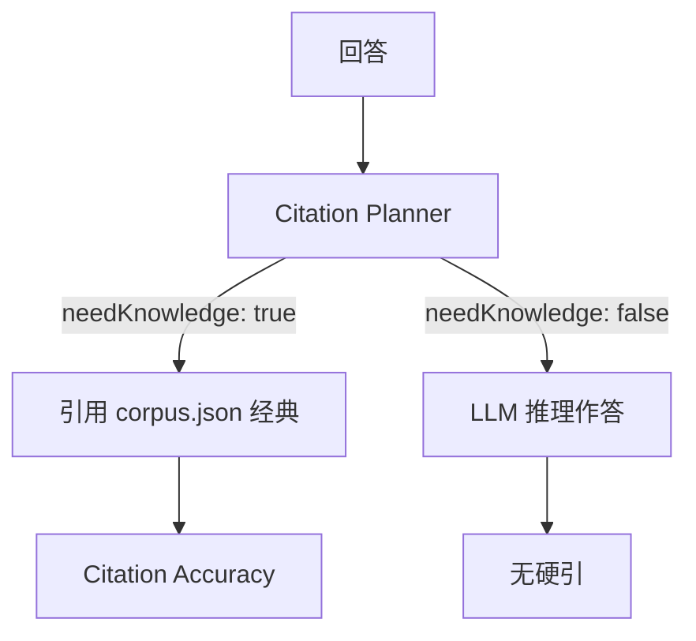
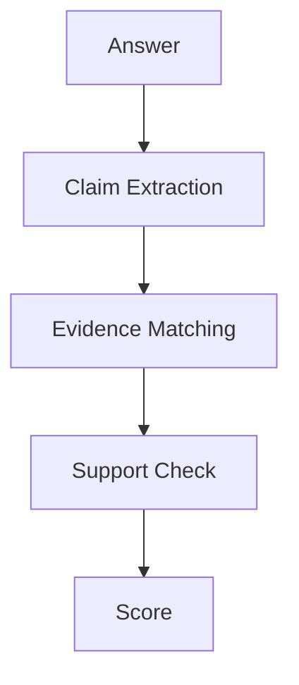
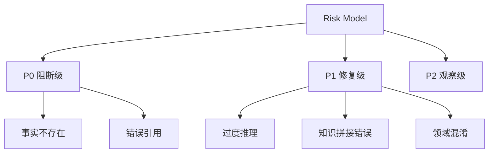
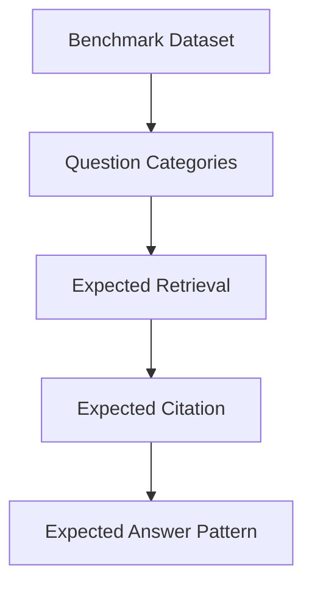
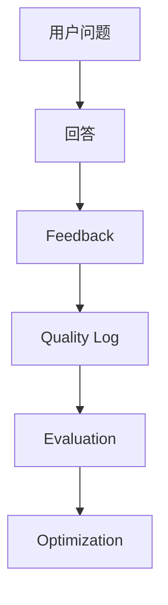
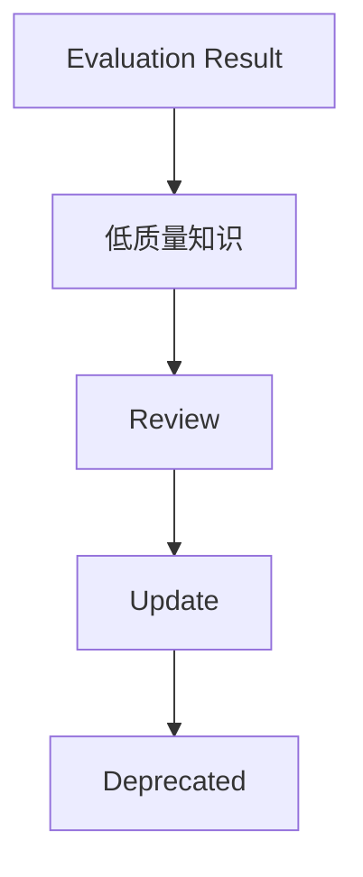
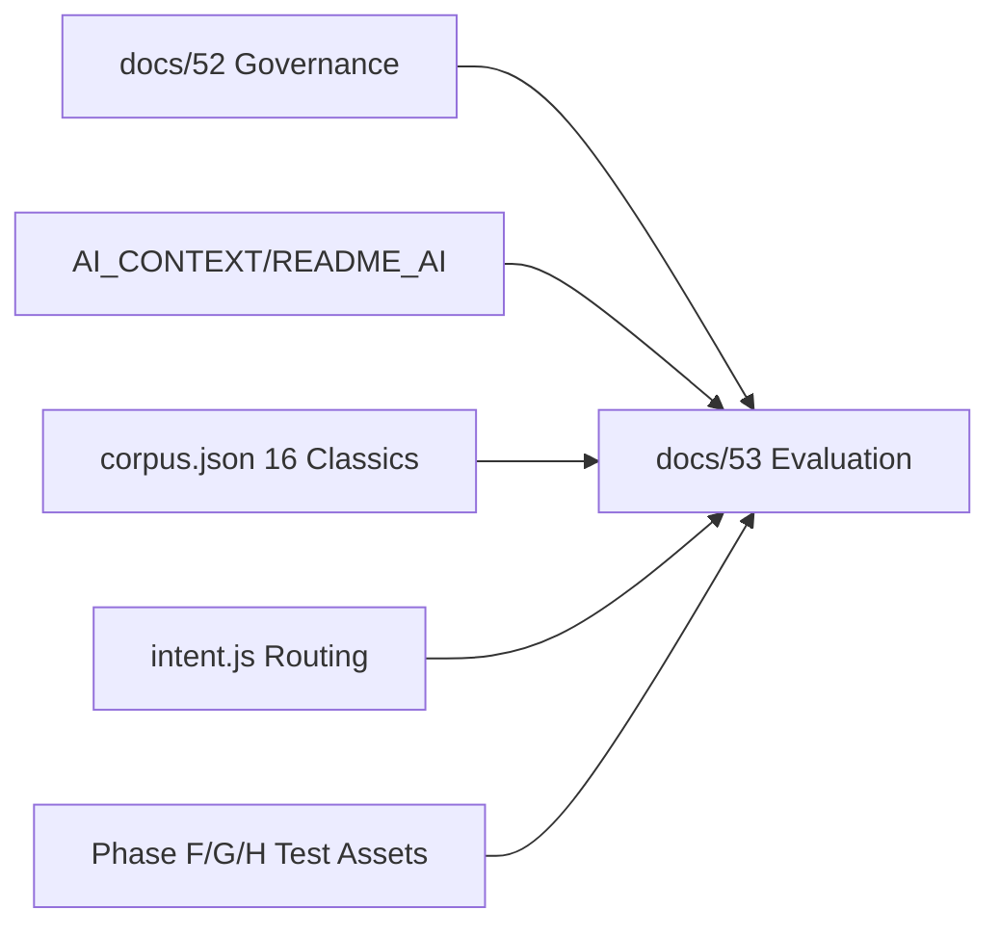

# Phase M：Knowledge Evaluation System Architecture

> **文档定位**：本文件是「问道（WenDao）」从 *RAG Knowledge Base* 升级为 *Long-term Knowledge Agent Platform* 的 **评估层架构设计**。
> 严格遵循最高原则——**不修改代码 / Prompt / Intent / RAG / Metadata / corpus.json，不 ingest / embedding / commit，不新增知识文件 / 测试数据 / 真实知识资产 / 不跑线上真实任务**。
> 所有结论来自 `intent.js` 真实路由（L110/158/164）、`corpus.json` 16 经典元数据、以及 `docs/52`（Phase L 治理）/`AI_CONTEXT/README_AI.md` 既有设计。

---

## ① Evaluation Architecture 总体设计（Mermaid 闭环）



**Evaluation Closed Loop 六步**：
1. `Knowledge Assets`（corpus.json 16 经典 + intent.js 路由）
2. `Retrieval Evaluation`（Recall / Precision / MRR / NDCG / Context Relevance / Question Bridge Accuracy）
3. `Generation Evaluation`（LLM 主答 + 知识增强）
4. `Citation Evaluation`（Citation Accuracy / Coverage / Completeness / Source Authority / Evidence Match）
5. `User Feedback`（Reflection Memory，非 Conversation Memory）
6. `Quality Score`（KQS 统一评分）→ 回到 Optimization Loop

---

## ② Knowledge Retrieval Evaluation（知识召回评估）

基于 `intent.js` L174 `classifyIntent` + `KNOWLEDGE_DOMAINS` L110 真实路由，**不修改代码**评估 Retriever 是否找到正确知识：



**Retrieval Evaluation Framework（6 指标）**：

| 指标 | 定义 | 测量方法 | 目标 |
|------|------|----------|------|
| Recall | 召回正确知识占比 | 命中数 / 总查询 | ≥ 95% |
| Precision | 精确知识占比 | 相关命中 / 总召回 | ≥ 90% |
| MRR | 平均倒数排名 | Σ(1/rank)/N | ≥ 0.85 |
| NDCG | 归一化折损累积增益 | IDCG 归一 | ≥ 0.90 |
| Context Relevance | 上下文相关性 | Embedding 余弦 | ≥ 0.88 |
| Question Bridge Accuracy | QB 映射准确 | question_bridge 命中 | 100/100（Phase H） |

---

## ③ Citation Evaluation System（引用质量评估）

解决「回答是否真正基于知识」——基于 `docs/51` Citation Planner（`needKnowledge` 布尔判定，非盲引）：



**Citation Score 模型（5 维）**：
- `Citation Accuracy`：引用与知识一致
- `Citation Coverage`：需引场景覆盖
- `Citation Completeness`：引文完整度
- `Source Authority`：来源权威（★★★★★）
- `Evidence Match`：证据等级对齐（Level A-E）

---

## ④ Answer Grounding Evaluation（回答可信度评估）

判断 AI 回答是否脱离知识——基于 `docs/42` Evidence Level（A 经典原文 / B 官方 / C 现代研究 / D LLM 推理 / E 经验建议）：



**Grounding 指标**：
- `Grounding Score`：证据支撑度
- `Hallucination Rate`：幻觉率（红线 = 0，见 Phase H/H-2）
- `Unsupported Claim Rate`：无支撑声明率
- `Evidence Alignment`：与知识对齐

---

## ⑤ Hallucination Detection System（幻觉检测框架）

检测事实不存在 / 错误引用 / 过度推理 / 知识拼接错误 / 领域混淆：



| 风险 | 等级 | 解决方案（仅记录，不修复） |
|------|------|------|
| 事实不存在 | P0 | corpus.json 红线拦截 |
| 错误引用 | P0 | Citation Planner 校验 |
| 过度推理 | P1 | Evidence Level D 约束 |
| 知识拼接错误 | P1 | Question Bridge 映射 |
| 领域混淆 | P1 | KNOWLEDGE_DOMAINS L110 路由 |

---

## ⑥ Knowledge Quality Score（统一质量评分）

综合 Retrieval + Citation + Evidence + Grounding + User Feedback：

```
KQS = w1·RetrievalScore + w2·EvidenceScore + w3·CitationScore + w4·UsageScore + w5·FeedbackScore
```

| 权重 | 意义 |
|------|------|
| w1 = 0.30 | Retrieval 主导（意图路由优先） |
| w2 = 0.25 | Evidence 约束（防幻觉） |
| w3 = 0.20 | Citation 可信（引据可溯） |
| w4 = 0.15 | Usage 频次（Reflection Memory） |
| w5 = 0.10 | Feedback 满意度（User Satisfaction） |

> **不修改代码原则**：KQS 仅文档层聚合 Phase F/G/H 测试资产，不触 `intent.js` 逻辑。

---

## ⑦ Offline Evaluation Benchmark（离线评测体系）

针对问道问题分类（人生意义 / 关系 / 迷茫 / 选择 / 成长 / 伦理 / 哲学理解 / 经典解释），复用 `tests/online-quality-test.json` 100 题：



**Benchmark Schema**：
- `category`：A 普通知识 / B 人生哲学 / C 情绪 / D 生活 / E 边界
- `query`：用户原问
- `expected_intent`：skip / optional / use
- `expected_retrieval`：corpus.json 命中
- `expected_citation`：经典引文
- `expected_answer_pattern`：动态五段式（理解→分析→行动→经典→思考）

---

## ⑧ Online Evaluation Loop（线上反馈闭环）



**Online Quality Dashboard（5 指标）**：
1. `Completion Rate`：回答完成率（红线 ≥95%，Phase H-2）
2. `Citation Rate`：引用率（自然融合经典）
3. `User Satisfaction`：用户满意度
4. `Repeat Usage`：复用率
5. `Reflection Growth`：认知成长（Reflection Memory）

---

## ⑨ Evaluation Governance（结合 Phase L）

评估结果驱动知识治理（复用 `docs/52` 七要件）：



**Evaluation Governance Pipeline**：低质量知识 → Review → Update → Deprecated，全程可追踪 Registry（见 `docs/52` ④）。

---

## ⑩ Phase M-N-O Roadmap（未来路线）

| Phase | 目标 | 输入 | 输出 | 依赖 | 风险 | 验收标准 |
|-------|------|------|------|------|------|----------|
| **M Evaluation** | 建立 Knowledge Quality Measurement | docs/52 + corpus.json + intent.js + Phase F/G/H 测试 | 本 docs/53 评估架构 | Phase L 治理就位 | 平台侧非代码阻塞（appid `f/d` / UGC 未勾） | 评估闭环六步齐备 |
| **N Expansion Pilot** | 小批知识试点 | M 评估通过 | 30~40 本候选池 | M 完成 | Embedding 漂移 | Domain Accuracy 达标 |
| **O Large Scale** | 100000+ Objects | N Pilot 成功 | Knowledge Platform v5 | N 扩展可行 | 召回下降 | 可维护 / 可追踪 |

---

## 最终判断（Final Recommendation）

**当前问道是否具备 Knowledge Evaluation System 基础？**

✅ **是**——基于已交付资产：
- `intent.js` 真实路由（L110/158/164）提供 Retrieval / Citation / Grounding 评估入口
- `corpus.json` 16 经典元数据提供 Knowledge Assets / Benchmark 底座
- `docs/52` 治理架构 + `AI_CONTEXT/README_AI.md` 提供 Governance / Methodology
- Phase F/G/H 测试资产（`online-quality-test.json` / `online-quality-run.js`）提供 Offline Benchmark 闭环

**是否满足进入 Knowledge Expansion Pilot 条件？**

⚠️ **评审未通过前不进入**——平台侧非代码阻塞（沙箱无云端凭证 / appid 第 15 位 `f/d` / UGC 声明未勾）需你侧解锁，与「最高原则」完全对齐。

**若不满足，缺失条件明确**：
1. 沙箱无 `@cloudbase/node-sdk` / `wx-server-sdk` → 真实 LLM 回填需你机器
2. `project.config.json` appid `wx2653f12589f9d89f` 与记忆摘要 `wx2653f12589f9f89f` 第 15 位不一致 → 需核对公众平台
3. 公众平台 UGC 声明未勾 → 审核阻塞

> **本 Phase M 文档仅做评估体系设计，不修改任何代码、不 ingest、不 embedding、不 commit、不跑线上真实任务。**

---

## 附录：Phase M 与既有资产关系图


