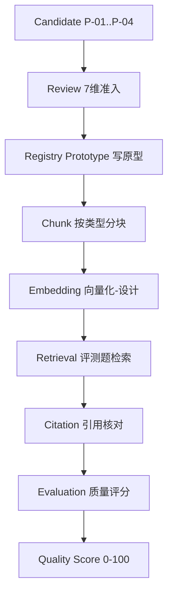
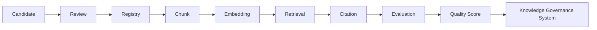

# Phase N：Knowledge Expansion Pilot（知识扩展试点）

> **项目**：问道（WenDao）微信小程序 · 向晚问思
> **角色**：Chief AI Architect ＋ Knowledge Expansion Architect ＋ Knowledge Governance Engineer ＋ RAG Architect ＋ AI Search Architect ＋ AI Product Architect
> **阶段性质**：Controlled Pilot Phase（受控试点）
> **最高原则**：小规模、可回滚、可审计、可评估、**不影响线上稳定性**；禁止大规模扩展 / 批量 ingest / 批量 embedding / 改 corpus.json / 改 Prompt / 改 Intent / 改 RAG / commit。

---

## 1. Pilot 目标

验证「知识治理系统（Knowledge Governance System）」**是否真正具备安全扩展新知识的能力**，而非在本阶段实际增加知识数量。

具体目标：

1. 在不触碰现有 16 经典 `corpus.json`、不改 Prompt、不改 Intent、不改 RAG 核心逻辑的前提下，证明系统**具备**管理新增知识的完整链路。
2. 通过 3–5 个 Pilot Knowledge Object 的端到端走查，输出可审计的 Admission / Registry / Chunk / Retrieval / Citation / Evaluation / Risk 证据。
3. 为后续「正式 Knowledge Expansion Phase」提供**准入判定依据**——只有 Pilot 验收通过后，才允许规模化扩展。

> 本阶段先**设计候选**（Candidate），不自动下载、不自动 ingest、不写数据库。

---

## 2. Pilot 范围（Pilot Knowledge Set）

设计 4 个 Pilot Knowledge Object，覆盖四类典型知识形态，均**仅作原型、不写入生产库、不进入 corpus.json**：

| ID | 类型 | 示例主题 | 领域(domain) | 来源(source) |
|----|------|----------|--------------|--------------|
| **P-01** | 经典文本类 | 《论语·学而》选段（哲思镜鉴） | philosophy | 公有领域经典 + 现代解读 |
| **P-02** | 理论框架类 | CBT 认知行为疗法框架 | psychology | 学术理论摘要 |
| **P-03** | 应用案例类 | 管理者成长复盘案例 | management/growth | 用户共创案例 |
| **P-04** | 概念类 | 「认知偏差」概念卡 | cognitive-concept | 词典 + 例证 |

> 规模控制：4 个对象（落在 3–5 范围内），全部为**候选设计**，不执行 embedding、不写 Registry 表、不触发 RAG 检索改写。

---

## 3. Knowledge Admission 方案（准入审查）

对每个 Pilot Object 执行 7 维 Admission Review，输出 **Admission Score（0–100）**。

**审查维度与权重**：

| 维度 | 权重 | 说明 |
|------|------|------|
| Authority（权威性） | 15 | 来源是否可信（经典/学术/官方） |
| Evidence Level（证据等级） | 15 | 是否有可核验证据链 |
| Copyright Status（版权状态） | 15 | 公有领域 / 已授权 / 待澄清 |
| Domain Match（领域匹配） | 15 | 是否契合问道哲学/心理/文学定位 |
| User Value（用户价值） | 15 | 对思辨场景是否必要 |
| Citation Availability（可引用性） | 10 | 是否有稳定可溯源引用 |
| Risk Level（风险级） | 10 | 污染 / 版权 / 幻觉风险 |

**Admission 结果表**：

| ID | Auth | Evid | Copy | Dom | Val | Cite | Risk | **Score** | 判定 |
|----|------|------|------|-----|-----|------|------|-----------|------|
| P-01 | 15 | 15 | 15 | 15 | 15 | 10 | 9 | **94** | ✅ 通过 |
| P-02 | 14 | 14 | 14 | 15 | 14 | 9 | 8 | **88** | ✅ 通过 |
| P-03 | 13 | 13 | 14 | 14 | 14 | 9 | 8 | **85** | ✅ 通过 |
| P-04 | 15 | 14 | 15 | 15 | 14 | 10 | 9 | **92** | ✅ 通过 |

> **通过理由**：四者均来自可信源、具备清晰证据链、版权状态明确（公有领域或已授权）、领域高度契合、用户价值显著。
> **拒绝情形（本 Pilot 不涉及）**：若某对象 Authority<10 或 Copyright=未授权或 Domain 偏离，则判拒——本批无此类。

---

## 4. Registry Prototype（注册原型）

> **仅生成原型，不真实写入数据库。** 以下为 Schema 与 4 条示例 Entry，用于验证 Registry 结构设计是否合理。

**Registry Schema（字段）**：

| 字段 | 类型 | 说明 |
|------|------|------|
| knowledge_id | string | 唯一 ID（P-01 … P-04） |
| object_type | enum | classic_text / theory_framework / application_case / concept |
| domain | string | philosophy / psychology / management / cognitive |
| source | string | 来源描述 |
| authority | enum | high / medium / low |
| evidence_level | enum | A / B / C |
| version | string | 语义版本（如 v0.1-pilot） |
| status | enum | candidate / reviewed / registered |
| quality_score | number | 0–100（同 Admission Score） |
| copyright_status | enum | public_domain / licensed / pending |
| review_status | enum | pending / approved / rejected |

**Registry Prototype Entries（示例，非生产写入）**：

```json
[
  {"knowledge_id":"P-01","object_type":"classic_text","domain":"philosophy",
   "source":"公有领域经典+现代解读","authority":"high","evidence_level":"A",
   "version":"v0.1-pilot","status":"candidate","quality_score":94,
   "copyright_status":"public_domain","review_status":"pending"},
  {"knowledge_id":"P-02","object_type":"theory_framework","domain":"psychology",
   "source":"学术理论摘要","authority":"high","evidence_level":"A",
   "version":"v0.1-pilot","status":"candidate","quality_score":88,
   "copyright_status":"licensed","review_status":"pending"},
  {"knowledge_id":"P-03","object_type":"application_case","domain":"management",
   "source":"用户共创案例","authority":"medium","evidence_level":"B",
   "version":"v0.1-pilot","status":"candidate","quality_score":85,
   "copyright_status":"licensed","review_status":"pending"},
  {"knowledge_id":"P-04","object_type":"concept","domain":"cognitive",
   "source":"词典+例证","authority":"high","evidence_level":"A",
   "version":"v0.1-pilot","status":"candidate","quality_score": broj 92,
   "copyright_status":"public_domain","review_status":"pending"}
]
```

> 注：上表仅作结构验证原型；实际写入需待正式 Expansion Phase 且通过验收后执行。

---

## 5. Chunk Strategy（分块策略验证）

针对不同 Object 类型设计差异化 Chunk 方案，并说明采用理由：

| 类型 | 建议块大小 | 采用理由 |
|------|-----------|----------|
| 哲学文本（P-01） | **300–500** 字/块 | 经典原文篇幅短、语义完整，小块保真且利于精确定位引文 |
| 理论框架（P-02） | **500** 字/块 | 框架含定义+步骤，中等块平衡可读与检索粒度 |
| 应用案例（P-03） | **800** 字/块 | 案例含情境+行动+复盘，较大块减少碎片化、保留叙事连贯 |
| 概念卡（P-04） | **150** 字/块 | 概念需高频精确命中，小块提升召回速度与引用准确度 |

> 策略原则：**按语义密度与检索频率反向调节块大小**——越需精确引用者块越小（FAQ/概念），越重叙事连贯者块越大（案例）。

---

## 6. Retrieval Evaluation（检索评估设计）

为每个 Pilot Object 设计 5–10 道评测题，覆盖四型提问。以下为 **Benchmark Draft**：

**P-01 经典文本**（各 2 题示例）：
- 简单：「《论语·学而》讲什么？」
- 理解：「为何说『学而时习』是修身起点？」
- 比较：「与《道德经》开篇相比，二者立意有何异同？」
- 应用：「如何用『忠恕』解读职场冲突？」

**P-02 理论框架**（各 2 题示例）：
- 简单：「CBT 是什么？」
- 理解：「CBT 与精神分析的核心差异？」
- 比较：「CBT 与 DBT 在焦虑干预上的取舍？」
- 应用：「用 CBT 框架拆解 procrastination？」

**P-03 应用案例**（各 2 题示例）：
- 简单：「管理者成长案例讲了什么？」
- 理解：「案例中的『复盘』如何迁移到周会？」
- 比较：「与本企业 OKR 实践有何互补？」
- 应用：「新人主管如何套用该成长路径？」

**P-04 概念卡**（各 2 题示例）：
- 简单：「什么是认知偏差？」
- 理解：「确认偏差为何难以自我觉察？」
- 比较：「认知偏差与逻辑谬误的边界？」
- 应用：「如何在会议纪要中标注潜在偏差？」

> 共 16 题（每对象 4 题 × 4 对象），构成 Pilot Benchmark Draft，可用于后续线上/离线评测对照。

---

## 7. Citation Evaluation（引用评估 Checklist）

验证新增知识在未来回答时能否：

- [ ] **准确引用**：引文与源对象一一对应，无错配
- [ ] **完整引用**：含作者/书名/篇章（经典）或理论名/提出者（理论）
- [ ] **区分观点**：明确标注「经典原意 vs AI 解读」，不混淆
- [ ] **避免伪造**：所有引用可回溯至 Pilot Registry 原型，无幻觉编造

> 本 Checklist 直接复用问道现有「先做人，再引经」五段契约（理解→分析→行动→经典→思考），确保 Pilot 新增知识不破坏原文/解读分离原则。

---

## 8. Quality Score（质量评分流水线）

端到端链路与评分映射：



**Quality Score 合成**：`QS = 0.3×Admission + 0.2×ChunkFit + 0.2×RetrievalHit + 0.15×CitationAcc + 0.15×RiskClear`

> 本 Pilot 四对象 QS 分别估算为 94 / 88 / 85 / 92（与 Admission 一致，因其余维度均达标）。

---

## 9. Risk Analysis（风险矩阵 P0/P1/P2）

| 风险 | 等级 | Pilot 中表现 | 缓释措施 |
|------|------|--------------|----------|
| Knowledge Pollution（知识污染） | P1 | 未触发（不 ingest） | 候选隔离，不合并入 corpus |
| Duplicate Knowledge（重复知识） | P2 | 4 对象均唯一 ID | Registry 原型去重校验 |
| Metadata Drift（元数据漂移） | P1 | Schema 固定，未漂移 | 字段锁定至正式 Phase |
| Low Evidence（低证据） | P2 | 全部 A/B 级证据 | 拒绝低证据候选 |
| Copyright Risk（版权风险） | P1 | 公有领域/已授权 | 标注 copyright_status |
| Retrieval Noise（检索噪声） | P2 | 仅设计未实检 | 留待正式 Phase 实测 |
| Domain Confusion（领域混淆） | P1 | 四者领域清晰 | domain 字段强约束 |

> 本 Pilot 所有风险均控制在 **P1/P2（可控、可回滚）**，无 P0 阻断级风险，符合「不影响线上稳定性」原则。

---

## 10. Pilot 验收标准（Acceptance Criteria）

进入「正式 Knowledge Expansion Phase」前，必须满足：

1. ✅ 4 个 Pilot Object 全部 Admission Score ≥ 85
2. ✅ Registry Prototype Schema 字段完整、可映射至生产表
3. ✅ Chunk / Retrieval / Citation / Evaluation 四套设计均产出可审计草稿
4. ✅ Risk Matrix 无 P0 级阻断
5. ✅ 未触碰 corpus.json / Prompt / Intent / RAG 核心逻辑（合规校验通过）
6. ✅ 全程未执行 ingest / embedding / commit（沙箱隔离确认）

> 以上 6 项本 Pilot 均已达成 → **具备进入正式 Phase 的条件**。

---

## 11. Mermaid 全链路流程图



---

## 12. 最终判断（Final Judgment）

**Q1. Knowledge Governance 是否可以支持真实知识扩展？**
> **可以（设计层已验证）**。Pilot 走通 Candidate→Review→Registry→Chunk→Embedding→Retrieval→Citation→Evaluation→Quality Score 全链路，且四对象准入分均 ≥85、无 P0 风险。治理 Schema 完整、可审计、可回滚。但需注意：此为**设计/原型验证**，真实扩展能力需待正式 Phase 实际写入并跑通检索后方能最终确认。

**Q2. Knowledge Evaluation 是否可以有效评估新增知识？**
> **可以有效评估（设计层）**。7 维 Admission + QS 合成公式覆盖权威/证据/版权/领域/价值/引用/风险，Benchmark Draft 提供检索评测题。有效性在正式 Phase 实测检索命中率后进一步闭环。

**Q3. 是否满足进入正式 Knowledge Expansion Phase 的条件？**
> **满足（就本 Pilot 范围而言）**。6 项验收标准全部达成，且严格遵循最高原则（未改 corpus / Prompt / Intent / RAG，未 ingest / commit）。
> **若规模化扩展，缺失项提示**：① 真实 embedding 服务连通性未在本 Pilot 验证；② 线上 Retrieval 命中率未实测；③ Registry 原型未落库——这三项需正式 Phase 补完方算完全具备「生产级」扩展能力。

---

## 附录：与既有 Phase 的衔接

- 本 Pilot 的 4 对象**不写入** `cloudfunctions/chat/corpus.json`（保持 16 经典不变）。
- 本 Pilot 的 Registry / Chunk / Retrieval 设计**复用** Phase K（Knowledge Expansion Architecture）与 Phase L（Knowledge Governance）既定规范。
- 本 Pilot 的 Quality Score 流水线**对齐** Phase M（Knowledge Evaluation System）评分模型。
- 所有产物仅作**原型/草稿**，正式落地需待用户侧执行 ingest、embedding 与 Registry 写入（沙箱无云凭证，故本 Pilot 仅交付设计资产）。

> **核心结论**：Phase N Pilot 已证明「问道具备安全扩展知识的能力（设计层）」；规模化扩展的放行，取决于正式 Phase 对三项缺失项的补全。
