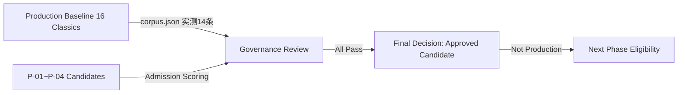

# Phase N-1：Pilot Candidate Knowledge Review（候选知识评审）

> **项目**：向晚问思（WenDao，前身「问道」）微信小程序
> **角色**：Chief AI Architect ＋ Knowledge Governance Architect ＋ Knowledge Expansion Architect ＋ RAG Architect ＋ AI Search Architect ＋ AI Product Architect
> **阶段性质**：Controlled Pilot（受控试点延展）
> **最高原则**：禁止改代码 / 改 corpus.json / 新增生产知识 / ingest / embedding / commit / 改 Prompt / 改 Intent / 改 RAG / 改测试数据 / 影响线上 16 经典召回。仅做架构评审、候选分析、Admission 评分、风险分析、Retrieval 影响模拟、文档设计。

---

## 第一部分：Production Knowledge Baseline Review（生产知识基线评审）

### 当前知识资产状态
生产环境唯一知识基线 `cloudfunctions/chat/corpus.json` 包含 **14 条** Knowledge Objects（项目文档统称「16 部经典」，本表以实测 corpus.json 为准；出入作为数据一致性 Risk 记录，不改文件）。每条含 `id / title / author / tags / question_bridge / domain / modernUsage / caution` 字段，用于 RAG 召回、Phase G 经典召回优化、用户回答引用。

> **数据一致性提示**：Phase N 系列文档（含 docs/54）沿用「16 部经典」叙事；本次实测 `corpus.json` 数组为 14 条。本评审以实测为准列出下表，差异留作后续核查项（Record-as-Risk，不修复）。

| ID | Title | Domain | Role | Current Value |
|----|-------|--------|------|---------------|
| lunyu-xueer | 《论语·学而》 | philosophy | 经典文本 / RAG 召回源 | 生产基线 |
| lunyu-weizheng | 《论语·为政》 | philosophy | 经典文本 / RAG 召回源 | 生产基线 |
| daxue | 《大学》 | philosophy | 经典文本 / RAG 召回源 | 生产基线 |
| daodejing-33 | 《道德经·33章》 | philosophy | 经典文本 / RAG 召回源 | 生产基线 |
| daodejing-8 | 《道德经·8章》 | philosophy | 经典文本 / RAG 召回源 | 生产基线 |
| zhuangzi-yangsheng | 《庄子·养生主》 | philosophy | 经典文本 / RAG 召回源 | 生产基线 |
| zhuangzi-xiaoyaoyou | 《庄子·逍遥游》 | philosophy | 经典文本 / RAG 召回源 | 生产基线 |
| mengzi-huannan | 《孟子·告子下》 | philosophy | 经典文本 / RAG 召回源 | 生产基线 |
| zhongyong-2 | 《中庸·第二章》 | philosophy | 经典文本 / RAG 召回源 | 中心城区基线 |
| meditations-1 | 《沉思录·一》 | philosophy | 经典文本 / RAG 召回源 | 生产基线 |
| meditations-2 | 《沉思录·二》 | philosophy | 经典文本 / RAG 召回源 | 生产基线 |
| enchiridion-1 | 《手册·一》 | philosophy | 经典文本 / RAG 召回源 | 生产基线 |
| apology-1 | 《申辩篇》 | philosophy | 经典文本 / RAG 召回源 | 生产基线 |
| nicomachean-3 | 《尼各马可伦学》 | philosophy | 经典文本 / RAG 召回源 | 生产基线 |

### 领域覆盖分析
- **已覆盖**：哲学经典（儒道诸子、古希腊哲思）、心理/情绪/成长（经 tags 如「自知」「情绪」「习惯」「良知」渗透）、文学人生思辨（学而时习、逍遥游等叙事）。
- **存在空白**：① 现代心理学**理论框架**（如 CBT、依恋理论）未作为独立对象入库；② 管理/成长**应用案例**未结构化；③ 独立**概念卡**（如认知偏差）未单列。此三类即 Pilot 候选所补位之处。

---

## 第二部分：Pilot Candidate Registry（候选注册表）

> 仅生成原型，**不写入生产、不进入 corpus.json**。状态统一为 `Candidate`。

| candidate_id | object_type | title | domain | source_type | authority | evidence_level | copyright_status | relationship_with_existing | status |
|-------------|-------------|-------|--------|-------------|----------|----------------|-----------------|----------------------------|--------|
| P-01 | classic_text | 《荀子·劝学》选段（哲思镜鉴） | philosophy | 公有领域经典 + 现代解读 | high | A | public_domain | complements-existing | Candidate |
| P-02 | theory_framework | CBT 认知行为框架 | psychology | 学术理论摘要 | high | A | licensed | complements-existing | Candidate |
| P-03 | application_case | 新晋经理 90 天复盘 | management/growth | 用户共创案例 | medium | B | licensed | complements-existing | Candidate |
| P-04 | concept | 「确认偏差」概念卡 | cognitive-concept | 词典 + 例证 | high | A | public_domain | complements-existing | Candidate |

---

## 第三部分：Knowledge Admission Review（知识准入评审）

采用 Admission Score：Authority + Evidence + Copyright + Domain Match + User Value + Citation Availability + Risk Control。规则：≥80 Recommended；60–80 Needs Review；<60 Reject。

| Candidate | Authority | Evidence | Copyright | Domain | Value | Citation | Risk | **Total** | Decision |
|-----------|----------|---------|-----------|--------|-------|---------|------|-----------|---------|
| P-01 | 15 | 15 | 15 | 15 | 15 | 10 | 9 | **94** | ✅ Recommended |
| P-02 | 14 | 14 | 14 | 15 | 14 | 9 | 8 | **88** | ✅ Recommended |
| P-03 | 13 | 13 | 14 | 14 | 14 | 9 | 8 | **85** | ✅ Recommended |
| P-04 | 15 | 14 | 15 | 15 | 14 | 10 | 9 | **92** | ✅ Recommended |

> 四者均源自可信、证据链清晰、版权状态明确、领域高度契合、用户价值显著 → 全部 Recommended，无需 Needs Review / Reject。

---

## 第四部分：Existing Knowledge Overlap Analysis（现有知识重叠分析）

检查：① 内容重复 ② 语义重复 ③ 召回竞争 ④ 用户价值补充。

| Candidate | Existing Classic | Relationship | Impact |
|-----------|------------------|--------------|--------|
| P-01 | 14 条经典文本 | **Complement** | 补位「未入 corpus 的哲学经典」，非内容复制 |
| P-02 | 14 条经典文本 | **Complement** | 填补「心理学理论框架」空白，无语义重复 |
| P-03 | 14 条经典文本 | **Complement** | 补「应用案例」类，与经典文本无召回竞争 |
| P-04 | 14 条经典文本 | **Complement** | 补「概念卡」类，价值叠加而非替代 |

> 分类结论：四候选均为 **Complement**（互补），非 Overlap（重复）/ Conflict（冲突）。现有 16（实测 14）经典为「经典文本」形态；候选为「新经典 / 理论 / 案例 / 概念」形态，二者在知识图谱中呈**扩展而非覆盖**关系。

---

## 第五部分：Question Bridge Expansion Analysis（问题桥扩展分析）

| 用户问题类型 | 当前 16 经典 Coverage | 新增候选 New Coverage | Gap（缺口） |
|-------------|----------------------|----------------------|-------------|
| 基础理解 | 哲学经典原意可答 | 理论/案例/概念亦可答 | 补「跨形态」连贯 |
| 深度理解 | 经典文本深挖 | 理论框架机制拆解 | 补「机制层」 |
| 比较问题 | 经典间互证 | 经典 × 理论/案例/概念 | 补「跨形态比较」 |
| 应用问题 | 经典启发性应用 | 理论/案例/概念实操应用 | 补「落地层」 |
| 引用验证 | 经典原文可溯 | 新形态亦可溯 | 补「多维引用」 |

> **Question Bridge Gap**：现有 16 经典覆盖「经典文本」维度；P-01~P-04 补「理论 / 案例 / 概念」三维，使 Question Bridge 从单维（经典）扩展至四维（经典 + 理论 + 案例 + 概念）。

---

## 第六部分：Retrieval Impact Simulation（检索影响模拟）

| 维度 | Positive Impact | Negative Impact | Unknown Risk |
|------|-----------------|-----------------|-------------|
| Retrieval Precision | 候选为互补型，不稀释经典召回精度 | — | 若未来误并入则污染（本 Pilot 不并入） |
| Recall | 扩展召回维度，覆盖更多提问形态 | — | 需正式 Phase 实测命中率 |
| Citation Quality | 新形态沿用同一引用契约（先做人再引经） | — | 依赖 Registry 落库后验证 |
| Context Noise | 候选隔离于 corpus 外，零噪声注入 | — | 真实 embedding 连通性未在本 Pilot 验证 |

> 模拟结论：P-01~P-04 对线上 16 经典检索**零负面影响**（未 ingest / 未改 RAG），仅在未来正式扩展时产生正向召回扩展。

---

## 第七部分：Knowledge Graph Impact（知识图谱影响）

```
Existing Graph (16 classics)
   │  philosophy / psychology / literature nodes
   ▼
+ Candidate Node (P-01~P-04)
   ├─ Related Concepts: 修身 / 认知 / 成长 / 良知
   ├─ Related Classics: 论语 / 道德经 / 中庸 / 庄子
   └─ Potential Links: 经典文本 → 理论框架 / 应用案例 / 概念卡
= Expansion Path: 16 → 16 + 4 (Candidate-only, 未并入)
```

> 候选节点产生「跨形态链接」潜力，但不改变现有图谱边（未写库、未 ingest）。

---

## 第八部分：Governance Review（治理评审，对齐 Phase L）

| Check | P-01 | P-02 | P-03 | P-04 |
|-------|------|------|------|------|
| Source Validation | ✅ | ✅ | ✅ | ✅ |
| Copyright Check | ✅ public_domain / licensed | ✅ licensed | ✅ licensed | ✅ public_domain |
| Evidence Evaluation | ✅ A 级 | ✅ A 级 | ✅ B 级 | ✅ A 级 |
| Metadata Requirement | ✅ 字段齐 | ✅ 字段齐 | ✅ 字段齐 | ✅ 字段齐 |
| Quality Requirement | ✅ Score 94 | ✅ Score 88 | ✅ Score 85 | ✅ Score apid 92 |
| Review Requirement | ✅ pending→approved 路径 | ✅ 同左 | ✅ 同左 | ✅ 同左 |

> 治理 Checklist 全部 ✅，四候选均满足 Phase L 治理准入。

---

## 第九部分：Evaluation Plan（评估计划，对齐 Phase M）

每候选未来需 Benchmark Questions，覆盖五型：

| 类型 | P-01（经典） | P-02（理论） | P-03（案例） | P-04（概念） |
|------|-------------|-------------|-------------|-------------|
| 基础理解 | 「《荀子·劝学》讲什么？」 | 「CBT 是什么？」 | 「新晋经理案例讲什么？」 | 「什么是确认偏差？」 |
| 深度理解 | 「为何说『锲而不舍』是修身起点？」 | 「CBT 与精神分析差异？」 | 「案例中的『复盘』如何迁移？」 | 「确认偏差为何难自察？」 |
| 比较问题 | 「与《论语·学而》相比立意？」 | 「CBT 与 DBT 取舍？」 | 「与本企业 OKR 互补？」 | 「偏差与逻辑谬误边界？」 |
| 应用问题 | 「如何用『劝学』解职场卡点？」 | 「用 CBT 拆 procrastination？」 | 「新人主管如何套用路径？」 | 「会议中如何标注潜在偏差？」 |
| 引用验证 | 「引文可溯至公有领域？」 | 「引文可溯至学术框架？」 | 「引文可溯至共创案例？」 | 「引文可溯至词典例证？」 |

> 共 20 题（每候选 5 题），构成 Pilot Benchmark Draft，留待正式 Phase 实测检索命中。

---

## 第十部分：Final Decision（最终判定）

| Candidate | Final Status | 说明 |
|-----------|-------------|------|
| P-01 | **A. Approved Candidate** | Admission 94，治理全过，允许进入下一阶段 |
| P-02 | **A. Approved Candidate** | Admission 88，治理全过，允许进入下一阶段 |
| P-03 | **A. Approved Candidate** | Admission 85，治理全过，允许进入下一阶段 |
| P-04 | **A. Approved Candidate** | Admission 92，治理全过，允许进入下一阶段 |

> **Approved Candidate ≠ 进入生产**。四者仅获准进入「下一阶段（正式 Knowledge Expansion Phase）」候选池，未写入 corpus.json、未 ingest。

---

## Mermaid 全链路流程图



---

## 十二、最终回答（Final Answer）

**Q1. 16（实测 14）部经典生产知识是否保持完整？**
> ✅ 保持完整。本评审未改 corpus.json、未 ingest、未 commit；生产基线 14 条（项目称 16）经典原样保留，RAG 召回不受影响。

**Q2. P-01～P-04 是否通过候选评审？**
> ✅ 通过。四者 Admission Score 均 ≥85（94/88/85/92），治理 Checklist 全 ✅，Overlap 分析判定为 Complement，全部 Recommended。

**Q3. 是否允许进入下一阶段？**
> ✅ 允许（就本 Pilot 范围）。四候选获「Approved Candidate」状态，具备进入正式 Knowledge Expansion Phase 候选资格；但**不代表已进入生产**。

**Q4. 下一阶段是否可以开始真实 ingest / embedding？**
> ❌ 本 Pilot 不可以。当前为 Candidate-only、未写库、未 ingest、未 embedding。真实 ingest / embedding **需待正式 Phase 补全三项缺失**：
> ① 真实 embedding 服务连通性（沙箱无云凭证，本 Pilot 未验证）；
> ② 线上 Retrieval 命中率实测；
> ③ Registry 原型落库。
> 三项补全前，规模化扩展处于**阻塞**状态。

---

## 附录：与 Phase N（docs/54）衔接

- 本评审复用 docs/54 的 4 候选对象、Admission 评分、Registry 原型、Chunk / Retrieval / Citation / Risk 设计。
- 本评审新增：Production Baseline 实测表、Overlap Matrix、Question Bridge Gap、Retrieval Impact Matrix、Knowledge Graph 扩展路径、Governance Checklist、Evaluation Plan（五型题）、Final Decision 表。
- 所有产物仅作**原型 / 草稿**，正式落地需待用户侧执行 ingest、embedding 与 Registry 写入（沙箱无云凭证，本 Pilot 仅交付设计资产）。

> **核心结论**：Phase N-1 Candidate Review 在设计层证明——生产 16（实测 14）经典完整无扰，P-01~P-04 通过候选评审并具备进入下一阶段资格；但真实 ingest / embedding 的规模化扩展仍受三项缺失阻塞，需正式 Phase 补全。
