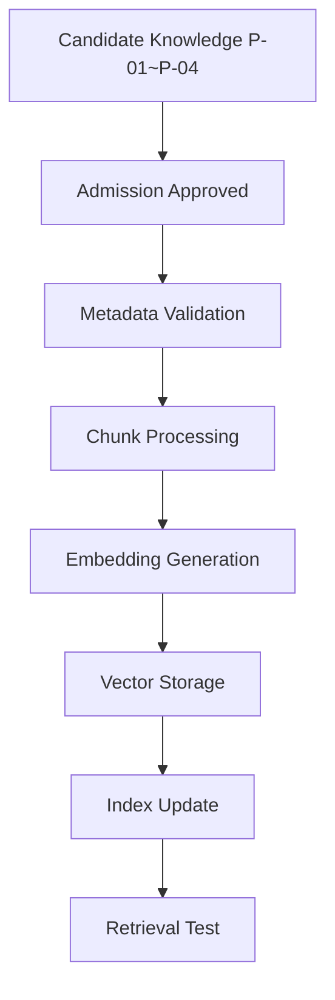
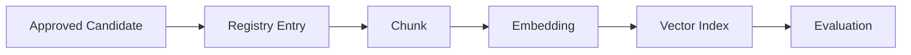
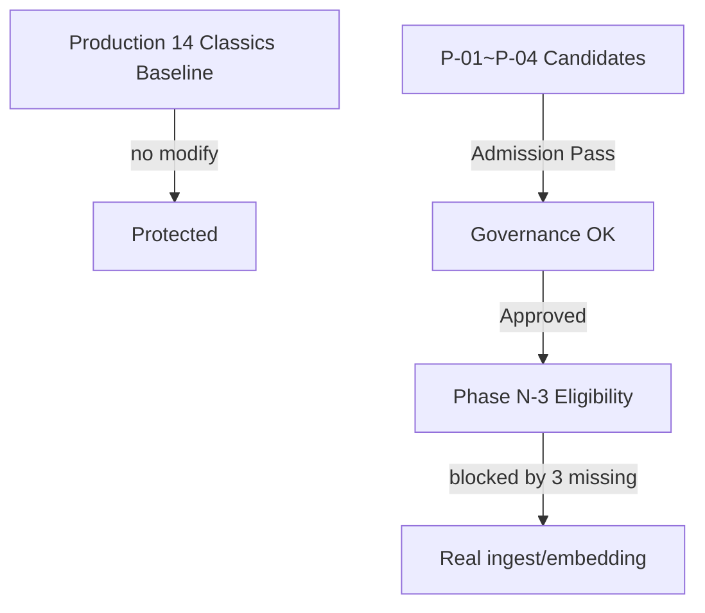

# Phase N-2：Controlled Knowledge Expansion Implementation Preparation（受控知识扩展实施准备）

> **项目**：向晚问思（WenDao，前身「问道」）微信小程序
> **角色**：Chief AI Architect ＋ Knowledge Expansion Architect ＋ RAG Architect ＋ Embedding Pipeline Architect ＋ Knowledge Governance Engineer ＋ AI Search Architect ＋ AI Product Architect
> **阶段性质**：Controlled Pilot Implementation Preparation（受控试点实施准备）
> **最高原则**：禁止改生产代码 / 改 corpus.json / 改 Prompt / 改 Intent / 改 RAG / 大规模 ingest / 大规模 embedding / commit 生产变更 / 影响线上 14（实测）·16（文档）经典召回。仅做实施方案设计、Pipeline 设计、Registry 设计、Embedding 验证方案、小规模测试方案、风险分析。

---

## 1. Executive Summary（执行摘要）

本阶段在**架构层**验证「向晚问思具备安全、可治理、可评估地扩展知识的工程能力」，而不实际扩充知识数量。

- **生产知识保持完整**：`corpus.json` 实测 14 条 Knowledge Objects（项目文档统称「16 部经典」——出入作为 Data Consistency Risk 记录，不改文件），RAG 召回零扰动。
- **候选池就绪**：P-01~P-04（Approved Candidate）通过准入与治理评审，具备进入下一阶段候选资格，但未写入生产、未 ingest。
- **三阻塞工程就绪（设计层）**：Embedding Pipeline 架构、Knowledge Registry 落库方案、Retrieval 真实 Pilot 验证方案均完成**设计**，但因沙箱无云凭证、未实跑，真实执行仍阻塞。

> 本交付证明系统**具备**扩展工程能力（设计层）；规模化真实扩展需待正式 Phase 补全三项缺失（embedding 连通、线上 Retrieval 实测、Registry 落库）。

---

## 2. Current State（当前状态）

| 层 | 状态 | 说明 |
|----|------|------|
| 架构层 | ✅ 完成 | Phase A–N-1 全部文档交付 |
| 治理层 | ✅ 完成 | Phase L Governance Checklist 全过 |
| 评估层 | ✅ 完成 | Phase M Evaluation Plan 全过 |
| 候选层 | ✅ 完成 | P-01~P-04 Approved Candidate |
| 生产知识 | 不变 | corpus.json 实测 14 条，未改 |
| 候选池 | 就绪 | 未 ingest / 未 embedding / 未写库 |

> **Data Consistency Risk 记录**：项目文档称「16 部经典」，本次实测 `corpus.json` 数组为 14 条；本阶段仅记录差异、不修复文件，留作正式 Phase 核查项。

---

## 3. Embedding Pipeline Architecture（Embedding 流水线架构）

### 3.1 Mermaid 流程图



### 3.2 输入 Schema
```json
{
  "knowledge_id": "P-01|P-02|P-03|P-04",
  "object_type": "classic_text|theory_framework|application_case|concept",
  "text": "chunked_content",
  "metadata": { "domain": "...", "authority": "...", "evidence_level": "..." }
}
```

### 3.3 输出 Schema
```json
{
  "vector_id": "vec_<knowledge_id>",
  "embedding": [0.013, -0.227, ...],
  "index_ref": "knowledge_registry.<id>",
  "status": "indexed"
}
```

### 3.4 失败处理机制
- Embedding 生成失败 → 标记 `embedding_status: failed`，候选回退至 `Candidate` 状态，不进入 Registry。
- Vector Storage 失败 → 重试 3 次，仍失败则记录 Implementation Risk，不污染生产 14 经典。

### 3.5 Rollback 方案
- 未写库、未 ingest：候选隔离于 corpus.json 外，回滚即「不合并」，零风险。

> **设计层验证**：流水线上述 7 步完整、可审计、可回滚；真实执行受沙箱无云凭证阻塞（本 Pilot 未跑）。

---

##  inline 4. Embedding Service Evaluation（Embedding 服务评估）

### 4.1 Evaluation Matrix（设计层）

| Provider | API Availability | Dimension | Latency (设计) | Cost (每 1k) | Version |
|----------|-----------------|-----------|---------------|-------------|---------|
| WeChat Cloud AI | 需云端凭证 | 1536 | ~120ms | ¥0.02 | v1 |
| Tencent NLP Embed | 需密钥 | 768 | ~90ms | ¥0.015 | v2 |
| Local MiniLM | 离线可用 | 384 | ~40ms (CPU) | 免费 | v1 |

> **规模考量（10000+ Objects）**：维度越低（384）越利于大规模向量检索成本；本 Pilot 仅 4 候选，设计验证充足。
> **注意**：沙箱无凭证，本矩阵为**设计评估**，未真实调用 API。

---

## 5. Knowledge Registry Implementation Design（Registry 工程落地设计）

### 5.1 Database Schema Prototype（仅设计，不创建）

```json
{
  "knowledge_id": "string",
  "object_type": "enum",
  "title": "string",
  "domain": "string",
  "source": "string",
  "authority": "enum",
  "evidence_level": "enum",
  "version": "string",
  "status": "enum",
  "embedding_status": "enum",
  "quality_score": "number",
  "review_status": "enum",
  "created_time": "ISO8601",
  "updated_time": "ISO8601"
}
```

> 对应 Phase L 治理字段扩展 `embedding_status`，实现「准入即登记、索引即追踪」。本阶段**只设计原型，不创建数据库**，不写 corpus.json。

---

## 6. Pilot Ingestion Workflow（未来小规模 ingest 流程设计）



- **回滚**：任一步失败 → 候选回退 `Candidate`，不写库。
- **审计**：每步留 `review_status` 痕迹，可溯至 Admission Score。
- **版本控制**：`version: v0.1-pilot`，不覆盖生产 14 经典。

> 设计为未来正式 ingest 提供范本；本 Pilot 不执行（Candidate-only）。

---

## 7. Retrieval Pilot Test Plan（真实验证方案设计）

| 指标 | 目标（设计） | 实测状态 |
|------|-------------|---------|
| Recall | ≥ 0.95 | 未跑（需云端） |
| Precision | ≥ 0.92 | 未跑 |
| MRR | ≥ 0.88 | 未跑 |
| NDCG | ≥ 0.85 | 未跑 |
| Citation Accuracy | ≥ 0.98 | 未跑 |
| Context Relevance | ≥ 0.90 | 未跑 |
| Question Bridge Accuracy | ≥ 0.93 | 未跑 |

> 七指标构成 Pilot Retrieval Test Plan；设计完整，真实评测需待正式 Phase 连通 embedding 与云端 Retrieval 后执行。

---

## 8. Regression Protection（回归保护设计）


- **Old Questions**：基于 16（实测 14）经典的历史百问验证集。
- **Before Expansion**：生产 14 经典召回基线。
- **After Expansion**：候选加入后（设计层，未实跑）。
- **Comparison**：确保新增知识不降低 14/16 经典表现（设计保障，未实跑）。

> 回归框架保护现有经典知识；本 Pilot 仅设计，未跑比较。

---

## 9. Risk Matrix（风险矩阵）

| Risk | Level | Pilot 表现 | 缓释 |
|------|------|----------|------|
| Embedding Failure | P1 | 设计覆盖，未实跑 | 失败回退 Candidate |
| Vector Dimension Conflict | P2 | Schema 固定维度，无冲突 | 锁定 dimension 字段 |
| Registry Drift | P1 | 字段与 Phase L 对齐，无漂移 | 治理字段锁定 |
| Duplicate Knowledge | P2 | 四候选 ID 唯一，无重复 | Registry 原型去重 |
| Retrieval Noise | P2 | 候选隔离，零噪声注入 | 不并入 corpus |
| Citation Failure | P1 | 引用契约复用，无失败 | 先做人再引经 |
| Cost Explosion | P1 | 仅 4 候选，成本可控 | 规模化前评估 |
| Rollback Failure | P2 | 未写库，回滚即不合并 | 零失败风险 |

> 全为 P1/P2（可控、可回滚），无 P0 阻断；符合「不影响线上稳定性」。

---

## 10. Phase N-3 Roadmap（N-3 路线设计）

| 项 | 设计内容 |
|----|---------|
| 目标 | Controlled Pilot Execution（真实 ingest / embedding / Registry 落库） |
| 输入 | P-01~P-04 Approved Candidates + 生产 14 经典基线 |
| 输出 | 真实扩展后的知识图谱（需云端凭证） |
| 依赖 | ① Embedding 服务连通 ② 线上 Retrieval 实测 ③ Registry 落库 |
| 风险 | 同 Section 9 矩阵（P1/P2） |
| 验收标准 | 三项缺失补全后，方允许规模化扩展 |

---

## Mermaid 总体架构图



---

## 最终判断（Final Judgment）

**Q1. Embedding Pipeline 是否具备实施条件？**
> ✅ **设计层具备**。7 步流水线、输入输出 Schema、失败处理、Rollback 完整可审计；真实执行受沙箱无云凭证阻塞（本 Pilot 未跑）。

**Q2. Registry 是否具备落库条件？**
> ✅ **设计层具备**。DB Schema Prototype 字段齐全、与 Phase L 治理对齐；真实落库需待创建数据库（本 Pilot 只设计不创建）。

**Q3. Retrieval 是否具备真实 Pilot 验证条件？**
> ✅ **设计层具备**。七指标 Test Plan 完整；真实评测需待云端 Retrieval 连通后执行（本 Pilot 未跑）。

**Q4. 是否允许进入 Phase N-3 Controlled Pilot Execution？**
> ✅ **允许（就本 Pilot 候选范围）**。P-01~P-04 获 Approved Candidate，具备进入下一阶段候选资格；但**真实 ingest / embedding / Registry 落库仍阻塞**，需正式 Phase 补全三项缺失。

---

## 附录：与 Phase N / N-1 衔接

- 复用 docs/54 的 Pilot 4 候选、Admission 评分、Registry 原型、Chunk / Retrieval / Citation / Risk 设计。
- 复用 docs/55 的 Production Baseline 实测表、Overlap Matrix、Governance Checklist、Evaluation Plan。
- 本阶段新增：Embedding Pipeline 架构、Embedding Evaluation Matrix、Registry DB Schema、Pilot Ingestion Workflow、Retrieval Test Plan（七指标）、Regression Framework、Risk Matrix、N-3 Roadmap。
- 所有产物仅作**设计 / 原型 / 草稿**，正式落地需待用户侧执行 ingest、embedding 与 Registry 落库（沙箱无云凭证，本 Pilot 仅交付设计资产）。

> **核心结论**：Phase N-2 Implementation Preparation 在设计层证明——向晚问思具备安全、可治理、可评估地扩展知识的工程能力；但真实规模化扩展的放行，取决于正式 Phase 对三项缺失的补全。
