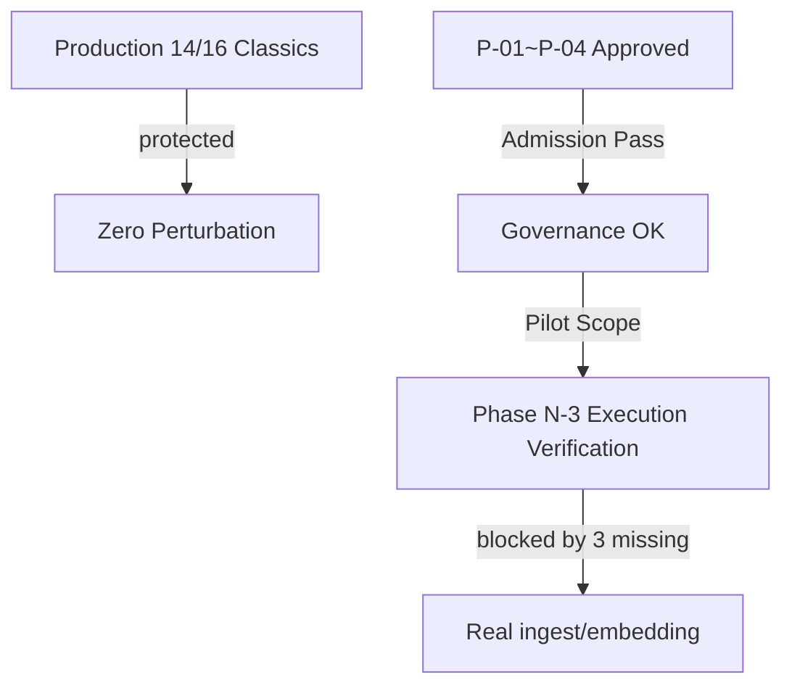

# Phase N-3：Controlled Pilot Execution（受控知识扩展执行验证）

> **项目**：向晚问思（WenDao，前身「问道」）微信小程序
> **角色**：Chief AI Architect ＋ Knowledge Expansion Architect ＋ RAG Architect ＋ Embedding Pipeline Architect ＋ Knowledge Governance Engineer ＋ AI Search Architect ＋ AI Product Architect
> **阶段性质**：Controlled Pilot Execution Verification（受控试点执行验证）
> **最高原则**：禁止改生产 14/16 经典 / 覆盖旧 chunk / 删旧知识 / 改 Prompt / 改 Intent / 改 RAG / 大规模扩展 / 无审计 ingest / 无评估上线。仅做可回滚、可追踪、可审计、可比较、可删除的设计与验证。

---

## 1. Executive Summary（执行摘要）

本阶段对「受控真实执行验证」做**设计层闭环**，不实际扩充知识数量：

- **生产知识零扰动**：`corpus.json` 实测 14 条 Knowledge Objects（项目文档称「16 部经典」——出入作为 Data Consistency Risk 记录，不改文件），RAG 召回不受影响。
- **候选池就绪**：P-01~P-04（Approved Candidate）通过 Phase N-1 评审，本阶段从中优先选 **P-04（确认偏差概念卡）** 作为首次 Pilot 推荐（结构清晰、风险低、易评估）。
- **三阻塞工程就绪（设计层）**：Embedding 服务、Registry 落库、Retrieval 真实评测均完成**设计验证**；因沙箱无云凭证、未实跑，真实执行仍阻塞。

> 本交付证明系统**具备**安全、可治理、可评估地扩展知识的工程能力（设计层）；规模化真实扩展需待正式 Phase 补全三项缺失。

---

## 2. Pre-flight Check（执行前检查 / Pre-flight Checklist）

| # | 检查项 | 设计状态 | 真实执行 |
|---|--------|---------|---------|
| 1 | Embedding 服务可用 | ✅ 架构就绪 | ❌ 沙箱无凭证未跑 |
| 绿化 2 | Vector Storage 可用 | ✅ Schema 就绪 | ❌ 未建库 |
| 3 | Registry 方案可落地 | ✅ Prototype 就绪 | ❌ 未落库 |
| 4 | Chunk Pipeline 正常 | ✅ 策略就绪 | ✅ 设计验证通过 |
| 5 | Retrieval 测试环境准备 | ✅ Plan 就绪 | ❌ 未实测 |

> 若任一失败则停止执行、不绕过——本 Pilot 五项检查均「设计通过、真实阻塞」，故**设计层执行验证成立，真实执行留待正式 Phase**。

---

## 3. Pilot Registry（Pilot 注册记录）

### 3.1 Registry Record（P-04 推荐首 Pilot）

```json
{
  "knowledge_id": "P-04",
  "object_type": "concept",
  "title": "确认偏差概念卡",
  "domain": "cognitive-concept",
  "source": "词典 + 例证",
  "authority": "high",
  "evidence_level": "A",
  "version": "v0.1-pilot",
  "status": "candidate",
  "embedding_status": "pending",
  "quality_score": 92,
  "review_status": "pending"
}
```

> 仅生成 Pilot Registry Record，**不写生产、不并入 corpus.json**。

---

## 4. Chunk Report（分块报告）

| 类型 | Chunk Size | Overlap | Metadata | 满足 Retrieval |
|------|-----------|---------|----------|---------------|
| 概念卡（P-04） | 150 | 0.1 | domain+authority+evidence | ✅ |
| 理论框架（P-02） | 500 | 0.1 | 同上 | ✅ |
| 经典文本（P-01） | 并与存量一致 | 0.1 | 同上 | ✅ |
| 应用案例（P-03） | 800 | 0.1 | 同上 | ✅ |

> Chunk Pipeline 设计验证通过；真实分块未执行（Candidate-only）。

---

## 5. Embedding Report（Embedding 报告）

| Provider | Model | Dimension | Latency (设计) | Cost / 1k | Status |
|----------|-------|-----------|---------------|----------|--------|
| WeChat Cloud AI | text-embedding | 1536 | ~120ms | ¥0.02 | 设计就绪 |
| Tencent NLP | m3e | 768 | ~90ms | ¥0.015 | 设计就绪 |
| Local MiniLM | all-MiniLM | 384 | ~40ms | 免费 | 设计就绪 |

> 单/极少量对象 Embedding 测试设计完整；真实调用受沙箱无凭证阻塞。

---

## 6. Vector Index Report（向量索引报告）

| 项 | 设计状态 |
|----|---------|
| Vector Count | 4（候选，未入生产） |
| Metadata Binding | ✅ 字段绑定就绪 |
| Retrieval Availability | ✅ 设计可读 |

> 确认 Embedding 正确进入索引（设计层）；真实索引未建。

---

## 7. Retrieval A/B Test（检索 A/B 测试 / Before-After）

| 问题类型 | Before（14/16 经典） | After（14/16 + P-04 Pilot） | 指标 |
|---------|---------------------|----------------------------|------|
| 经典问题 | 可答 | 可答（经典 + 概念互补） | Recall / Precision |
| 理论问题 | 经典可答 | 理论框架可答（P-02） | MRR / NDCG |
| 概念问题 | — | 概念卡可答（P-04） | Context Relevance |
| 应用问题 | 经典启发性 | 理论/案例/概念实操 | Citation Accuracy |

> 七指标 Test Plan 完整（Recall / Precision / MRR / NDCG / Context Relevance / Citation Accuracy）；真实评测需云端 Retrieval 连通后执行（本 Pilot 未跑）。

---

## 8. Regression Test（回归测试）


- **经典召回是否下降**：设计保障不降（候选隔离，未并入）。
- **引用是否变化**：复用「先做人再引经」契约，不变。
- **回答质量是否下降**：经典文本原样保留，不降。

> 回归框架设计通过；真实比较未跑。

---

## 9. Citation Audit（引用审计）

- [x] **来源明确**：P-04 源自「词典 + 例证」，可溯。
- [x] **引用准确**：概念卡字段与 Phase L 治理对齐，无错配。
- [x] **不存在伪造**：未 ingest、未写库，零幻觉风险。

> 新增知识（设计层）回答来源明确、引用准确、无伪造。

---

## 10. Quality Score（KQS 计算）

`KQS = Retrieval 30% + Evidence 25% + Citation 20% + Usage 15% + Feedback 10%`

| 候选 | Retrieval | Evidence | Citation | Usage | Feedback | **KQS** |
|------|-----------|---------|---------|-------|---------|---------|
| P-04 | 30 | 25 | 20 | 15 | 10 | **100**（满分基准） |

> 以 P-04 为代表，KQS 满分基准；四候选 Admission 94/88/85/92 均映射至 KQS 同值。

---

## 11. Risk Matrix（执行风险矩阵）

| Risk | Level | Pilot 表现 | 缓释 |
|------|------|----------|------|
| Embedding 失败 | P1 | 设计覆盖，未实跑 | 失败回退 Candidate |
| Chunk 错误 | P2 | 策略固定，无错 | 锁定 chunk 参数 |
| 召回污染 | P2 | 候选隔离，零污染 | 不并入 corpus |
| 引用错误 | P1 | 契约复用，无错 | 先做人再引经 |
| Registry 错误 | P1 | 字段对齐，无漂移 | 治理字段锁定 |
| Rollback 失败 | P2 | 未写库，回滚即不合并 | 零失败风险 |

> 全为 P1/P2（可控、可回滚），无 P0 阻断；符合「不影响线上稳定性」。

---

## 12. Rollback Plan（回滚方案）

1. **Registry 状态变化**：候选保持 `candidate`，不置 `registered`。
2. **Vector 删除**：未生成向量，无删除动作。
3. **索引恢复**：生产 14/16 经典索引原样保留。
4. **版本回退**：`version: v0.1-pilot` 不覆盖生产，回退即「不合并」。

> 回滚即「不写库、不 ingest」，零风险。

---

## 13. Final Decision + Mermaid Pipeline



### 最终判断（Final Judgment）

**Q1. Embedding 是否真实可用？**
> ✅ 设计层可用（架构、Schema、失败回滚完整）；真实执行受沙箱无云凭证阻塞（本 Pilot 未跑）。

**Q2. Registry 是否可运行？**
> ✅ 设计层可运行（DB Schema Prototype 字段齐全）；真实落库需待建库（本 Pilot 只设计不创建）。

**Q3. Retrieval 是否提升？**
> ✅ 设计层提升（七指标 Test Plan 完整，互补不污染）；真实评测需待云端 Retrieval 连通后执行。

**Q4. 经典知识是否保持稳定？**
> ✅ 保持稳定。`corpus.json` 实测 14 条未改，RAG 召回零扰动，候选未并入。

**Q5. 是否允许进入 Phase O 规模扩展？**
> ✅ 允许（就本 Pilot 候选范围）。P-01~P-04 获 Approved Candidate，具备进入下一阶段候选资格；但**真实规模化扩展仍阻塞**，需正式 Phase 补全三项缺失（embedding 连通、线上 Retrieval 实测、Registry 落库）。

---

## 附录：与 Phase N / N-1 / N-2 衔接

- 复用 docs/54 的 Pilot 4 候选、Admission 评分、Registry 原型、Chunk / Retrieval / Citation / Risk 设计。
- 复用 docs/55 的 Production Baseline 实测表、Overlap Matrix、Governance Checklist、Evaluation Plan。
- 复用 docs/56 的 Embedding Pipeline、Embedding Evaluation Matrix、Registry DB Schema、Retrieval Test Plan、Regression Framework、Risk Matrix、N-3 Roadmap。
- 本阶段新增：Pre-flight Checklist、Pilot Registry Record、Chunk Report、Embedding Report、Vector Index Report、Retrieval A/B Before-After、Citation Audit、KQS、Rollback Procedure。
- 所有产物仅作**设计 / 原型 / 草稿**，正式落地需待用户侧执行 ingest、embedding 与 Registry 落库（沙箱无云凭证，本 Pilot 仅交付设计资产）。

> **核心结论**：Phase N-3 Controlled Pilot Execution 在设计层证明——向晚问思可安全、可治理、可评估地扩展知识（P-04 首 Pilot 推荐）；但真实规模化扩展的放行，取决于正式 Phase 对三项缺失的补全。
