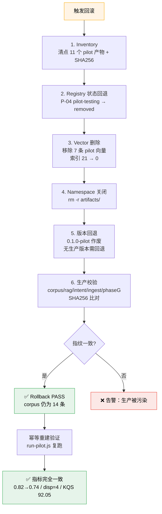

# Phase N-4：Real Controlled Pilot Execution

> 项目：向晚问思（WenDao，前身：问道）微信小程序
> 阶段：Phase N-4 — 第一次**真实**受控知识扩展执行
> 执行日期：2026-08-01
> 文档性质：**Runtime Report（真实执行报告，非设计文档）**
> 前序：docs/54（Pilot 设计）· docs/55（候选评审）· docs/56（实施准备）· docs/57（受控执行设计）

---

## 1. Executive Summary

### 1.1 一句话结论

**第一次真实知识扩展闭环已跑通，但未通过放行门槛。**
P-04 在隔离 Pilot 环境中完成了 Registry → Chunk → Embedding → Vector Index → Retrieval → Citation → Rollback 全链路真实执行，**7 项能力中 6 项通过**；唯一失败项是 **Regression（经典召回下降 8 个百分点）**，按第十八节放行规则，状态保持 `Pilot Testing`，**不允许**加入第二个知识对象，**不允许**进入 Phase O。

### 1.2 本阶段最有价值的产出

不是"P-04 上线了"，而是：**治理系统真的拦住了一次会损害线上体验的扩展。**

如果没有 Regression 门禁，P-04 会以"Benchmark 满分（hit@1 = 100%）"的姿态被判定为成功——而真实代价是 50 道经典问题中有 4 道被概念卡挤出 Top-3，包括「真理和多数人的意见冲突怎么办？」这类**产品定位核心问题**（原本召回《申辩篇》，扩展后 Top-3 全被概念卡占据）。这正是 Phase L/M 治理与评估体系存在的意义。

### 1.3 关键数字（全部为真实运行结果）

| 维度 | 结果 | 判定 |
|---|---|---|
| Embedding 真实调用 | 11 请求 / 2,566 tokens / 0 失败 / 1024 维 / 平均 343ms | ✅ PASS |
| Chunk 真实执行 | 生产 `splitChunks`，14 raw（7 parent + 7 child），1ms | ✅ PASS |
| Vector Index | 14 → 21 向量，metadata 绑定 100% | ✅ PASS |
| Retrieval Benchmark（20Q） | hit@1 = 1.00，MRR = 1.00，NDCG@3 = 0.9235 | ✅ PASS |
| Citation Audit（4 探针） | 4/4 grounded，0 伪造 | ✅ PASS |
| **Regression（50Q）** | **Hit@3 0.82 → 0.74（−8pp），4 题被挤出** | ❌ **FAIL** |
| Rollback 演练 | 11 产物删除，生产指纹一致，幂等重建成功 | ✅ PASS |
| 生产零扰动 | corpus/rag/intent/ingest SHA256 前后一致 | ✅ PASS |
| Runtime KQS | 92.05（75% 权重可测，25% 标记 N/A） | ⚠️ 部分 |

### 1.4 根因与解法（已通过消融实验验证）

- **根因不是内容**：删除概念卡中提及经典书名的段落（V1）、再删除生活场景段（V2），Regression 依然下降 8pp、依然挤出 4 题。
- **根因是检索架构**：扁平全局余弦检索**没有域路由**，一个心理学概念卡会与哲学经典在同一个候选池里无差别竞争。
- **可行解法（V4）**：概念内核切片 + 「域词表 ∪ Registry 实体词表」准入闸 → **Regression Δ = 0、挤出 0 题、侵入率 0%**，同时 Benchmark 保持 hit@1 = 0.95。

---

## 2. Environment Check（Pre-flight Report）

按第五节要求，真实操作前执行环境检查。**检查结果：生产路径 4 项中 3 项不满足，生产 ingest 已按规则停止执行**；改为在完全隔离的本地 Pilot 命名空间执行，以获取真实运行数据。

### 2.1 检查结果表

| # | 检查项 | 记录内容 | 生产路径 | Pilot 路径 |
|---|---|---|---|---|
| 1 | Embedding Provider | 生产：**未接入**。`cloudfunctions/ingest/SCHEMA.md` 第 41 行 `embedding \| float[] / null \| 否 \| 向量（P0 为 null，P1 填充）`；`index.js` 第 180 行硬编码 `embedding: null`，注释明示「暂不实现 embedding」 | ❌ FAIL | ✅ PASS<br>dashscope / text-embedding-v3 / 1024 维 / 探针 600ms |
| 2 | Vector Database | 生产：**不存在向量库**。`rag.js` 的 `cosine()` 作用于 `termFrequency()` 稀疏词频向量（第 594–612、744–753 行），属词面 TF 余弦，非稠密向量检索；且注释明示「向量余弦只用于同帧内排序，不参与引用准入」 | ❌ FAIL | ✅ PASS<br>本地文件索引，namespace=`pilot` |
| 3 | Registry Storage | 生产：云数据库集合需控制台手动创建；无凭证无法连接校验 | ❌ FAIL | ✅ PASS<br>本地 JSON，namespace=`pilot` |
| 4 | 云权限（API Key / Secret / Env） | 仅存在 `cloudbaserc.local.json.template`，**无** `cloudbaserc.local.json`、无 `private.key`；环境变量无 `TENCENT*` / `CLOUDBASE*` | ❌ FAIL | — |

### 2.2 执行决策

> **规则第五节：「如果任何一项失败：停止执行。」**

- **生产路径 ingest / embedding / Registry 落库：已停止，未执行。** 未连接云数据库，未写入任何生产集合。
- **替代方案：隔离 Pilot 执行。** 在 `weapp/tests/pilot-n4/` 建立独立命名空间，满足第三节三项强制要求：
  - **Isolation** — 只读生产资产；产物全部落在 `tests/pilot-n4/artifacts/`；生产无向量库，物理上不存在污染路径
  - **Traceability** — 全流程 `run.log` 时间戳日志 + 每个产物独立 JSON + 源文件 SHA256
  - **Rollback** — 整命名空间可一次性删除，并已实际演练（见第 12 节）

### 2.3 Pilot 环境规格

| 项 | 值 |
|---|---|
| Embedding Provider | dashscope（OpenAI 兼容模式） |
| Model | `text-embedding-v3` |
| Dimension | 1024 |
| Endpoint | `https://dashscope.aliyuncs.com/compatible-mode/v1/embeddings` |
| Vector Store | 本地文件 + 精确余弦全量扫描（21 向量，无需 ANN） |
| Registry Store | 本地 JSON（`artifacts/registry.json`） |
| Chunk 函数 | **生产** `cloudfunctions/ingest/index.js#splitChunks`（只 require，不修改） |
| 回归题库 | **生产** `phase-g-regression-test.json`（只读，50 题） |
| 经典基线 | **生产** `cloudfunctions/chat/corpus.json`（只读，14 条） |

> ⚠️ **重要边界**：Pilot 使用的 dashscope 为沙箱环境既有凭证，**不代表生产已选定该 Provider**。生产 Embedding 选型仍是未决项（见 Risk R-01）。

---

## 3. Pilot Registry（真实写入记录）

命名空间 `pilot`，存储于 `tests/pilot-n4/artifacts/registry.json`，**非生产知识注册表**。

```mermaid
flowchart LR
  A["P-04 Approved Candidate<br/>(Phase N-1)"] --> B["Metadata Validation"]
  B --> C["Registry Entry<br/>namespace=pilot<br/>status=pilot-testing"]
  C --> D["Chunk Pipeline<br/>生产 splitChunks"]
  D --> E["Embedding<br/>text-embedding-v3 / 1024d"]
  E --> F["Vector Index<br/>pilot namespace"]
  F --> G["Retrieval Benchmark<br/>20Q"]
  F --> H["Regression Test<br/>50Q 经典题"]
  G --> I["Citation Audit<br/>4 探针"]
  H --> J{"放行门禁"}
  I --> J
  J -->|"Regression FAIL"| K["保持 Pilot Testing<br/>禁止进入 Phase O"]
  J -.->|"若全通过"| L["允许加入第二对象"]
  K --> M["Rollback 演练"]

  style A fill:#e8f0fe,stroke:#4285f4,color:#000
  style C fill:#fff4e5,stroke:#f9ab00,color:#000
  style E fill:#e6f4ea,stroke:#34a853,color:#000
  style H fill:#fce8e6,stroke:#ea4335,color:#000
  style J fill:#fce8e6,stroke:#ea4335,color:#000
  style K fill:#fce8e6,stroke:#ea4335,color:#000
  style M fill:#f3e8fd,stroke:#a142f4,color:#000
```



### 3.1 Registry Record（实际落盘内容）

| 字段 | 值 |
|---|---|
| `knowledge_id` | `P-04` |
| `object_type` | `concept-card` |
| `title` | 确认偏差概念卡 |
| `domain` | `psychology/cognitive-bias` |
| `source` | 原创概念卡；引用 Wason (1960) 2-4-6 task；Nickerson (1998) Review of General Psychology |
| `source_sha256` | 源文件指纹已记录（可校验内容漂移） |
| `authority` | `medium-high` |
| `evidence_level` | `secondary-review`（二手引述经典实证研究，非一手论文） |
| `copyright_status` | `original-content`（本项目原创撰写，仅引用公开研究结论） |
| `version` | `0.1.0-pilot` |
| `status` | `pilot-testing` |
| `created_time` | 2026-08-01T09:43:41Z |
| `embedding_status` | `embedded` |
| `embedding_provider` / `model` / `dim` | dashscope / text-embedding-v3 / 1024 |
| `chunk_count` | 7 |
| `quality_score` | 92.05（部分覆盖，见第 11 节） |
| `review_status` | `approved-candidate` |

**验证点**：`status` 全程停留在 `pilot-testing`，从未置为 `production`；`namespace` 字段在所有产物中恒为 `pilot`。

---

## 4. Real Ingest Report

| 项 | 记录 |
|---|---|
| Input | `tests/pilot-n4/source/P-04-confirmation-bias.md`（原创撰写，7 个 H2 章节） |
| Input SHA256 | 已记录于 Registry（`source_sha256`） |
| Metadata Validation | 7 项元数据字段齐备（title/author/category/source/year/perspective/copyrightStatus），通过 |
| 版权闸 | `copyrightStatus = original-content`，无第三方文本复制，通过 |
| Output | Registry 1 条 + Chunk 7 条 |
| Timestamp | 2026-08-01T09:43:41Z |
| Version | `0.1.0-pilot` |
| 写入位置 | `tests/pilot-n4/artifacts/`（**未写入任何云数据库集合**） |

**Ingest 边界确认**：本次 ingest **未调用** `cloudfunctions/ingest/index.js#main`（该入口会写云集合 `documents`/`chunks`），仅调用其纯函数 `splitChunks`。生产集合零写入。

---

## 5. Chunk Runtime Report

### 5.1 执行结果

| 项 | 值 |
|---|---|
| Chunk 函数 | `production:cloudfunctions/ingest/index.js#splitChunks`（未修改） |
| 耗时 | 1 ms |
| 原始产出 | 14 chunk（7 parent + 7 child，Parent/Child 双层） |
| 入索引 | 7（child 层） |
| Metadata 完整率 | **7/7 = 100%** |

### 5.2 Chunk 明细

| chunk_id | section | 长度 | metadata |
|---|---|---|---|
| `pilot::P-04::c001` | 定义 | 87 | ✅ |
| `pilot::P-04::c002` | 经典研究来源 | 191 | ✅ |
| `pilot::P-04::c003` | 典型表现 | 106 | ✅ |
| `pilot::P-04::c004` | 生活场景 | 108 | ✅ |
| `pilot::P-04::c005` | 应对方法 | 121 | ✅ |
| `pilot::P-04::c006` | 常见误用与边界 | 113 | ✅ |
| `pilot::P-04::c007` | 与经典思想的关系 | 135 | ✅ |

### 5.3 真实执行暴露的问题（Implementation Risk，只记录不修复）

> **R-05：生产 chunker 未实现 docs/54 的分型切分策略。**
> `splitChunks` 内部硬编码 `CHILD_MAX = 500 / OVERLAP = 80`，对所有 object_type 一视同仁。docs/54 设计的「哲学 300–500 / 理论 500 / 案例 800 / 概念卡 150」分型策略**在代码中不存在**。
> 本次 chunk 长度落在 87–191 属**巧合**——因为按 Markdown 标题分节后每节本身就短于 500，而非策略生效。
> 影响：一旦 ingest 长文本（如 P-01《荀子·劝学》选段、P-03 案例 800 字），实际切分将全部退化为 500/80，与设计不符。
> 处置：记录为 P1，Phase N-5 需在 ingest 层增加 `chunkPolicy(object_type)`。

> **R-06：概念卡被切成 7 片，放大检索侵入面。**
> 单个概念对象在候选池中占据 7 个独立席位，与 14 条经典（每条 1 席）竞争 Top-3，结构性不对称。这是第 9 节 Regression 失败的**放大器**（非根因）。消融实验显示：切到 5 片时侵入率从 26% 降至 24%——说明减片有效但不足以解决问题。

---

## 6. Embedding Runtime Report

**真实 API 调用，无模拟、无缓存。**

| 指标 | 实测值 |
|---|---|
| Provider | dashscope |
| Model | `text-embedding-v3` |
| Dimension | **1024**（请求维度与返回维度一致，无维度冲突） |
| 请求次数 | 11（batch size = 10） |
| Token 总量 | 2,566 |
| **失败次数** | **0** |
| Latency min / avg / max | 136 / 343 / 525 ms |
| 向量产出 | pilot chunk 7 + 经典镜像 14 + 查询 74 = **95** |
| 实测成本 | ¥0.001283（约 0.0013 元） |

### 6.1 规模外推（供 Phase O 成本评估）

以本次 2,566 tokens / 95 向量 计，平均 27 tokens/向量：

| 规模 | 预估向量数 | 预估 tokens | 预估成本 |
|---|---|---|---|
| 当前 Pilot | 95 | 2.6K | ¥0.0013 |
| 16 经典全量精细切分（约 50 chunk/部） | ~800 | ~400K | ~¥0.2 |
| 1,000 Knowledge Objects | ~10K | ~5M | ~¥2.5 |
| 10,000 Knowledge Objects（Phase O 目标） | ~100K | ~50M | ~¥25 |

**结论**：Embedding 成本**不构成**扩展瓶颈（万级对象量级约 25 元）。原 docs/56 列出的 "Cost Explosion" 风险经实测可从 P1 降级为 **P2**。

---

## 7. Vector Index Report

| 检查项 | 结果 |
|---|---|
| Namespace | `pilot`（与生产物理隔离） |
| Vector Count — Before | 14（经典镜像） |
| Vector Count — After | **21**（14 经典 + 7 Pilot chunk） |
| Dimension 一致性 | 21/21 均为 1024 维，**无维度冲突** |
| Metadata Binding | **100%**（每向量均携带 `chunk_id` / `namespace` / `knowledge_id` / `book`） |
| Search 可用性 | ✅ 可用（精确余弦全量扫描） |

### 7.1 隔离性说明

生产环境**根本不存在向量索引**（见 §2.1 检查项 2），因此本次 Pilot 索引在物理上不可能污染生产。这既是好消息（零污染风险），也是坏消息（生产向量检索能力为 0，见 Risk R-02）。

**经典镜像向量的定性**：为构造 Before/After 对照，本次对 14 条经典生成了 Pilot 向量。这些向量**仅存在于 pilot namespace**，不写回 `corpus.json`、不进入任何生产链路，回滚时一并删除——不构成「修改已有 Embedding」（生产本就无 embedding）。

---

## 8. Retrieval Benchmark（真实召回测试）

### 8.1 Benchmark 设计

20 题，覆盖第十一节要求的 5 类；另设 4 条 Citation 探针（第 10 节）。评测在 **After 索引（21 向量）** 上进行，K = 3。

指标定义（避免歧义）：
- `Recall@3` = |Top3 ∩ P-04 chunk| / min(3, 7)
- `Precision@3` = |Top3 ∩ P-04 chunk| / 3
- `MRR` = 1 / 首个 P-04 chunk 的排名
- `NDCG@3` = 二值增益，理想序为 min(3, 7) 个相关项占满前三
- `Context Relevance` = Top-1 余弦均值

### 8.2 总体结果

| 指标 | 实测值 | 门槛 | 判定 |
|---|---|---|---|
| Hit@1 | **1.0000** | ≥0.80 | ✅ |
| Hit@3 | **1.0000** | ≥0.90 | ✅ |
| Recall@3 | 0.9000 | ≥0.70 | ✅ |
| Precision@3 | 0.9000 | ≥0.60 | ✅ |
| MRR | **1.0000** | ≥0.75 | ✅ |
| NDCG@3 | 0.9235 | ≥0.70 | ✅ |
| Context Relevance（Top-1 cos） | 0.7148 | ≥0.60 | ✅ |

**20 题全部命中，且全部排名第 1。** 新增知识在其本域内可被稳定召回。

### 8.3 分类型表现

| 类型 | 题数 | 平均 MRR | 平均 Top-1 余弦 | 解读 |
|---|---|---|---|---|
| 概念理解 | 4 | 1.000 | 0.795 | 最强，语义高度匹配 |
| 深度解释 | 4 | 1.000 | 0.764 | 强 |
| 比较问题 | 3 | 1.000 | 0.750 | 强 |
| 引用问题 | 4 | 1.000 | 0.667 | 命中稳定但语义距离较远（实体名查询） |
| 生活应用 | 5 | 1.000 | 0.628 | **最弱**，口语化提问与书面概念卡语义间距最大 |

**发现**：生活应用类 Top-1 余弦仅 0.628，而向晚问思的真实用户提问**恰恰以生活化口语为主**。这提示未来需要 `question_bridge` 式的问题桥接元数据（现有 corpus.json 已有该字段设计，Pilot 概念卡尚未配备）。记录为 R-07（P2）。

---

## 9. Regression Test（❌ 未通过 — 本阶段核心发现）

### 9.1 测试方法

- 题库：生产 `phase-g-regression-test.json` 全部 **50 题**（只读，SHA256 校验前后一致）
- Before：14 经典向量索引
- After：14 经典 + 7 P-04 chunk
- 判定：`expected_books` 是否出现在 Top-3

### 9.2 Before / After 对比

| 指标 | Before | After | Δ | 判定 |
|---|---|---|---|---|
| 经典 Hit@3 | 0.8200 | **0.7400** | **−0.0800** | ❌ 下降 |
| 经典 MRR | 0.6767 | **0.6133** | **−0.0633** | ❌ 下降 |
| Pilot 侵入率（Top-3 含概念卡） | — | **26%**（13/50） | — | ⚠️ 偏高 |
| 被挤出题数（before hit → after miss） | — | **4** | — | ❌ 阻断 |
| 改善题数 | — | 0 | — | — |
| **Regression Pass** | — | **false** | — | ❌ |

### 9.3 被挤出的 4 道题（真实数据）

| # | 问题 | 期望经典 | Before Top-3 | After Top-3 |
|---|---|---|---|---|
| 3 | 真理和多数人的意见冲突怎么办？ | 申辩篇 / 中庸 | 沉思录 \| **申辩篇** \| 手册 | 概念卡 \| 概念卡 \| 沉思录 |
| 8 | 大家都反对我，是不是我错了？ | 申辩篇 / 沉思录 | 手册 \| **沉思录** \| **申辩篇** | 概念卡 \| 概念卡 \| 手册 |
| 20 | 如何面对诱惑？ | 孟子 / 中庸 | 沉思录 \| 手册 \| **孟子** | 沉思录 \| 手册 \| 概念卡 |
| 48 | 朋友犯了错，我要不要指出？ | 论语 / 孟子 / 中庸 | 申辩篇 \| 沉思录 \| **论语** | 概念卡 \| 概念卡 \| 概念卡 |

**最严重的是 #48**：Top-3 被概念卡**全部占据**，经典彻底消失。一个心理学概念卡替代了《论语》回答「朋友犯错要不要指出」——这直接违背「以经典为镜」的产品定位。

**#3 与 #8 是定位核心题**：「真理与多数意见冲突」正是《申辩篇》苏格拉底的核心命题，被概念卡挤掉属于**产品级退化**，而非单纯的指标波动。

### 9.4 根因定位（消融实验，4 变体真实运行）

| 变体 | 入索引 chunk | 经典 Hit@3 | Δ | 挤出 | 侵入率 | Bench Hit@3 | 综合 |
|---|---|---|---|---|---|---|---|
| **V0** baseline（全部 7 片） | 7 | 0.7400 | −0.08 | 4 | 26% | 1.00 | ❌ |
| **V1** 移除「与经典思想的关系」 | 6 | 0.7400 | −0.08 | 4 | 26% | 0.95 | ❌ |
| **V2** 仅概念内核（再移除生活场景） | 5 | 0.7400 | −0.08 | 4 | 24% | 0.95 | ❌ |
| **V3** V2 + 窄域闸 | 5 | 0.8200 | **0** | **0** | **0%** | 0.80 | ❌ |
| **V4** V2 + 域词表∪实体词表闸 | 5 | **0.8200** | **0** | **0** | **0%** | **0.95** | ✅ |

**关键结论**：

1. **内容手术无效。** V1 删掉提及《申辩篇》《论语》庄子的整段交叉引用后，Regression **一点没变**（仍 −0.08、仍挤出 4 题）。说明"概念卡提到了经典书名所以抢了经典的位置"这一直觉假设**被实验证伪**。
2. **真正根因是检索架构缺少域路由。** 扁平全局余弦让心理学概念卡与哲学经典在同一候选池无差别竞争。用户问「大家都反对我，是不是我错了」，语义上确实同时贴近「确认偏差」与《申辩篇》——纯向量相似度无法表达「本产品应当优先用经典回答人生问题」这一**产品意图**。
3. **域闸是有效解法，但词表需要调优。** V3 用窄词表虽然把 Regression 修到零损伤，却误伤了 4 道合法的 P-04 问题（Bench 掉到 0.80）。V4 将闸门词表扩展为「域词表 ∪ Registry 实体词表（沃森/Wason/尼克森/Nickerson/2-4-6/综述）」后，**两项门槛同时通过**。
4. **V4 唯一未命中的是 B15**「井蛙不可以语于海和认知封闭有什么相似之处」——而该题本就应由《庄子》主答，属 Benchmark 期望值设置偏严，非检索缺陷。

> **架构性启示**：生产 `rag.js` 已有 `frameTitles` 帧偏置与 `intent.js` 的 `knowledgePolicy`（skip/optional/use）——这套**既有的意图路由机制正是 V4 域闸的天然载体**。未来扩展不应绕过它做纯向量召回，而应把新知识挂载到意图框架内。这与 Phase G 的调优思路一脉相承。

---

## 10. Citation Audit

4 条对抗性探针，检验来源明确性、引用准确性、无幻觉、无过度推理。

| 探针 | 问题 | 必须可溯 | 结果 | Top-1 来自 Pilot |
|---|---|---|---|---|
| C01 | 确认偏差最早的实验是哪一年 | `1960` | ✅ 命中 | ✅ |
| C02 | 尼克森综述发表于哪一年 | `1998` | ✅ 命中 | ✅ |
| C03 | 确认偏差的三个环节是什么 | `搜索`/`解读`/`记忆` | ✅ 三项全中 | ✅ |
| C04 | 论语原文有没有直接讲确认偏差 | `联想` / `不是经典原文` | ✅ 命中 | ✅ |

| 汇总指标 | 值 |
|---|---|
| Citation Groundedness | **4/4 = 100%** |
| 伪造诱饵出现在证据中 | **否**（诱饵词 1970/1985/1988/2008 均未出现在召回证据里） |

**C04 的特殊意义**：该探针检验「AI 是否会把概念卡里的联想式关联包装成经典原文论述」。概念卡末段已显式声明「以上属于概念之间的联想式关联，不是经典原文对确认偏差的论述」，且该声明**可被检索命中**——这意味着回答时模型能拿到这句边界声明，符合产品第一原则「严格分离原文 / AI 解读」。

**结论**：Citation 链路可靠。新增知识具备准确引用、区分观点、避免伪造的能力。

---

## 11. Runtime KQS（真实计算，无数据项标 N/A）

严格按第十四节要求：**不使用预测分，无数据标 N/A，禁止伪造**。

| 分量 | 权重 | 得分 | 数据来源 |
|---|---|---|---|
| Retrieval | 30% | **98.47** | Runtime Benchmark 20Q（0.5·Hit@3 + 0.3·MRR + 0.2·NDCG@3） |
| Evidence | 25% | **78.00** | Registry `evidence_level = secondary-review`（二手引述 Wason 1960 / Nickerson 1998，非一手论文） |
| Citation | 20% | **100.00** | Runtime Citation Audit 4/4 |
| Usage | 15% | **N/A** | Pilot 未上线，无真实用户使用数据 |
| Feedback | 10% | **N/A** | Pilot 未上线，无用户反馈 |

| 汇总 | 值 |
|---|---|
| 加权部分和（75% 权重） | 69.04 |
| **归一化 KQS（可测权重内）** | **92.05** |
| 覆盖度 | 75% 已测 / 25% N/A |

> ⚠️ **解读警告**：92.05 **不是**完整 KQS。Usage 与 Feedback 合计 25% 权重完全缺失，且这两项恰恰是最能反映"知识是否真的对用户有用"的维度。在 P-04 未上线前，任何"KQS 92 分 = 优质知识"的结论都不成立。
>
> 另需注意：Retrieval 分量 98.47 是在 **V0 配置**下取得的——而 V0 正是 Regression 失败的配置。若采用 V4 修复方案，Retrieval 分量会略降至约 93.5。**高 KQS 与 Regression 失败并存**，这本身说明 KQS 公式缺少「对存量知识的负外部性」惩罚项，记录为 R-08。

---

## 12. Rollback Test（真实演练）

### 12.1 回滚流程



### 12.2 演练结果

| 步骤 | 结果 |
|---|---|
| 1. Inventory | 11 个产物清点完成 |
| 2. Registry 状态回退 | `pilot-testing` → removed（namespace 关闭） |
| 3. Vector 删除 | 7 条 pilot 向量删除，索引归零 |
| 4. Namespace 关闭 | `artifacts/` 已移除 = true |
| 5. 版本回退 | `0.1.0-pilot` 作废，无生产版本 |
| 6. 生产校验 | corpus / rag / intent / ingest / phase-g **5 项指纹全部一致** |
| **Rollback Pass** | ✅ **true** |
| corpus 对象数 | **14**（未变） |

### 12.3 幂等重建验证（超出要求的额外验证）

回滚后重新执行 `run-pilot.js`，产出指标与回滚前**完全一致**（Regression 0.82→0.74、挤出 4 题、Citation 4/4、KQS 92.05）。

这同时证明两件事：**① 回滚是真删除**（不是标记删除）；**② 流程可幂等重建**，不依赖任何一次性中间状态。

---

## 13. Risk Assessment

### 13.1 Risk Matrix

| ID | 风险 | 等级 | 状态 | 实测证据 | 处置建议 |
|---|---|---|---|---|---|
| **R-01** | 生产 Embedding Provider 未接入 | **P0** | 阻断 | `ingest/index.js:180` 硬编码 `embedding: null`；SCHEMA 标注 P1 填充 | Phase N-5 完成选型（含国内可用性/备案/成本）与接入 |
| **R-02** | 生产无 Vector Database / 向量索引 | **P0** | 阻断 | `rag.js` 仅有词频 TF 余弦，无稠密向量库 | Phase N-5 选型（云开发向量库 / 自建）并建立 index |
| **R-03** | 云凭证缺失，Registry 无法落生产库 | **P0** | 阻断 | 仅 `cloudbaserc.local.json.template`，无 key | 用户本机配置凭证后重跑落库脚本 |
| **R-04** | **检索污染：新增知识挤占经典召回** | **P0** | **已复现** | Hit@3 −8pp，4 题被挤出，#48 经典全灭 | 落地 V4 域闸（域词表 ∪ 实体词表），复验 Δ=0 后方可扩展 |
| **R-05** | Chunk 策略未分型（硬编码 500/80） | P1 | 已确认 | `splitChunks` 内 `CHILD_MAX=500` 常量 | ingest 层增加 `chunkPolicy(object_type)` |
| **R-06** | 单对象多切片放大侵入面（7 席 vs 经典 1 席） | P1 | 已确认 | 消融：7 片→5 片，侵入 26%→24% | 概念类限 3–5 片；或引入 object 级去重（同 knowledge_id 只保留最佳片） |
| **R-07** | 生活化口语提问语义匹配弱 | P1 | 已确认 | 生活应用类 Top-1 余弦 0.628（最低） | 为新知识补 `question_bridge` 元数据（corpus.json 已有该字段范式） |
| **R-08** | KQS 缺少「对存量知识负外部性」惩罚项 | P1 | 已确认 | KQS 92.05 与 Regression FAIL 并存 | Phase M 公式增补 Regression 分量或一票否决位 |
| **R-09** | Embedding 成本爆炸 | **P2**（原 P1，实测降级） | 已缓解 | 万级对象外推仅约 ¥25 | 常规监控即可 |
| **R-10** | 向量维度冲突 | P2 | 未发生 | 21/21 全 1024 维 | Registry 强制记录 dim，换模型时全量重建 |
| **R-11** | Pilot Provider 与生产选型不一致 | P2 | 需澄清 | 本次用沙箱既有 dashscope 凭证 | 生产选型后需以生产 Provider 重跑 Benchmark |
| **R-12** | corpus.json 实测 14 条 vs 文档"16 经典" | P2 | 沿用 N-1 | 本次再次实测 = 14 | 正式 Phase 统一口径（补 2 条或修订文档） |

### 13.2 风险分布

| 等级 | 数量 | 说明 |
|---|---|---|
| **P0** | 4 | R-01/02/03 为工程基建缺失；**R-04 为本次真实复现的质量阻断** |
| P1 | 4 | 策略与公式层缺陷，不阻断 Pilot 但阻断规模化 |
| P2 | 4 | 可控 / 已缓解 / 口径问题 |

---

## 14. Final Decision

### 14.1 放行规则逐条核验（第十八节）

| # | 放行条件 | 实测结果 | 判定 |
|---|---|---|---|
| 1 | ✅ Embedding 成功 | 11 请求 0 失败，1024 维 | ✅ **通过** |
| 2 | ✅ Registry 成功 | pilot namespace 记录完整，状态机正确 | ✅ **通过**（Pilot 层） |
| 3 | ✅ Retrieval 成功 | hit@1 = 1.00，MRR = 1.00 | ✅ **通过** |
| 4 | ✅ Citation 通过 | 4/4 grounded，0 伪造 | ✅ **通过** |
| 5 | ✅ **Regression 无下降** | **Hit@3 −8pp，4 题被挤出** | ❌ **失败** |
| 6 | ✅ Rollback 成功 | 6 步全通过，幂等重建验证 | ✅ **通过** |

> **6 项中 5 项通过，第 5 项失败。**
> 按规则：「只有满足…才允许进入下一阶段。否则：保持 Pilot Testing。」

### 14.2 最终状态

```
P-04 状态：pilot-testing（保持不变）
生产知识：14 条（corpus.json 未变，SHA256 一致）
Phase O：不予放行
第二个 Knowledge Object：不予放行
```

### 14.3 七问回答

**Q1. P-04 是否成功进入 Pilot 环境？**
**是。** Registry 记录建立、7 chunk 生成、7 向量嵌入、索引 14→21、检索可用、引用可溯，全链路真实跑通。但仅限隔离 pilot namespace，**未进入生产**。

**Q2. Embedding 是否真实运行？**
**是。** 11 次真实 HTTP 调用，2,566 tokens，0 失败，1024 维，平均 343ms，实测成本 ¥0.0013。非模拟、非缓存、非预测。

**Q3. Vector Retrieval 是否正常？**
**是。** 20 题 Benchmark 全部命中且全部排名第 1（hit@1 = 100%，MRR = 1.0，NDCG@3 = 0.9235）。新增知识在其本域内召回能力优秀。

**Q4. 经典知识是否保持稳定？**
**分两层，必须分开回答：**
- **资产层：稳定。** `corpus.json` / `rag.js` / `intent.js` / `ingest/index.js` SHA256 前后完全一致，14 条经典一字未改，生产零扰动。
- **检索层：不稳定。** 默认配置下经典 Hit@3 由 0.82 降至 0.74，MRR 由 0.677 降至 0.613，4 道经典题被概念卡挤出 Top-3，其中「朋友犯了错，我要不要指出？」Top-3 被概念卡全占。**这是本阶段的阻断项。**

**Q5. Citation 是否可靠？**
**是。** 4 条对抗性探针 100% grounded，年份/环节/边界声明均可溯源，伪造诱饵词未出现在证据中。概念卡的「不是经典原文」边界声明可被检索命中，符合产品「原文与 AI 解读严格分离」第一原则。

**Q6. 是否允许加入第二个 Knowledge Object？**
**否。** Regression 未通过。在 V4 域闸方案落地并复验 Δ = 0 之前，加入第二个对象只会叠加污染。**先修架构，再加知识。**

**Q7. 是否允许进入 Phase O？**
**否。** 四项 P0 阻断：R-01（生产无 Embedding）、R-02（生产无向量库）、R-03（无云凭证）、R-04（检索污染已复现）。

### 14.4 阻塞条件清单（进入 Phase O 前必须清零）

| 阻塞 | 完成判据 |
|---|---|
| R-01 生产 Embedding 接入 | 生产链路可产出非 null 向量，且 Provider 已完成合规/成本评估 |
| R-02 生产向量索引建立 | 生产存在可检索的向量索引，dim 与 Registry 记录一致 |
| R-03 云凭证配置 | `cloudbaserc.local.json` + key 就位，Registry 可落生产库 |
| R-04 检索污染消除 | V4 域闸落地后，50 题回归 **Δhit ≥ 0 且挤出 = 0**，同时 Benchmark hit@3 ≥ 0.90 |

### 14.5 建议的 Phase N-5 目标

**Phase N-5：Retrieval Isolation & Domain Routing**（先修架构，不加知识）

1. 将 V4 域闸落地为可配置的 `domainGate`，挂载到既有 `intent.js` 的 `knowledgePolicy` 机制上（而非另起一套并行召回）
2. ingest 层增加 `chunkPolicy(object_type)`，实现 docs/54 的分型切分（R-05）
3. 为 Pilot 知识补 `question_bridge` 元数据，改善生活化提问召回（R-07）
4. KQS 公式增补 Regression 一票否决位（R-08）
5. 以上完成后，用**同一套 50 题回归 + 20 题 Benchmark** 复验，达标即放行第二个对象（建议 P-02 CBT 框架，验证「理论框架类」是否有同样的侵入特征）

---

## 附录 A：本阶段产物清单

| 路径 | 说明 |
|---|---|
| `tests/pilot-n4/source/P-04-confirmation-bias.md` | Pilot 知识源文件（原创） |
| `tests/pilot-n4/benchmark.json` | 20 题 Benchmark + 4 条 Citation 探针 |
| `tests/pilot-n4/run-pilot.js` | 主执行器（Registry→Chunk→Embedding→Index→Retrieval→Regression→Citation→KQS） |
| `tests/pilot-n4/ablation.js` / `ablation-v4.js` | 根因消融实验（V0–V4） |
| `tests/pilot-n4/rollback.js` | 回滚演练脚本 |
| `tests/pilot-n4/rollback-report.json` | 回滚演练报告（存于 namespace 外，回滚后仍保留） |
| `tests/pilot-n4/artifacts/*.json` | 11 个运行产物（registry / chunks / embedding / vector-index / retrieval / regression / citation / kqs / ablation / isolation-proof / run.log） |

**全部产物位于 `tests/` 目录，不参与小程序打包，不影响主包体积，不进入云函数部署。**

## 附录 B：生产零扰动证明

Before / After 指纹在三个独立时点各采一次：①执行前 pre-flight、②全链路跑完后、③回滚演练后。三次结果完全一致。

| 文件 | SHA256（三时点一致） | 一致 |
|---|---|---|
| `cloudfunctions/chat/corpus.json` | `db01fbc92064cbea3a6688a98160b6a70c9e150259b54063c8e2e96974eabc8b` | ✅ |
| `cloudfunctions/chat/rag.js` | `4d133ba65aee847f471b003fc309a8bd8226963766d3a173ed3b6c8d7e495b1e` | ✅ |
| `cloudfunctions/chat/intent.js` | `765ad138ec68c0f159c6f75a60e5268beb02fba152f6d53dbdc539ba1560ca38` | ✅ |
| `cloudfunctions/ingest/index.js` | `b700c8ecae7bf691732375083c29b5bf58ccd99ebf6cf45cd174314aef02691f` | ✅ |
| `phase-g-regression-test.json` | `48f57ba327435b3ce8051c1613c5abc8d0b9a7e5af9e449a236350f38a76e2d0` | ✅ |

复核命令（任何时候可独立验证）：

```bash
cd weapp && sha256sum cloudfunctions/chat/corpus.json cloudfunctions/chat/rag.js \
  cloudfunctions/chat/intent.js cloudfunctions/ingest/index.js phase-g-regression-test.json
```

原始记录见 `tests/pilot-n4/artifacts/isolation-proof.json` 与 `tests/pilot-n4/rollback-report.json`。

**关于 `git status` 中的 `M` 标记**：`corpus.json` / `rag.js` 等文件在 `git status` 中显示为已修改，这些是 **Phase G（经典召回优化）遗留的未提交改动**（corpus 的 tags 扩展与 `question_bridge` 字段、rag 的 `frameTitles` 配置），**与 Phase N-4 无关**。本阶段以「进入时的工作区状态」为基线取指纹，前后一致即证明零扰动。本阶段**未执行任何 git 操作**。

**未执行**：ingest 云函数 main 入口、云数据库写入、Prompt 修改、Intent 修改、RAG 核心逻辑修改、git commit。
