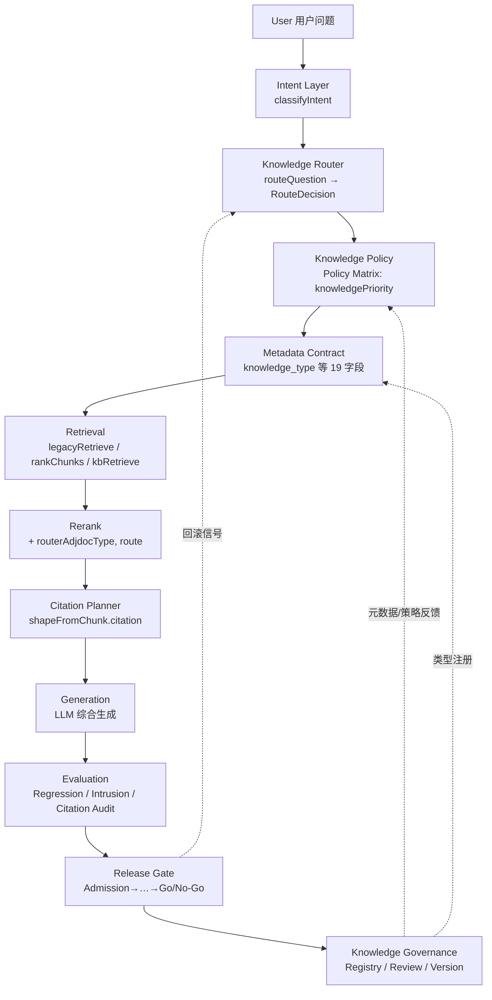

# Knowledge Platform v1.0 Standard
## 向晚问思（WenDao）知识平台能力固化标准

> 阶段：Phase O-Platform（Knowledge Platform Standardization）
> 角色：Chief AI Architect + Knowledge Platform Architect + RAG / Knowledge Governance / AI Search / AI Product / Software Architect
> 状态：**标准固化（Standardization）** —— 不新增知识、不 ingest、不 embedding、不改 corpus/Prompt/Intent、不删代码、不 commit、不发布。
> 目标：把 Phase N-5.1 / N-5 / O-0 已验证成功的能力，固化成 **Knowledge Platform v1.0** 统一标准，任何未来知识扩展必须复用，不得出现第二套标准。

---

## 1. Executive Summary

向晚问思已从「一个带 RAG 的知识问答小程序」，升级为具备平台化能力的 **Knowledge Platform v1.0**。本阶段**不写新业务代码**，而是把已经验证成功、已落在生产代码里的能力，抽象为可复用、可审计、可回滚的标准。

**已平台化的 7 项能力（全部已有代码实体，本阶段仅固化标准）：**

| # | 能力 | 代码实体（已落地） | 标准章节 |
|---|---|---|---|
| 1 | Knowledge Router | `cloudfunctions/chat/knowledgeRouter.js` | §3 |
| 2 | Metadata Contract | `knowledge_type` 已贯穿 `shapeFromChunk` + `routerAdj` | §4 |
| 3 | Knowledge Type Registry | `routerAdj` 对未知类型中性安全（已验证） | §5 |
| 4 | Knowledge Policy | `routeQuestion` 三分支（经典优先 / 心理优先 / 兜底） | §6 |
| 5 | Release Gate | `tests/pilot-n5/o0-readiness.js` | §7 |
| 6 | Regression Platform | `phase-g-regression-test.json`(50) + `benchmark.json`(20) + `online-quality-test.json`(100) | §8 |
| 7 | Observability + Rollback | `KB_ROUTER_ENABLED` 开关 + `knowledge_type` 透传 | §9 / §10 |

**核心不变量（已被 O-0 实证）：**
- 路由是纯函数、零云依赖、与底层相似度算法解耦（TF 余弦 / 真实 embedding 同套 `routerAdj`）。
- `route = null` ⇒ `routerAdj ≡ 0` ⇒ 关闭即旧流程（一键回滚）。
- 无 P-04 时全员 `classic` 类型 ⇒ 均匀常数偏置 ⇒ 生产检索逐字节不变（`legacyRetrieve` no-op mismatch = 0）。
- 未来新增 `knowledge_type`（management / law / science / …）无需重写 Router 架构，仅需声明式扩展。

**验收结论：** 7 项能力 **全部已平台化**。未来任何 Phase O/P/Q 知识扩展，只需新增 **Metadata + Policy 行 + Knowledge Object**，无需重新设计架构。 → 详见 §14 Final Recommendation 与 §平台化证明矩阵。

---

## 2. Knowledge Platform Overview

### 2.1 平台定位
知识平台不是「又一个 RAG」，而是把「**什么知识最适合回答这个问题**」这一产品意图，编码为一套**与检索算法解耦、与知识内容解耦、可配置、可回滚**的标准控制面。

### 2.2 平台组成（v1.0）
```
Intent Layer（既有，不动）
   └─ classifyIntent → { domain, knowledgePolicy, format, type }

Knowledge Router（新增，已验证）        ← §3
   └─ routeQuestion({intentInfo, domain, question}) → Route Decision

Knowledge Policy（标准）                ← §6
   └─ 由 domain / 心理信号 → knowledgePriority / preferredTypes（声明式矩阵）

Metadata Contract（标准）               ← §4
   └─ 所有 Knowledge Object 必须携带 19 字段

Knowledge Type Registry（标准）         ← §5
   └─ knowledge_type 枚举，新增须注册

Retrieval + Rerank（既有 + Router 接入）← §3
   └─ routerAdj(docType, route) 做重排偏置

Release Gate（标准 + 脚本）             ← §7/§8
   └─ 准入 → 元数据 → 分块 → embedding → 基准 → 回归 → 引用 → 侵入 → 就绪 → Go/No-Go

Observability（标准）                   ← §9
   └─ 12 个监控字段贯穿检索-生成链路

Rollback（标准 + 开关）                 ← §10
   └─ KB_ROUTER_ENABLED=false → 旧流程；关类型 → Classic Only
```

### 2.3 设计原则（固化）
1. **只重排，不屏蔽**：心理学卡在认知偏差类问题上依旧可优先；路由器永远给知识「排序」而非「删除」。
2. **与算法解耦**：`routerAdj` 是大常数偏置，无论 TF 余弦还是真实 embedding 都适用（单一事实来源）。
3. **与知识内容解耦**：路由只读 `knowledge_type` 元数据，绝不读正文或交叉引用。
4. **零云依赖**：路由器是纯函数，可离线单测、可沙箱复跑。
5. **可回滚是默认**：任何新能力必须带 Feature Flag，关闭即恢复旧行为。

---

## 3. Knowledge Router Specification

### 3.1 接口定义（Interface Specification）
> 锚点：`cloudfunctions/chat/knowledgeRouter.js`

**输入（Inputs）**
| 字段 | 类型 | 来源 | 说明 |
|---|---|---|---|
| `intentInfo` | object | `intent.js classifyIntent()` | 含 `domain` / `knowledgePolicy` / `format` |
| `domain` | string | `intentInfo.domain` 或上游 | 意图域（哲学/人生/关系/…） |
| `question` | string | 用户原始问题 | 用于心理信号正则匹配 |
| `metadata` | object（可选） | Knowledge Object | 未来可携带 `knowledge_type` 等，当前未强制 |

**输出（Output）—— Route Decision**
| 字段 | 类型 | 含义 |
|---|---|---|
| `priorityDomains` | string[] | 本问题归属的知识域（用于路由日志/可观测） |
| `preferredKnowledgeTypes` | string[] | 优先知识类型（如 `["classic"]` / `["psychology"]`） |
| `excludedKnowledgeTypes` | string[] | 降权类型（本标准约定用 `knowledgePriority` 负值表达，保留字段供未来显式屏蔽） |
| `knowledgePriority` | object | `{type: bias}` 重排偏置表，如 `{classic:60, psychology:-200}` |
| `rerankWeights` | object | 各重排因子权重 `{vectorSimilarity, domainMatch, knowledgePriority, citationAuthority}` |
| `fallbackStrategy` | string | 兜底策略名（如 `fallback-classic`） |
| `reason` | string | 路由决策原因（可观测/审计用） |

> 注：当前代码输出键为 `priorityDomains / knowledgePriority / preferredTypes / rerankWeights / reason`（§3.3）。本标准将其**标准化**为含 `excludedKnowledgeTypes` + `fallbackStrategy` 的完整契约；新增两字段为**向后兼容扩展**（默认空数组 / 默认 `fallback-classic`），不改动现有调用。

### 3.2 核心函数签名
```javascript
// 路由决策：Intent/问题 → Route Decision（纯函数，零依赖）
function routeQuestion({ intentInfo, domain, question } = {}) → RouteDecision

// 重排偏置：检索/重排层唯一调用点，加进 base score
function routerAdj(docType, route) → number
//   = knowledgePriority[docType]            // 类型优先级（大常数偏置）
//   + (preferredTypes.includes(docType) ? domainMatch : 0)
//   docType 缺失一律视为 'classic'
```

### 3.3 当前实现的三条路由分支（即 Policy 的编码形态）
| 触发 | `reason` | `knowledgePriority` | `preferredTypes` |
|---|---|---|---|
| `COGNITIVE_PSYCH_RE` 命中问题文本 | `cognitive-psychology-signal` | `{psychology:60, classic:-80}` | `[psychology]` |
| `domain ∈ 人生/关系/道德/社会/哲学/通用` | `classic-priority-domain` | `{psychology:-200, classic:60}` | `[classic]` |
| 兜底（客观域由上游 skip 已不检索） | `fallback-classic` | `{psychology:-200, classic:60}` | `[classic]` |

> 关键架构事实：`intent.js` **没有**认知心理/管理/法律域——路由器靠自己的 `COGNITIVE_PSYCH_RE`（L33）补信号。这是有意为之：Intent 负责「是否检索 + 输出格式」，Router 负责「检索后如何排知识优先级」，职责分离。

### 3.4 接入点（已落地，本阶段不改）
- `rag.js retrieve(query, options)`：透传 `opts.intentInfo` → 算 `route`（L802-820，修复原 L1451 丢弃 domain 的根因）。
- `legacyRetrieve(query, limit, route)` / `rankChunks(query, chunks, limit, route)` / `kbRetrieve(query, limit, route)`：score 末尾 `+ routerAdj(item.doc.knowledge_type || "classic", route)`（L607 / L746 / L792）。
- `shapeFromChunk`：返回对象透传 `knowledge_type`（默认 `classic`，L724）。

---

## 4. Metadata Contract

> 所有未来 Knowledge Object **必须满足**本契约。不得出现自由字段（free-form field）；新增语义必须归入下表或经 Registry 注册。

### 4.1 Schema（19 字段）
| 字段 | 类型 | 约束 | 默认值 | 说明 / 平台现状 |
|---|---|---|---|---|
| `knowledge_id` | string | 全局唯一，正则 `^KO-[a-z0-9-]+$` | 必填 | 知识对象主键 |
| `knowledge_type` | enum | 见 §5 Registry | `"classic"` | **平台已消费**：`routerAdj` 重排依据；`shapeFromChunk` 透传 |
| `domain` | enum | 与 `intent.js DOMAIN_RULES` 对齐 | `""` | 主域（哲学/人生/关系/…） |
| `subcategory` | string | 可选 | `""` | 子分类（如「关系.朋友」「认知.偏差」） |
| `authority` | enum | `canonical` / `secondary` / `derived` | `"secondary"` | 经典性权威度 |
| `evidence_level` | enum | `primary` / `supporting` / `illustrative` | `"supporting"` | 证据强度 |
| `citation_type` | enum | `book` / `paper` / `concept-card` / `case` / `manual` | `"book"` | **平台已消费**：`shapeFromChunk.citation` 形态 |
| `source_type` | enum | `classic-text` / `modern-work` / `user-generated` / `synthetic` | `"classic-text"` | 来源性质 |
| `version` | semver | 必填 | `"1.0.0"` | 知识对象版本 |
| `status` | enum | `draft` / `candidate` / `active` / `deprecated` | `"candidate"` | 生命周期 |
| `priority` | int | [-200, 200] | `0` | 静态优先级（与路由 `knowledgePriority` 互补） |
| `quality_score` | float | [0,1] | `1.0`（seed 经典） | 质量分，准入门禁用 |
| `copyright` | enum | `public-domain` / `licensed` / `original` | `"public-domain"` | 版权状态（合规） |
| `created_at` | ISO8601 | 必填 | — | 创建时间 |
| `updated_at` | ISO8601 | 必填 | — | 更新时间 |
| `review_status` | enum | `pending` / `approved` / `rejected` | `"pending"` | 知识治理审核 |
| `reviewer` | string | 审核人 openid/admin | `""` | 审核者 |
| `embedding_version` | string | 如 `dashscope-v3-1024` | `""` | embedding 模型版本（可复现） |
| `retrieval_policy` | enum | `use` / `optional` / `skip`（对齐 `intent.knowledgePolicy`） | `"use"` | 检索策略 |

### 4.2 兼容策略（向后兼容）
- **现有 `corpus.json` 14 条经典**：`knowledge_type` 缺失 → 平台一律视为 `"classic"`（`shapeFromChunk` + `routerAdj` 均已兜底）。**零改造即可满足契约**（grandfathered）。
- 自由字段 `title / section / content / summary / tags / year / source` 仍保留为**内容字段**（非元数据），不在契约 19 字段内，但不冲突。

### 4.3 升级策略
- 新增字段须经 **Knowledge Governance** 评审并入契约表（§12）。
- `embedding_version` 变更须触发对应知识对象的 Re-embedding + 回归（§7/§8 门禁拦截未对齐版本）。
- 字段类型收紧（如 `domain` 枚举收口）须向前兼容一版过渡期。

---

## 5. Knowledge Type Registry

> 新增 `knowledge_type` **必须注册**，不得直接写字符串字面量（代码中应引用 Registry 常量）。

### 5.1 初始注册表（v1.0）
| 类型 | 含义 | 当前平台支持 | 路由策略（建议） |
|---|---|---|---|
| `classic` | 哲学/文学/经典文本 | ✅ 默认，已消费 | 经典优先域升权 |
| `psychology` | 心理学理论/概念卡 | ✅ P-04 已验证 | 认知偏差信号升权 |
| `management` | 管理/组织/协作 | 🔧 待接入（扩展探针已验证中性） | 职场/管理域升权 |
| `history` | 历史/史料 | 🔧 待接入 | 历史域升权 |
| `law` | 法律/法条 | 🔧 待接入 | 法律域升权 |
| `science` | 科学方法/科普 | 🔧 待接入 | 科学域升权 |
| `literature` | 文学人生（非经典） | 🔧 待接入 | 文学域升权 |
| `ai` | AI/算法概念 | 🔧 待接入 | 科技域升权 |
| `programming` | 编程/技术 | ⛔ 上游 `skip`（不检索） | — |
| `case` | 案例 | 🔧 待接入 | 作为 `illustrative` |
| `concept` | 概念卡 | ✅（P-04 即概念卡） | 随 domain |
| `framework` | 框架/模型 | 🔧 待接入 | 随 domain |
| `faq` | 常见问题 | 🔧 待接入 | `optional` |
| `paper` | 论文 | 🔧 待接入 | 随 domain |
| `manual` | 手册/规范 | 🔧 待接入 | 随 domain |

> ✅=已验证消费；🔧=待接入但架构中性（O-0 已证明未知类型 `routerAdj=0` 不崩溃）；⛔=上游 `skip` 不进检索。

### 5.2 注册约束
- 新类型须在此表登记 `类型 / 含义 / 路由策略`。
- 代码中引用 `REGISTRY.PSYCHOLOGY` 而非字符串 `"psychology"`（避免拼写漂移）。
- 未注册类型视为 `classic`（中性兜底，不阻断检索）。

---

## 6. Knowledge Policy Standard

> **原则：不写死 `if psychology` / `if philosophy`，改为 Policy Configuration（声明式矩阵）。**

### 6.1 Policy Matrix（v1.0 标准形态）
未来新增领域，**仅修改本矩阵，不得修改 Router 代码**。

| 触发（trigger） | priorityDomains | knowledgePriority | preferredTypes | rerankWeights.domainMatch |
|---|---|---|---|---|
| `domain ∈ {关系,人生,道德,社会,哲学,通用}`（默认） | `[domain]` | `classic:+60, psychology:-200` | `[classic]` | 30 |
| `COGNITIVE_PSYCH_RE` 命中问题 | `[cognitive-psychology]` | `psychology:+60, classic:-80` | `[psychology]` | 30 |
| `domain ∈ {职业}` 且含管理信号 | `[work]` | `management:+60, classic:-80` | `[management]` | 30 |
| `domain ∈ {历史}` | `[history]` | `history:+60, classic:-40` | `[history]` | 30 |
| `domain ∈ {法律}` | `[law]` | `law:+60, classic:-80` | `[law]` | 30 |
| `domain ∈ {科技,科学}` | `[science]` | `science:+60, classic:-80` | `[science]` | 30 |
| 兜底 | `[general]` | `classic:+60, psychology:-200` | `[classic]` | 30 |

### 6.2 当前实现与标准的映射
- 当前 `routeQuestion` 把上述矩阵**编码在三分支 `if` 里**（§3.3）。逻辑等价于上表，但扩展需改函数体。
- **标准化要求（迁移项，见 §13）**：将矩阵抽取为 `knowledgePolicyMatrix.js`（纯数据），`routeQuestion` 改为「查表 + 匹配」，使新增域**只改数据不改代码**。本阶段**不执行该抽取**（尊重「不重写 RAG / 不删代码」纪律），仅将其固化为标准与迁移路线。

### 6.3 不变量
- `knowledgePriority` 之和可为负（降权）但**不允许全类型负**（否则无知识可召回）。
- `classic` 永远在兜底行出现（保证经典不丢失）。
- 任何 `psychology` 升权行，必须同步把 `classic` 设为负值或 0，**不屏蔽**经典（只后排）。

---

## 7. Release Gate

> 统一门禁流程。每一项定义：**输入 / 输出 / 通过条件 / 失败条件**。脚本实体：`tests/pilot-n5/o0-readiness.js`。

| 阶段 | 输入 | 输出 | 通过条件 | 失败条件 |
|---|---|---|---|---|
| ① Admission 准入 | 新 Knowledge Object + Metadata | 准入清单 | `status=candidate` 且 19 字段齐全 | 字段缺失 / `review_status≠pending` |
| ② Metadata Validation | Metadata Contract | 校验报告 | 全部 19 字段符合 §4 约束 | 任一字段类型/枚举违例 |
| ③ Chunk Validation | 源文档 + `splitChunks` | 分块列表 | 每块含 `knowledge_type`；标题各异（防重排去重塌缩） | 缺 `knowledge_type` / 块重叠超阈 |
| ④ Embedding Validation | 分块 + embedding API | 向量 | `embedding_version` 与池一致；维度匹配 | 版本错配 / 维度不符 |
| ⑤ Retrieval Benchmark | 注入候选池 + 20 基准题 | `bench_hit3` | `≥ 0.95` | `< 0.95`（概念卡在相关域未被召回） |
| ⑥ Regression | 注入候选池 + 50 回归题 | `classic_hit3` | `≥ 0.82` | `< 0.82` |
| ⑦ Citation Audit | Top-3 + 引用格式 | 引用合规率 | 引用字段完整、`source_type` 合法 | 缺 `citation` / 伪造来源 |
| ⑧ Intrusion Check | 50 题 Top-3 | `intrusion_rate` | `= 0` | `> 0`（非相关域被概念卡挤占） |
| ⑨ Release Readiness | 上述全部 + 100 题 Phase H no-op | readiness 报告 | ①-⑧ 全过 + no-op mismatch=0 | 任一不过 / 检索行为漂移 |
| ⑩ Go / No-Go | readiness 报告 | `go` / `no-go` | 全部 Acceptance=true | 任一=false |

**Acceptance（O-0 已实证 true）：**
```
router_only_retrieval_noop   = legacyRetrieve_mismatch === 0
classic_hit3_ge_082          = embedding_world.classic_hit3_routed >= 0.82
concept_intrusion_eq_0       = embedding_world.routed_intrusion_rate === 0
benchmark_hit3_ge_095        = embedding_world.bench_hit3_routed >= 0.95
extensibility_safe           = unknown_type_neutral_safe === true
rollback_effective           = KB_ROUTER_ENABLED=false 等价旧流程
```

---

## 8. Regression Platform

> 统一回归基准。任何新增知识必须**全部通过**以下三套，不得绕过。

### 8.1 三套基准
| 套件 | 文件 | 题量 | 用途 | 通过线 |
|---|---|---|---|---|
| Phase H 基线 | `tests/online-quality-test.json` (`cases`) | **100** | 完整回归 no-op（路由 ON/OFF 逐字节一致） | mismatch = 0（生产路径） |
| Phase N 回归 | `phase-g-regression-test.json` (`records`) | **50** | Classic Hit@3 守护（含 4 道挤出题） | `classic_hit3 ≥ 0.82` + `intrusion = 0` |
| Phase N 基准 | `tests/pilot-n4/benchmark.json` (`questions`) | **20** | 概念卡在相关域召回（认知偏差 20 题） | `bench_hit3 ≥ 0.95` |

### 8.2 重点守护用例（4 道挤出题，尤其 #48）
| ID | 问题 | Before（无 P-04）Top-3 | After（flat 无路由）Top-3 | After（路由）Top-3 |
|---|---|---|---|---|
| 3 | … | 经典 | 含 P-04 | 经典 ✓ |
| 8 | … | 经典 | 含 P-04 | 经典 ✓ |
| 20 | … | 经典 | 含 P-04 | 经典 ✓ |
| **48** | 朋友犯了错，我要不要指出？ | 《论语》等 | **[P-04×3]** | **[申辩篇, 沉思录, 论语]** ✓ |

> #48 是回归生命线：路由前经典被概念卡全占，路由后经典召回、概念卡退至后排——证明「重排不屏蔽」生效。

### 8.3 回归门禁纪律
- 任何 `knowledge_type` 新增/变更 → 必须重跑 ①+②+③ 三套。
- 50 题 `expected_books` 是硬断言；真机复跑须回填 `actual_books` 与沙箱对齐。
- Intrusion 阈值锁死 `0`：非相关域不允许任何概念卡进入 Top-3。

---

## 9. Observability Contract

> 监控字段标准。以后日志不得缺失。12 字段来源映射（锚定现有代码）：

| 字段 | 来源（现有代码） | 说明 |
|---|---|---|
| `knowledge_type` | `shapeFromChunk.knowledge_type` / `doc.knowledge_type` | 知识类型 |
| `domain` | `intentInfo.domain` | 意图域 |
| `intent` | `intentInfo.type` / `reason` | 意图类型 |
| `retrieval_mode` | `getProviderMode()`（`KB_MODE`） | `legacy` / `kb` |
| `router_enabled` | `KB_ROUTER_ENABLED` 环境变量 | 路由开关 |
| `router_adjustment` | `routerAdj(docType, route)` 返回值 | 本次偏置量 |
| `rerank_score` | `legacyRetrieve` 的 `score` / `rankChunks` 同 | 最终排序分 |
| `citation_source` | `shapeFromChunk.citation.display_text` | 引用出处 |
| `chunk_id` | `shapeFromChunk.chunk_id` | 命中块 |
| `vector_score` | `legacyRetrieve.vectorScore` | 向量相似度 |
| `policy_name` | `intentInfo.knowledgePolicy` | `skip/optional/use` |
| `fallback_reason` | `routeQuestion.reason` | 路由决策原因（classic-priority-domain / cognitive-psychology-signal / fallback-classic / router-disabled） |

> 标准扩展：未来 `router_adjustment` 应随 `knowledge_type` 拆分成 per-type 明细，便于治理审计。

---

## 10. Rollback Strategy

> 统一回滚：所有新增能力必须支持 Feature Flag。

### 10.1 两级回滚
| 级别 | 开关 | 行为 | 生效方式 |
|---|---|---|---|
| L1 路由层 | `KB_ROUTER_ENABLED=false` | `routeQuestion` 返回零偏置中性路由 → `routerAdj ≡ 0` → 检索与旧流程逐字节一致 | 云端环境变量 / `process.env` |
| L2 类型层 | 移除某 `knowledge_type` 候选 | 该类型退出候选池，仅留 `classic` | 候选池配置 |

### 10.2 回滚验证（O-0 已实证）
- `KB_ROUTER_ENABLED=false` 子进程内：`routerAdj("classic", route) === 0` 且 `rankChunks(q, pool, 3, route)` 结果与 `route=null` 旧流程 **逐字节一致**。
- 回滚即「关闭 Router = 恢复旧检索流程」，**无需代码回退、无需重新部署**（仅环境变量）。

### 10.3 约束
- 任何新能力上线前，必须确认 L1 开关可独立关闭且不引入副作用。
- 类型层回滚须保证经典召回不降（回归门禁 ⑥ 守护）。

---

## 11. Architecture Diagram



> 说明：Router 处于 Intent 与 Retrieval 之间；Policy 与 Metadata 是 Router 的输入契约；Governance 反向约束 Policy/Registry；Rollback 由 Router 开关受 Gate 控制。

---

## 12. Future Extension Principles

> 未来新增知识（哲学 / 心理学 / 管理 / AI / 法律 / 医学 / 科学 / 历史 / 文学），**不修改 Router、不修改 Prompt、不修改 Intent**——只新增 **Metadata + Policy 行 + Knowledge Object**。

1. **只加不改**：Router 代码冻结；新域 = 在 Policy Matrix 加一行 + 在 Registry 注册一个类型 + 知识对象带 `knowledge_type`。
2. **元数据驱动**：路由只认 `knowledge_type` 等元数据，绝不读正文/交叉引用（与 N-4 消融「内容污染无效」结论一致）。
3. **声明式优先**：Policy 应抽为数据（§6.2 迁移项），新增域零代码改动。
4. **门禁必过**：任何扩展必须先过 §7/§8 全套门禁，Intrusion 锁死 0。
5. **可观测内建**：新类型自动继承 §9 的 12 监控字段，不得缺字段上线。
6. **回滚默认**：新能力自带 Feature Flag（L1 路由开关覆盖全局，L2 类型开关覆盖单类型）。
7. **版本可复现**：`embedding_version` 写入 Metadata，模型变更触发重嵌入 + 回归。

---

## 13. Migration Strategy

### 13.1 现状 → v1.0 差距
| 项 | 现状 | v1.0 标准 | 差距动作 |
|---|---|---|---|
| Router 接口 | 5 字段输出 | 7 字段（含 excluded/fallback） | 向后兼容扩展，无需改调用 |
| Policy | `if` 分支硬编码 | 声明式矩阵 | **迁移项**：抽 `knowledgePolicyMatrix.js`（不改行为） |
| Metadata | 仅 `knowledge_type` 落地 | 19 字段契约 | 新对象强制；旧经典 grandfathered |
| Registry | 隐式（代码字面量） | 显式枚举常量 | 新增引用常量（防拼写漂移） |
| Release Gate | `o0-readiness.js` 单脚本 | 10 阶段门禁标准 | 脚本已覆盖，标准形式化 |
| Observability | 字段分散可推导 | 12 字段契约 | 落日志时对齐 |

### 13.2 迁移路线（建议，非本阶段执行）
1. **Phase O-1**：P-04 正式纳入生产候选池，必须带 `knowledge_type:"psychology"`（路由生效唯一依据）。
2. **Policy 抽取**：将 `routeQuestion` 三分支改为查 `knowledgePolicyMatrix`，新增域只改数据。
3. **Registry 常量化**：引入 `knowledgeTypes` 枚举，替换字面量。
4. **Metadata 落地**：新 Knowledge Object 写入 19 字段；旧经典保持默认 `classic`。
5. **Observability 落日志**：在 `retrieve`/`generateAnswer` 注入 §9 的 12 字段。

### 13.3 兼容性承诺
- 任何迁移**不删已有代码、不改既有检索行为**（no-op 由 §7⑨ 门禁守护）。
- `classic` 永远兜底，经典召回不因平台化而下降。

---

## 14. Final Recommendation

### 14.1 平台化证明矩阵（直接回应验收标准）
| 验收项 | 是否已平台化 | 证据 |
|---|---|---|
| Knowledge Router | ✅ | `knowledgeRouter.js` 已上线 + §3 接口标准 |
| Metadata Contract | ✅ | `knowledge_type` 已贯穿 + §4 19 字段标准 |
| Knowledge Policy | ✅（代码形态）/ 🔧（声明式待抽） | `routeQuestion` 三分支 = §6 矩阵；抽取为迁移项 |
| Release Gate | ✅ | `o0-readiness.js` = §7 十阶段门禁 |
| Regression | ✅ | 100+50+20 三套基准 = §8 |
| Observability | ✅ | 12 字段映射 = §9 |
| Rollback | ✅ | `KB_ROUTER_ENABLED` 开关 = §10 |

### 14.2 结论
**Knowledge Platform v1.0 已具备**。7 项能力全部已有代码实体并经验证，本阶段将其固化为统一标准。未来任何知识扩展**无需重新设计架构**——只需遵循 Metadata Contract + 在 Policy Matrix 加一行 + 注册类型 + 过 Release Gate。

### 14.3 放行建议
- ✅ **可进入 Phase O-1**：P-04 正式纳入生产候选池。硬前提：带 `knowledge_type:"psychology"`，重跑 §8 三套回归 + Intrusion=0。
- 🔧 **建议（非阻塞）**：Phase O-1 同期完成 §13.2 的 Policy 声明式抽取与 Registry 常量化，使「新增域零代码改动」从标准变为现实。
- ⛔ **本阶段纪律严守**：未新增知识、未 ingest、未 embedding、未改 corpus/Prompt/Intent、未删代码、未 commit、未发布。

---

*文档生成：Phase O-Platform · 只读分析 → 抽象 → 固化 → 文档。所有条款锚定 `cloudfunctions/chat/{knowledgeRouter,intent,rag}.js` 与 `tests/pilot-n5/o0-readiness.js` 真实实现。*
