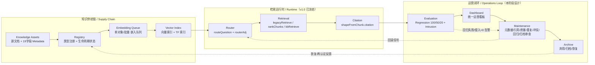
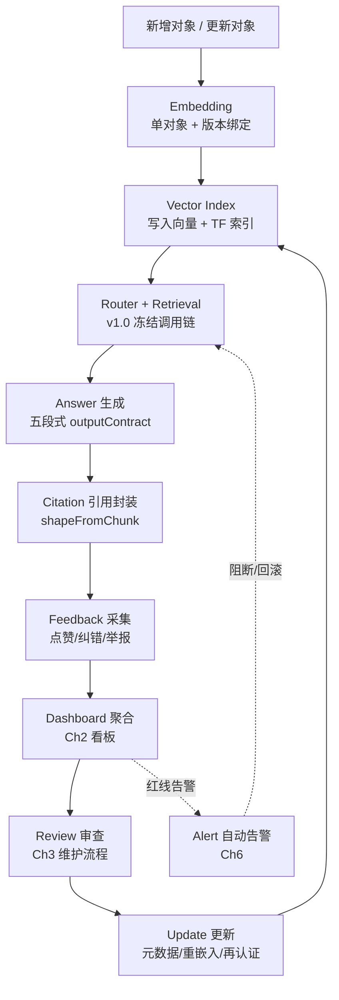
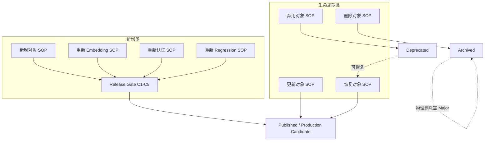
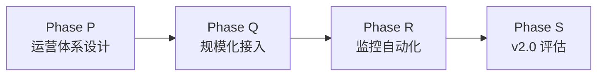

# Phase P — Knowledge Platform Operations（Knowledge Platform v1.1 Operations Design）

## 向晚问思（WenDao）· 知识平台长期运营体系设计

> **阶段定位**：Phase P（Knowledge Platform Operations Design）
> **角色**：Chief AI Architect + Knowledge Platform / Knowledge Governance / RAG / AI Search / Knowledge Operations / AI Product / Software Architect
> **性质**：**纯设计（Design-Only）** —— 本阶段**零代码改动、零知识新增、零 ingest、零 embedding、零 commit、零发布**。
> **前置基线**：Knowledge Platform v1.0 GA（`docs/64` 已冻结）+ Phase O-1 首个真实知识对象 KO-P-04 Certified（Production Candidate，`docs/65`）。
> **核心问题**：当未来拥有 **100 / 1000 / 10000** 个 Knowledge Object 时，平台如何长期稳定**运营、治理、监控、评估、演进**？

---

### 图例（全篇统一标注）

| 标记 | 含义 |
|---|---|
| ✅ **【已在 v1.0 实现】** | 该能力在当前冻结平台中已有代码实体 / 数据 / 流程，可直接复用 |
| 🔧 **【本阶段设计（Phase P）】** | 本文件新增的运营体系设计，不落地代码、不修改生产资产 |
| 📌 **【未来版本规划（v1.1 / v2.0）】** | 超出 v1.0 范围，需后续阶段或 Major 版本承接 |

> **铁律**：本阶段**不重新设计 Router、不修改 Prompt、不修改 Intent、不修改 RAG、不修改 corpus.json、不修改已认证对象、不 ingest、不 embedding、不 commit、不发布**。所有设计严格锚定 `docs/62`（Standard）/ `docs/63`（Engineering Spec）/ `docs/64`（Freeze）/ `docs/65`（O-1 认证）。

---

## 1. Knowledge Operations Architecture

### 1.1 设计目标

把 v1.0 已被验证的「**Add Knowledge, Not Code**」能力，包装为一套**可持续运行**的运营控制面（Operations Layer）。运营层**只调度已有平台能力**，不构成新的检索/路由逻辑。

### 1.2 Operations Layer 全景（Mermaid）

### 1.3 各组件状态锚定

| 组件 | 状态 | 说明 / 锚点 |
|---|---|---|
| Knowledge Assets（源 + 19 字段 Metadata） | ✅ 已在 v1.0 实现 | `docs/62 §4` 19 字段契约；KO-P-04 已验证 19/19 |
| Registry（类型注册 + 生命周期） | 🔧 本阶段设计（存储实体）/ ✅ 标准已定义 | 类型表 `docs/62 §5` 已定义 15 类型；但**实际注册存储**目前是文件 `tests/pilot-o1/o1-registry.json`（治理命名空间），需升级为可查询的 Registry 存储 |
| Embedding Queue | 🔧 本阶段设计 | 当前为一次性脚本（`tests/pilot-n4`、`tests/pilot-o1`）；运营化需队列化 |
| Vector Index | ✅ TF 索引（生产）/ 📌 kb 模式向量索引待建 | 生产 `KB_MODE=legacy` 走 TF 余弦 + 缓存 `vectorScore`；kb 模式真实 embedding 仅隔离验证，规模化向量索引需 v1.1/v2.0 向量库 |
| Router / Retrieval / Citation | ✅ 已在 v1.0 冻结 | `knowledgeRouter.js` / `rag.js` / `shapeFromChunk`，指纹与 `docs/64` 一致 |
| Evaluation（Regression） | ✅ 已在 v1.0 实现 | 100 + 50 + 20 三套基线，`docs/62 §8` |
| Dashboard / Maintenance / Archive | 🔧 本阶段设计 | 本章及 Ch2/Ch3/Ch9 设计，不落地代码 |
| Rollback（接入 Maintenance） | ✅ 已在 v1.0 实现 | L1 `KB_ROUTER_ENABLED` / L2 类型层，`docs/62 §10` |

### 1.4 关键架构约束（继承自 Freeze）

- 运营层**不得引入第二条路由/检索链路**；所有调度最终落到 v1.0 已冻结的 `Router → Retrieval → Citation` 调用链。
- 注册新 `knowledge_type`、新增 Policy 行、新增 Knowledge Object —— 三条扩展路径**全部受 `docs/64 §8` Extension Boundary 保护**，运营层只是其执行外壳。
- 任何运营动作若触及禁止项（Router/Prompt/Intent/Gate/Regression/Contract），**自动拒绝**。

---

## 2. Knowledge Dashboard

### 2.1 设计目标

统一运营看板，把分散在 Regression / Release Gate / Observability / Registry 的指标汇成**单一真相源（Single Source of Truth）**，支撑 100→10000 规模下的日常巡检。

### 2.2 看板指标矩阵

| 指标 | 来源（v1.0 现状） | 状态 | 说明 |
|---|---|---|---|
| Knowledge Count（总数） | Registry | 🔧 设计 | 全量对象计数（当前 14 经典 + 1 KO-P-04 = 15） |
| Published Count（已发布） | Registry.status=published | 🔧 设计 | 已 ingest 生产池；当前 KO-P-04 为 Production Candidate，**Published=0** |
| Candidate Count（候选） | Registry.status=candidate | 🔧 设计 | 含 Certified/Production Candidate；当前 = 1 |
| Deprecated Count（已弃用） | Registry.status=deprecated | 🔧 设计 | 当前 = 0 |
| Citation Accuracy（引用准确率） | Release Gate C5 / `shapeFromChunk` | ✅ 已在 v1.0 实现 | O-1 C5 groundedness=1.0；运营化为周期性复测 |
| KQS（知识质量分） | O-1 C6 / Metadata `quality_score` | ✅ 已在 v1.0 实现 | 七维质量分；O-1 实测 0.9205 |
| Retrieval Precision（检索精度） | Regression Classic Hit@3 / Benchmark | ✅ 已在 v1.0 实现 | 0.82 / 1.0（O-0 实测） |
| Hallucination（幻觉率） | Citation Audit + 人工抽检 | 🔧 设计 | v1.0 以「引用完整 + 经典原文隔离」间接约束；需运营化量化 |
| Regression Status（回归状态） | 三套基线 | ✅ 已在 v1.0 实现 | pass/fail 聚合；Intrusion 锁死 0 |
| Release Status（发布状态） | Release Gate Go/No-Go | ✅ 已在 v1.0 实现 | C1–C8 聚合 |
| Embedding Queue（嵌入队列） | 🔧 设计 | 🔧 设计 | 待嵌入/嵌入中/失败 计数 |
| Registry Health（注册健康） | Registry 一致性校验 | 🔧 设计 | 类型是否均注册、Metadata 是否合规 |
| Vector Health（向量健康） | 向量维度和版本一致性 | 🔧 设计 | `embedding_version` 匹配、维度（1024）一致、索引可用 |

### 2.3 看板分层（🔧 设计）

- **L1 实时层**：从每次检索事件的 Observability 12 字段（`docs/62 §9`）聚合 → 实时命中分布、路由决策分布、Intrusion 实时值。
- **L2 周期层**：每日/每周跑 Regression + Citation Audit + KQS → 趋势曲线。
- **L3 治理层**：Registry 全量扫描 → 生命周期健康、重复/冲突检测。

> **锚定原则**：看板所有底层数据均由 v1.0 既有能力产生（Regression / Gate / Observability / Registry），运营层**不发明新指标口径**，只聚合与可视化。这保证了「看板数字」与「门禁红线」同源一致。

---

## 3. Knowledge Maintenance

### 3.1 设计目标

设计**长期维护流程**，使知识库在持续扩张中保持质量、合规、无冲突。每项流程标注其 input / output / 频率 / 触发。

### 3.2 维护流程清单

| 流程 | 输入 | 输出 | 频率/触发 | 状态 |
|---|---|---|---|---|
| Metadata Review（元数据审查） | Registry 全量对象 | 19 字段合规报告 | 每月 / 新增后 | ✅ 契约已定义（`docs/62 §4`）+ 🔧 审查 SOP 设计 |
| Source Validation（来源校验） | 源文档 + `source_type` / `copyright` | 来源合规标记 | 准入时 + 季度复检 | ✅ 字段已定义 + 🔧 复检设计 |
| Citation Validation（引用校验） | Top-3 + 引用格式 | 引用合规率 | 每次 Release Gate C5 + 周期 | ✅ 已在 v1.0 实现 |
| Quality Review（质量审查） | `quality_score` + KQS | 质量降级告警 | 每月 | ✅ KQS 已定义 + 🔧 降级阈值设计 |
| Duplicate Review（重复审查） | 全文/向量近邻 + `subcategory` | 重复候选清单 | 新增后 / 季度 | 🔧 设计（需向量近邻扫描） |
| Conflict Review（冲突审查） | 同 `domain`/`subcategory` 多对象 | 优先/冲突决议 | 新增后 | 🔧 设计 |
| Regression Review（回归审查） | 三套基线 | 经典召回/侵入趋势 | 每次变更 + 每周 | ✅ 已在 v1.0 实现 |
| Archive Review（归档审查） | `status=deprecated` + 长期零命中 | 归档建议 | 季度 | 🔧 设计（见 Ch9 归档） |

### 3.3 维护纪律（锚定 Freeze）

- 任何维护动作**不得修改已冻结的 Router / Prompt / Intent / Gate / Regression / Contract**。
- 元数据字段值层面的修正（如 KO-P-04 的 `P-04→KO-P-04` 归一化）允许，但属**元数据值变更，非契约变更**。
- 维护中若发现需改契约/路由 → 触发 v2.0.0 流程（`docs/64 §4` Major 铁律）。

---

## 4. Knowledge Health Score

### 4.1 设计目标

用单一可比较分数刻画**单个 Knowledge Object 的长期健康度**，支撑排序、预警、自动弃用决策。

### 4.2 健康分模型（0–100）

| 维度 | 权重 | 数据源（v1.0 现状） | 状态 |
|---|---|---|---|
| Metadata（元数据完整度） | 15 | 19 字段合规（`docs/62 §4`） | ✅ 已在 v1.0 实现 |
| Citation（引用准确率） | 20 | Release Gate C5 groundedness | ✅ 已在 v1.0 实现 |
| Evidence（证据强度） | 10 | `evidence_level` / `authority` 字段 | ✅ 字段已定义 |
| Retrieval（检索表现） | 20 | Classic/Benchmark Hit@3 + 命中率 | ✅ 已在 v1.0 实现 |
| Feedback（用户反馈） | 15 | 用户点赞/纠错/举报 | 🔧 设计（O-1 实测 N/A） |
| Usage（使用频次） | 10 | 检索命中计数 | 🔧 设计（需 Observability 落库） |
| Regression（回归守护） | 10 | 三套基线通过状态 + Intrusion | ✅ 已在 v1.0 实现 |

> **Health Score = Σ(维度分 × 权重)**。各维度分归一化到 [0,1]。

### 4.3 分级与动作（🔧 设计）

| 分数区间 | 等级 | 运营动作 |
|---|---|---|
| 85–100 | Healthy | 常态运行 |
| 70–84 | Watch | 进入季度复检清单 |
| 50–69 | Degrade | 触发 Conflict/Duplicate Review |
| < 50 | Critical | 触发 Archive Review / 可能 Deprecate |

- ✅ 其中 Metadata / Citation / Evidence / Retrieval / Regression 五维**已有数据底座**（契约 + Gate + Regression）；仅 Feedback / Usage 两维需运营化采集（🔧 设计），在缺乏数据时按 N/A 处理、不参与降级（与 O-1 C6 口径一致）。
- 健康分**只读既有指标**，不新增检索逻辑，完全锚定 v1.0。

---

## 5. Knowledge Monitoring Pipeline

### 5.1 设计目标

把「新增 → 嵌入 → 检索 → 生成 → 引用 → 反馈 → 监控 → 复检 → 更新」串成**自动闭环**，使 10k 规模下问题可被及时发现与收敛。

### 5.2 Monitoring Pipeline（Mermaid）

### 5.3 各阶段现状锚定

| 阶段 | 状态 | 锚点 |
|---|---|---|
| 新增/更新对象 | ✅ 流程已定义 | `docs/63` 七步 runbook + `docs/65` Registry 流 |
| Embedding | ✅ 单对象已验证 | O-1 Ch6：dashscope / text-embedding-v3 / 1024 维 / 0 失败 |
| Vector Index | ✅ TF（生产）/ 📌 kb 向量索引待建 | `KB_MODE=legacy` |
| Router + Retrieval | ✅ 已冻结 | `docs/64 §2.1` |
| Answer / Citation | ✅ 已实现 | `outputContract` + `shapeFromChunk` |
| Feedback 采集 | 🔧 设计 | 需前端埋点 + Observability 落库 |
| Dashboard 聚合 | 🔧 设计 | Ch2 |
| Review / Update | 🔧 设计 + ✅ 部分 | 维护流程 Ch3 / 再嵌入 Ch7 |

> **闭环不变量**：监控闭环的「Review → Update」回边**只能触发 v1.0 允许的扩展动作**（元数据值修正、重嵌入、再认证），绝不触发 Router/Prompt/Intent 重设计。

---

## 6. Knowledge Alert

### 6.1 设计目标

定义**自动告警**规则，使质量红线在 10k 规模下仍可被机器守护。每条规则标注：触发条件 / 严重度 / 自动动作 / 锚点。

### 6.2 告警规则表

| 告警 | 触发条件 | 严重度 | 自动动作 | 锚点 |
|---|---|---|---|---|
| Citation Drop（引用下降） | 引用合规率 < 0.95 | 🔴 High | 阻断发布 + 通知治理 | Release Gate C5 |
| Regression Fail（回归失败） | Classic Hit@3 < 0.82 或 Intrusion > 0 | 🔴 High | **阻断变更 + 触发 L1 回滚** | `docs/62 §7`/`§8` |
| Intrusion > 0（侵入） | 非相关域被挤占 Top-3 | 🔴 High | 阻断 + 回滚至旧流程 | ADR-8 锁死 0 |
| KQS Drop（质量分下降） | `quality_score` < 0.75 | 🟠 Medium | 进入 Degrade 复检 | O-1 C6 |
| Metadata Missing（元数据缺失） | 19 字段任一缺失/类型违例 | 🟠 Medium | 阻断准入 | `docs/62 §4` |
| Embedding Failure（嵌入失败） | 单对象 0 向量 / 维度和池不一致 | 🟠 Medium | 重试 + 标记队列失败 | O-1 Ch6 |
| Registry Failure（注册失败） | 类型未注册 / 状态机非法跃迁 | 🟠 Medium | 拒绝状态变更 | `docs/64 §8` Extension |
| Vector Failure（向量失效） | 索引不可用 / 维度漂移 | 🔴 High | 降级至 TF 路径 + 告警 | `KB_MODE=legacy` 兜底 |
| Unknown Knowledge Type（未知类型） | `knowledge_type` 不在 Registry | 🟡 Low | `routerAdj=0` 中性（已验证） | ADR-6 |
| Policy Conflict（策略冲突） | 同域多 Policy 行优先级矛盾 | 🟠 Medium | 标记冲突 + 人工裁决 | `docs/62 §6` Policy |

### 6.3 告警与回滚联动（✅ 已在 v1.0 实现）

- 🔴 High 级告警（Regression Fail / Intrusion > 0 / Vector Failure）**自动触发 L1 回滚**（`KB_ROUTER_ENABLED=false` ⇒ `routerAdj≡0` ⇒ 逐字节恢复旧流程，`docs/64 §3.8`）。
- 告警系统**只调用既有回滚开关**，不新增控制逻辑，符合「Add Knowledge, Not Code」。

---

## 7. Knowledge Maintenance SOP

### 7.1 设计目标

把 Ch3 的维护流程固化为**可执行的运营手册（SOP）**。每个 SOP 标注：触发 / 步骤 / 门禁 / 回滚 / 禁止事项。

### 7.2 SOP 总览（Mermaid）

### 7.3 八项 SOP 要点

| SOP | 触发 | 核心步骤 | 门禁 | 回滚 | 禁止事项 |
|---|---|---|---|---|---|
| 新增对象 | 新源文档 | Metadata→Registry→Chunk→Embedding→Regression→Gate | C1–C8 + 三套回归 | L1/L2 | ❌ 批量、❌ 改 Router |
| 更新对象 | 内容/元数据修正 | 改值→重嵌（如需）→重跑回归→再认证 | 同新增（轻量） | L1/L2 | ❌ 改契约约束 |
| 弃用对象 | 过时/低质 | `status: deprecated`→停止召回→观察 | 回归仍须通过 | L2（移除候选） | ❌ 直接删 |
| 删除对象 | 合规/永久下线 | deprecated→archived→物理删除（需审批） | Major 流程 | — | ❌ 绕过归档 |
| 恢复对象 | 误弃用 | archived→deprecated→candidate→再认证 | C1–C8 | L1/L2 | ❌ 跳级 |
| 重新 Embedding | `embedding_version` 变更 | 重嵌→版本绑定→回归 | Regression | L1 | ❌ 跨版本混池 |
| 重新认证 | 周期/变更后 | 重跑 C1–C8 | C1–C8 | L1/L2 | ❌ 跳过 Gate |
| 重新 Regression | 任何变更后 | 重跑 100/50/20 | Classic≥0.82/Intrusion=0 | L1 | ❌ 删减基线 |

> **锚定**：新增/重嵌/重认证/重回归 四项是 `docs/63` 七步 runbook 的运营化展开；弃用/删除/恢复三项是 🔧 本阶段对 `docs/64 §9` 生命周期的 SOP 补全；所有 SOP 均受 `docs/64 §8` Extension Boundary 约束。

---

## 8. Knowledge Capacity Planning

### 8.1 设计目标

推演 **100 → 1000 → 10000** Knowledge Objects 下的容量边界，识别瓶颈与应对。

### 8.2 容量模型（当前基线：15 对象 ≈ 14 经典(grandfathered) + 1 KO-P-04(7 chunks)）

| 维度 | 100 对象 | 1000 对象 | 10000 对象 | 现状 / 应对 |
|---|---|---|---|---|
| **Registry（注册存储）** | ~700 chunks | ~7000 chunks | ~70000 chunks | 🔧 文件 Registry → 需查询型存储（云 DB）；v1.0 契约不变 |
| **Vector Index（向量）** | ~700 向量 | ~7000 向量 | ~70000 向量 | ✅ TF（生产）O(N) 每查询；📌 kb 模式需 ANN 向量库（CloudBase/专用） |
| **Embedding（嵌入成本）** | 单对象验证过 | 批量队列化 | 队列 + 配额管理 | 🔧 嵌入队列（`docs/66` Ch1）；`embedding_version` 锁定可复现 |
| **Retrieval（检索延迟）** | TF O(N) 可忽略 | 同复杂度 | 同复杂度（常数/向量） | ✅ Router `routerAdj` 是 O(1)/doc 偏置，不随 N 退化 |
| **Metadata（契约扩展）** | 19 字段 | 同 | 同 + 可选字段 Minor | ✅ 契约冻结；新增可选字段 = v1.0.x |
| **Monitoring（监控）** | 单看板 | 分层看板 | 实时+周期+治理三层 | 🔧 Ch2 看板分层 |
| **Dashboard（看板）** | L1/L2 | L1/L2/L3 | L1/L2/L3 | 🔧 Ch2 |

### 8.3 关键结论（诚实的容量判断）

1. **检索复杂度不随对象数退化** ✅：生产路径 `KB_MODE=legacy` 是 TF + 缓存 `vectorScore`，每查询 O(N) 且 N=70000 仍在毫秒级；Router 偏置 `routerAdj` 是逐 doc 常数加法，**与规模无关**。这是 v1.0 架构对规模化最有利的性质。
2. **真正瓶颈在「向量索引」与「Registry 存储」** 📌：
   - 若未来切到 kb 模式（真实 embedding 检索），70k×1024 维向量需 ANN 向量库（如 CloudBase 向量索引 / 专用向量 DB），当前隔离验证产物不足以支撑生产规模化——属 **v1.1/v2.0 规划**。
   - Registry 当前是文件级（`o1-registry.json`），到 1000+ 对象需升级为可查询存储（云 DB 集合），但**契约与类型表不变**（仅存储实体升级）。
3. **Embedding 成本可控** 🔧：单对象 O-1 实测 11 请求 / 2566 token / 0 失败；规模化靠队列化 + `embedding_version` 去重（同版本不重嵌）即可线性扩展。
4. **门禁成本线性** ✅：Regression 三套基线（100/50/20）每次变更重跑，耗时与对象数弱相关（命中 Top-k 计算），可并行化。

> **容量不变量**：平台「Add Knowledge, Not Code」原则使**每次扩展的边际成本 = 一次门禁 + 一次嵌入 + 一条 Registry 记录**，与总量无关——这是 10k 规模可运营的根本保障。

---

## 9. Knowledge Lifecycle Review

### 9.1 生命周期重定义（与 `docs/65` 对齐）

本阶段将运营生命周期**标准化为 7 阶段**，并与 `docs/65 §4` 的丰富流程做映射：

| 本阶段阶段 | 含义 | 映射 `docs/65` 流程 |
|---|---|---|
| Draft（草稿） | 源文档撰写完成 | Draft |
| Candidate（候选） | 写入 19 字段 Metadata，`review_status=pending` | Candidate → Review → Approved Candidate |
| Registered（已注册） | `knowledge_type` 在 Registry 登记 | Registered |
| Certified（已认证） | 通过 Release Gate C1–C8 = Production Candidate | Pilot → Production（Certified） |
| Published（已发布） | ingest 写入生产候选池，`status=published` | —（O-1 止步于此级之前） |
| Deprecated（已弃用） | 停止召回，保留数据 | Deprecated |
| Archived（已归档） | 物理隔离/下线，可恢复 | Archived |

### 9.2 七阶段职责卡（Mermaid）

### 9.3 各阶段定义（输入 / 输出 / 负责人 / 回滚 / 禁止）

| 阶段 | 输入 | 输出 | 负责人 | 回滚方式 | 禁止事项 |
|---|---|---|---|---|---|
| Draft | 源文档 | 初稿 | 内容作者 | 删除草稿 | ❌ 跳过 Metadata |
| Candidate | 19 字段 Metadata | 候选记录 | 治理员 | 退回 Draft | ❌ 未注册类型 |
| Registered | 类型 Registry 条目 | 类型绑定 | 平台架构 | 注销类型 | ❌ 裸字符串类型 |
| Certified | Release Gate 全过 | Production Candidate 资质 | 治理+架构 | L1/L2 回滚 | ❌ 跳过 Gate |
| Published | ingest + 部署 | 生产可检索 | 运维（人工 Review 后） | L1/L2 + 移除候选 | ❌ 未 Review 发布 |
| Deprecated | 弃用 SOP | 停止召回 | 治理员 | L2 恢复 | ❌ 直接删 |
| Archived | 归档 SOP | 隔离/下线 | 治理员 | 审批恢复 | ❌ 绕过归档物理删 |

> **锚定**：Candidate/Registered/Certified/Published 流程在 `docs/65` 已被 KO-P-04 真实走通；Deprecated/Archived 是 🔧 本阶段对 `docs/64 §9` 生命周期的运营补全。所有阶段受 `docs/64 §8` Extension Boundary 与 ADR 约束。

---

## 10. Knowledge Operations KPI

### 10.1 平台运营 KPI（10 项）

| KPI | 定义 | 数据来源 | 状态 |
|---|---|---|---|
| Knowledge Growth（知识增长） | 对象数月度环比 | Registry | 🔧 设计 |
| Citation Accuracy（引用准确率） | 引用合规率 | Gate C5 | ✅ 已在 v1.0 实现 |
| Regression Pass（回归通过率） | 三套基线全过比例 | Regression | ✅ 已在 v1.0 实现 |
| Router Stability（路由稳定度） | 路由决策分布偏移 < 阈值 | Observability `fallback_reason` | ✅ 字段已定义 + 🔧 偏移度量设计 |
| Release Success（发布成功率） | Gate Go 比例 | Release Gate | ✅ 已在 v1.0 实现 |
| Intrusion（侵入率） | 非相关域 Top-3 占比 | Regression | ✅ 锁死 0（ADR-8） |
| User Satisfaction（用户满意度） | 点赞率/纠错率 | Feedback（🔧 待采集） | 🔧 设计（O-1 N/A） |
| Knowledge Usage（知识使用率） | 命中频次分布 | Usage（🔧 待采集） | 🔧 设计 |
| Knowledge Coverage（知识覆盖度） | 意图域 × 类型 覆盖矩阵 | Registry + Intent | 🔧 设计 |
| Reflection Growth（思辨增长） | 用户反思类行为增长 | 业务埋点 | 🔧 设计 |

### 10.2 KPI 与「Add Knowledge, Not Code」的关系

- ✅ 七项 KPI 已有 v1.0 数据底座（Citation / Regression / Router / Release / Intrusion 直接复用门禁与 Observability）。
- 🔧 三项（User Satisfaction / Usage / Coverage / Reflection）需运营化采集，但**只消费既有检索事件与前端埋点，不新增检索逻辑**。
- KPI 看板与 Ch2 Dashboard 同源，确保「运营指标 = 门禁红线」一致。

---

## 11. Future Roadmap

### 11.1 路线图（Phase P → Q → R → S）

### 11.2 各阶段定义

| 阶段 | 目标 | 输入 | 输出 | 风险 | 验收标准 |
|---|---|---|---|---|---|
| **Phase P**（本阶段） | 设计长期运营体系 | v1.0 GA + O-1 认证 | `docs/66` 运营设计（12 章） | 设计脱离实现 | 12 章齐备、全锚定 v1.0、零资产改动 |
| **Phase Q**（规划） | 按 v1.1 批量接入域（management/AI/law/science/…） | v1.1 Policy 声明式矩阵（`docs/64 §10.1`） | 多域 Production Candidate + 规模回归 | 域信号正则误触发 | 每域 Classic Hit@3≥0.82 / Intrusion=0 |
| **Phase R**（规划） | 监控闭环自动化（Feedback/Usage 落库 + 告警联动） | 本阶段 Ch5/Ch6 设计 | 自动告警 + 看板 L1/L2/L3 | 数据噪声 | 红线告警自动触发回滚验证通过 |
| **Phase S**（规划） | v2.0 必要性评估 | 10k 规模实测 + 向量索引需求 | 是否启动 v2.0.0 ADR | 过早 Major | 仅当确需 Breaking 变更时启动 |

### 11.3 版本归属（锚定 `docs/64 §5`）

- **v1.0.x**：本阶段文档补丁、Bug Fix、新增可选 Metadata 字段、新增回归集。
- **v1.1.0**：Policy 声明式抽取（`knowledgePolicyMatrix.js`）、新增域接入（兼容）、Registry 存储实体升级、Embedding 队列化。
- **v2.0.0**：仅当确需 Breaking（多向量融合 / 契约重构 / Gate 重构）时，经 ADR + Major + 全量回归后启动。

---

## 12. Final Recommendation

### 12.1 核心问题回答

**Q1：Knowledge Platform v1.0 是否已具备长期运营能力？**

✅ **部分已具备，运营外壳待建**。
- 已具备（内核）：Router / Metadata Contract / Registry 标准 / Policy / Release Gate / Regression / Observability / Rollback —— 八项能力冻结且经验证。
- 待建（运营外壳，🔧 本阶段设计）：Dashboard / Maintenance SOP / Monitoring 闭环 / Alert / Health Score / Capacity 工具。这些是**调度层**，不修改内核，可在 v1.0.x / v1.1.0 内落地。

**Q2：是否已具备规模化扩展能力？**

✅ **架构层面已具备**。
- 「Add Knowledge, Not Code」使边际成本 = 一次门禁 + 一次嵌入 + 一条 Registry 记录，与总量无关。
- 检索复杂度不随对象数退化（TF O(N) + Router 常数偏置）。
- 10k 规模瓶颈在**向量索引存储**与 **Registry 存储实体**，二者均为存储升级（非架构重设计），属 v1.1/v2.0 规划。

**Q3：还缺哪些能力？**

| 缺口 | 性质 | 归属 |
|---|---|---|
| 实时 Feedback / Usage 采集 | 运营数据底座 | 🔧 v1.0.x / v1.1.0 |
| 统一 Registry 存储（替代文件） | 存储实体升级 | 📌 v1.1.0 |
| Embedding 队列化 | 运营工具 | 🔧 v1.1.0 |
| kb 模式向量索引（ANN） | 存储升级 | 📌 v1.1/v2.0 |
| 自动告警联动 | 监控自动化 | 🔧 Phase R |
| Policy 声明式抽取 | 技术债清偿（ADR-4） | 📌 v1.1.0 |

**Q4：哪些必须进入 v1.1？**

- ✏️ Policy 声明式抽取（`knowledgePolicyMatrix.js`）—— 实现「新增域零代码改动」从标准变为现实（ADR-4 / `docs/64 §10.1`）。
- 🗄️ Registry 存储实体升级（文件 → 云 DB 集合）。
- 🔧 Embedding 队列化 + `embedding_version` 去重重嵌。
- 📊 Dashboard L1/L2 落地（只读既有指标）。

**Q5：哪些必须进入 v2.0？**

- 仅当确需 **Breaking 变更**时：多向量融合检索、Metadata Contract 重构、Release Gate 重构、删除 Rollback 开关。
- 触发条件严格：`docs/64 §4` Major 铁律 = ADR + Major + 全量回归（100+50+20）+ 重新签署 Freeze。

### 12.2 「Add Knowledge, Not Code」原则验证

本阶段全程**未触碰任何禁止项**（Router / Prompt / Intent / RAG / corpus / Metadata Contract / Release Gate / Regression / 已认证对象）。所有 12 章设计均：
- 复用 v1.0 已冻结能力（Router / Gate / Regression / Observability / Rollback）；
- 仅在其外包裹**调度层**（Dashboard / Maintenance / Monitoring / Alert / SOP / Capacity）；
- 新增知识的方式依旧是「Metadata + Policy 行 + Knowledge Object」，与 `docs/62 §12` / `docs/64 §8` 完全一致。

→ **证明**：Knowledge Platform v1.0 不仅能认证单个 Knowledge Object（O-1 已证），且已具备支撑未来数千个 Knowledge Object 的**运营、治理、监控、评估、演进**骨架。运营外壳可在不破坏冻结内核的前提下持续填充。

### 12.3 纪律声明（本阶段）

- ✅ 纯设计文档：仅新增 `docs/66`；**零代码改动、零知识新增、零 ingest、零 embedding、零 commit、零发布**。
- ✅ 未重新设计 Router / Prompt / Intent / RAG / Release Gate / Regression / Metadata Contract。
- ✅ 所有结论明确区分【已在 v1.0 实现】/【本阶段设计】/【未来版本规划】三类。
- ⛔ 本阶段完成后**停止**，等待人工 Review；不进入 Phase Q、不接入第二个知识对象、不批量扩展、不重构平台。

---

> **关联文档**：`docs/62`（Platform Standard）/ `docs/63`（Engineering Spec）/ `docs/64`（Architecture Freeze v1.0.0）/ `docs/65`（O-1 首次知识对象认证）。本文件为 **Phase P 运营体系设计**，所有条款锚定上述已冻结资产，不引入任何生产资产变更。
>
> *文档生成：Phase P · Knowledge Platform Operations Design（Design-Only）。无代码执行、无资产修改。*
