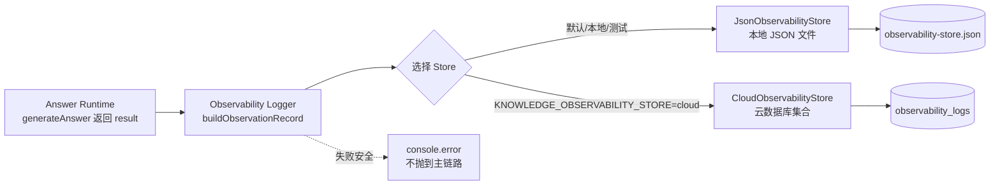

# Phase P+ — Observability 落库设计（docs/68）

## 向晚问思（WenDao）· Knowledge Platform v1.0.1 Hardening — 第三阶段：Observability 数据闭环

> **阶段定位**：Phase P+ 第三阶段
> **角色**：Knowledge Platform Engineer + RAG Platform Engineer
> **关联**：`docs/62 §9`（Observability 字段设计）、`docs/66 §5`（Monitoring Pipeline）
> **性质**：**纯新增代码**（观测模块 + 入口 fire-and-forget 调用），**零冻结资产改动**。

---

## 1. 目标与约束

将 `docs/62 §9` 已设计的 12 个 Observability 字段从「概念」变为「真实落库数据」，使 Dashboard / Health Score / Alert 有真实数据可消费。

| 约束 | 处理 |
|---|---|
| 不影响回答链路 | Logger 在 `generateAnswer` 返回后调用，只读 `result`；不进检索/生成路径 |
| 失败不能阻断回答 | `store.write` 永不抛出；`logObservation` 包 try/catch，fire-and-forget |
| 异步写入优先 | 不 `await` 落库，主流程立即返回（与既有 `logChat`/`logQuestion` 同模式） |
| 不修改冻结资产 | 仅 `require` 冻结的 `knowledgeRouter.routeQuestion`（只读调用）；不修改 router/rag/intent/corpus |
| 不重算检索逻辑 | 仅复算轻量路由决策（纯函数）用于观测，不跑检索 |

---

## 2. 数据流（Mermaid）



---

## 3. 观测记录 Schema

每次请求生成一条记录（`buildObservationRecord`）：

| 字段 | 来源 | 说明 |
|---|---|---|
| `query` | 用户原始问题 | 与 `question_logs.question` 对齐 |
| `answer_id` | `result.answerId` | 贯通所有回答路径的规范化 ID |
| `conversation_id` | 前端传入 | 会话关联 |
| `openid` | `cloud.getWXContext().OPENID` | 用户关联 |
| `router_decision` | **只读调用 `knowledgeRouter.routeQuestion`** | `{priorityDomains, knowledgePriority, preferredTypes, reason}` |
| `fallback_reason` | `router_decision.reason` | `classic-priority-domain` / `cognitive-psychology-signal` / `fallback-classic` / `router-disabled` |
| `knowledge_type` | `result.citations[].knowledge_type` 去重 | 命中的知识类型集合（如 `["classic"]` / `["classic","psychology"]`） |
| `retrieval_result` | `result.citations[].title` | 命中资料标题列表 |
| `citation_count` | `result.citations.length` | 引用数量 |
| `latency_ms` | `Date.now() - startTime` | 端到端生成耗时 |
| `created_at` | `new Date().toISOString()` | 时间戳 |

> **关键设计**：`router_decision` / `fallback_reason` 通过**只读调用冻结的 `routeQuestion`** 复算获得 —— 既拿到 Knowledge Router 的真实决策用于观测，又不修改任何冻结代码。这是「复用冻结能力、不加不改」原则的体现。

### 3.1 补充字段（Phase ⑥ 测试驱动增补，2026-08-01）

Phase ⑥ 测试暴露出上表对 `docs/62 §9` 十二字段契约的覆盖仅 2 项。以下 4 项数据本就存在于入参 `opts.intent` / 环境变量中，只是未持久化，已零成本补齐：

| 字段 | 来源 | 说明 |
|---|---|---|
| `domain` | `intentInfo.domain` | 意图域（§9 契约字段） |
| `intent` | `intentInfo.type` | 意图类型（§9 契约字段） |
| `policy_name` | `intentInfo.knowledgePolicy` | `skip` / `optional` / `use`（§9 契约字段） |
| `router_enabled` | `process.env.KB_ROUTER_ENABLED` | 路由开关状态（§9 契约字段） |

补齐后记录共 **15 字段**。对 §9 十二字段契约的覆盖度：**直接 6/12**（`knowledge_type` `fallback_reason` `domain` `intent` `policy_name` `router_enabled`）、**等价 1/12**（`citation_source` ≈ `retrieval_result`）、**未覆盖 5/12**（`retrieval_mode` `router_adjustment` `rerank_score` `chunk_id` `vector_score`）。

> 未覆盖的 5 项取值均位于**冻结的 `rag.js` 检索内部**，必须在 rag 内部埋点才能取到，与 Phase P+「零冻结资产改动」硬约束冲突 → 明确推迟至 Phase Q，并由 `tests/phase-p-plus/test-2-observability.js` **显式锁定该缺口**（断言这 5 项确实缺席），防止被悄悄改变而不更新披露。

---

## 4. 存储抽象（可替换）

| Store | 适用 | 接口 |
|---|---|---|
| `JsonObservabilityStore` | 默认 / 本地 / 测试 / 降级 | `write(record)` / `readAll()`，写本地 JSON 数组 |
| `CloudObservabilityStore` | 生产云端 | 写 `observability_logs` 云数据库集合（`wx-server-sdk` 延迟加载） |

- 二者实现**同一接口**，Logger 通过 `createDefaultStore()` 按 env 选择。
- 云函数本地文件系统无状态，**生产必须切到 Cloud Store**（设 `KNOWLEDGE_OBSERVABILITY_STORE=cloud`）。
- `write()` 全部 `try/catch` 包裹，失败返回 `{ok:false}` 并 `console.error`，**绝不抛出**。

---

## 5. 入口接线（`cloudfunctions/chat/index.js`，非冻结）

仅作**增量 instrumentation**，不改动既有 `logChat`/`logQuestion`：

```javascript
// 顶部新增
const { logObservation } = require("./observability/observabilityLogger");

// main 内：generateAnswer 前记 startTime；结果返回后 fire-and-forget
const startTime = Date.now();
const result = await generateAnswer(...);
result.answerId = makeAnswerId();
...
const ctx = cloud.getWXContext();
try {
  logObservation({ query: message, answerId: result.answerId, conversationId,
                   result, intent: result.intent, latencyMs: Date.now()-startTime,
                   openid: ctx && ctx.OPENID });
} catch (e) { console.error("logObservation unexpected error:", e); }
```

调用为**未 await 的 fire-and-forget**，与现有日志模式一致，主流程零阻塞。

---

## 6. 与既有 `question_logs` 的关系

`question_logs`（既有）已覆盖 query/answer_id/conversation_id/intent/matchedTitles/routeThemes。本观测集合**补齐 Phase P+ 强调的缺失维度**：`knowledge_type`、`fallback_reason`、`citation_count`、`latency_ms`，并面向 Knowledge Platform 治理独立成表。二者并存、互不替代，避免改动既有逻辑。

---

## 7. 验收映射

| 用户要求 | 实现 |
|---|---|
| 记录 query / answer_id / conversation_id | ✅ 字段齐备 |
| 记录 router decision / knowledge_type | ✅ 只读复算 `routeQuestion` + citations 去重 |
| 记录 retrieval result / citation count | ✅ `retrieval_result` / `citation_count` |
| 记录 fallback reason / latency | ✅ `fallback_reason` / `latency_ms` |
| 不影响回答链路 | ✅ 返回后调用、只读 result |
| 失败不能阻断回答 | ✅ store 永不抛、fire-and-forget |
| 异步写入优先 | ✅ 未 await 落库 |

---

> *文档生成：Phase P+ 第三阶段（Observability 落库设计）。所有代码为新增模块；`index.js` 仅增量接线（非冻结文件）。*
